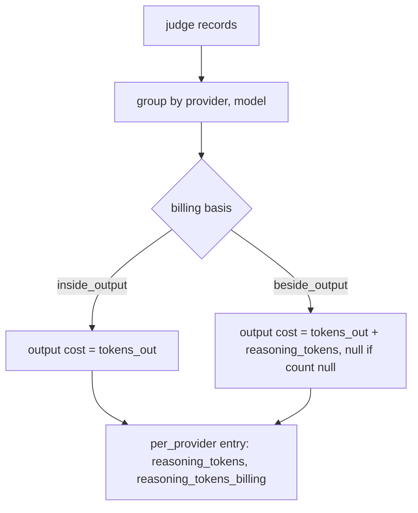
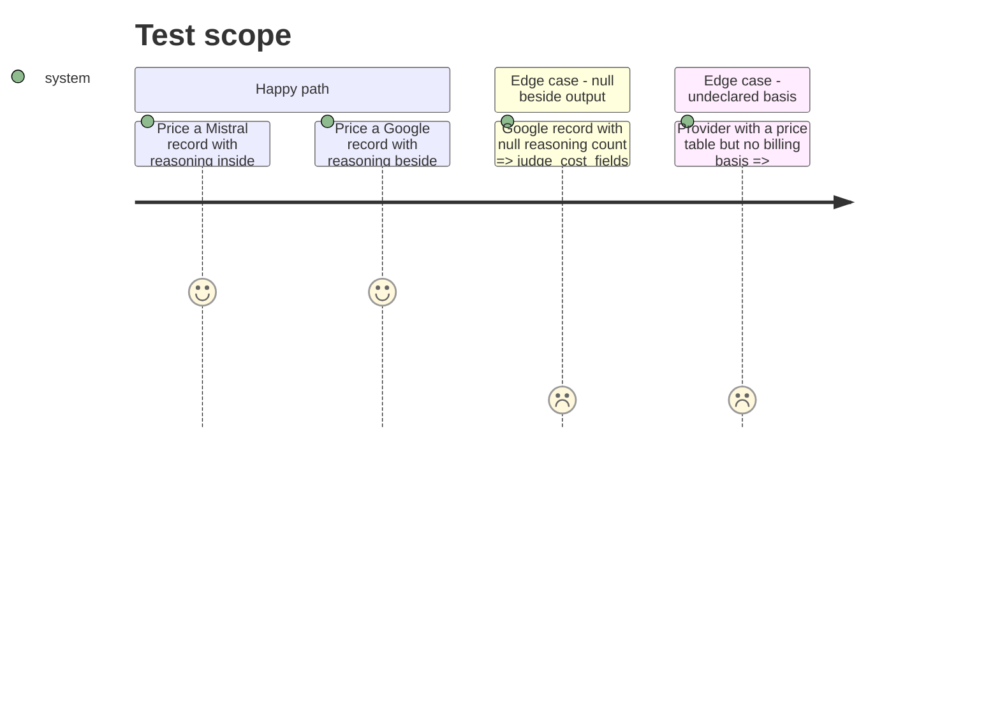

# Instruction: Reasoning tokens and their billing basis in `judge_cost`

## Architecture projection

> Tree of the final files. ✅ create · ✏️ modify · ❌ delete

```txt
.
├── src/wave_local_ai_v2/
│   └── cost.py          ✏️ REASONING_TOKEN_BILLING per provider; per_provider reasoning_tokens + billing basis; priced once
└── tests/
    └── test_cost.py     ✏️ inside-output not added twice; beside-output priced once; null beside -> cost null; unknown basis refused
```

## User Journey



## Test Scope



## Tasks to do

### `1)` Billing basis and pricing

> Each reasoning token priced exactly once.

1. Declare `REASONING_BILLED_INSIDE_OUTPUT`, `REASONING_BILLED_BESIDE_OUTPUT` and `REASONING_TOKEN_BILLING` keyed like `PRICE_TABLES`.
2. In `judge_cost_fields`, add `reasoning_tokens`, `reasoning_tokens_null_reason` and `reasoning_tokens_billing` per provider; add reasoning to the billed output only under `beside_output`.

## Test acceptance criteria

| Task | Acceptance criteria |
| ---- | ------------------- |
| 1 | Inside-output reasoning never moves the cost; beside-output reasoning is priced once at the output rate; a null beside-output count nulls that provider's cost; `cost_total` on the row is untouched |
