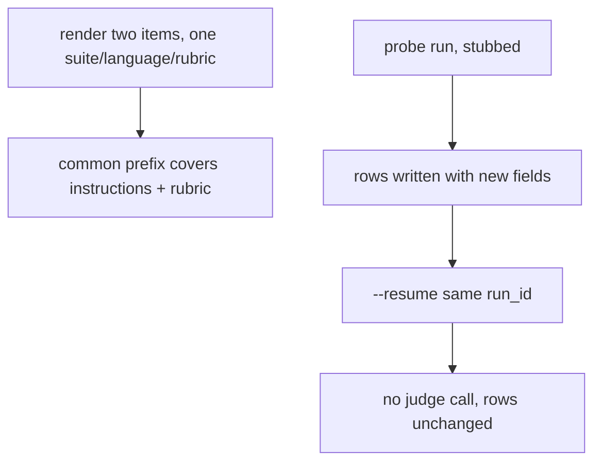
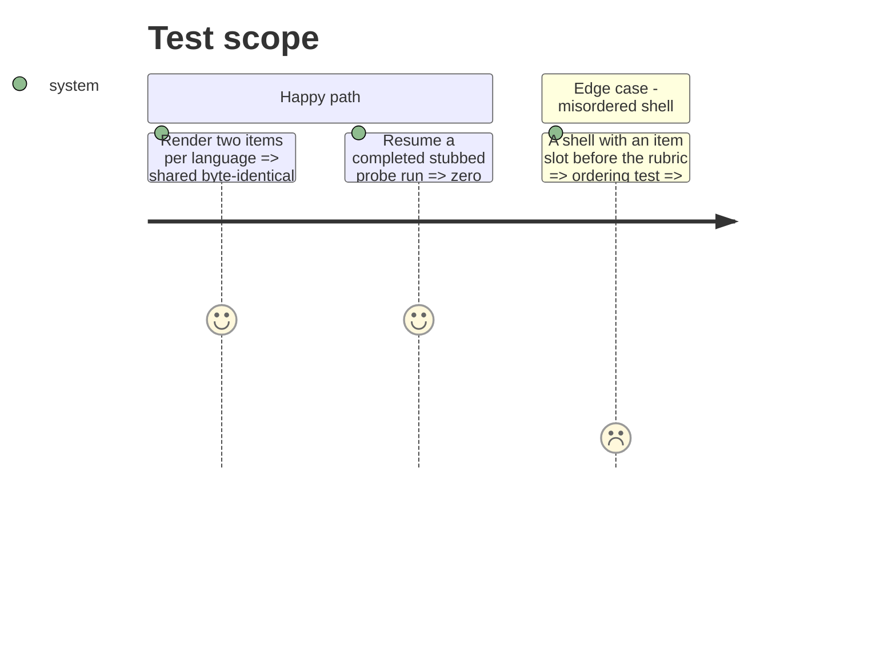

# Instruction: Stable judge-prompt prefix, resume read-back, stubbed evidence

## Architecture projection

> Tree of the final files. ✅ create · ✏️ modify · ❌ delete

```txt
.
├── src/wave_local_ai_v2/
│   └── judge_protocol.py          ✏️ comment: the rubric precedes every item slot (stable prefix)
├── tests/
│   ├── test_judge_protocol.py     ✏️ shells order rubric before item slots; two items share a prefix ending after the rubric
│   └── test_judge_probe.py        ✏️ stub replies carry reasoning_tokens; resume reads the new fields back unchanged, no call
└── aidd_docs/tasks/2026_10/2026_10_01_judge-call-provider-effort-reasoning-tokens/evidence/
    ├── stubbed-judged-row.jsonl            ✅ the stubbed judged row as `append_row` wrote it
    └── stubbed-judged-row-read-back.json   ✅ its judge records and `judge_cost`, read back via `read_rows`
```

## User Journey



## Test Scope



## Tasks to do

### `1)` Stable prefix

> Item substitutions only after the rubric.

1. Test every shipped shell orders `{{rubric}}` before both item slots.
2. Test two rendered items share a prefix that contains the shell instructions and the full rubric text.

### `2)` Resume and evidence

> The new fields survive a write/read/resume cycle.

1. Extend the probe's stub replies with `reasoning_tokens`; assert a resume re-issues nothing and reads the six fields back unchanged.
2. Write a stubbed judged row through `append_row`, read it back, save it under `evidence/`.

## Test acceptance criteria

| Task | Acceptance criteria |
| ---- | ------------------- |
| 1 | Shared prefix ends after the rubric for EN, FR and DE; reordering a shell fails the ordering test |
| 2 | Resumed run makes no judge call; the rows read back carry the same six fields; evidence row shows answering provider, effort and reasoning tokens apart from output tokens |
