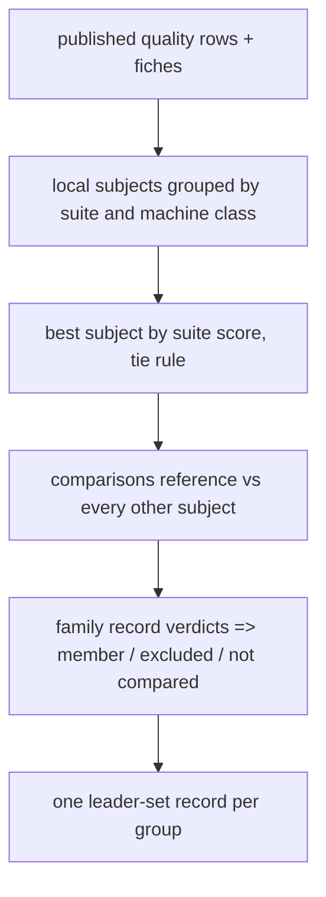
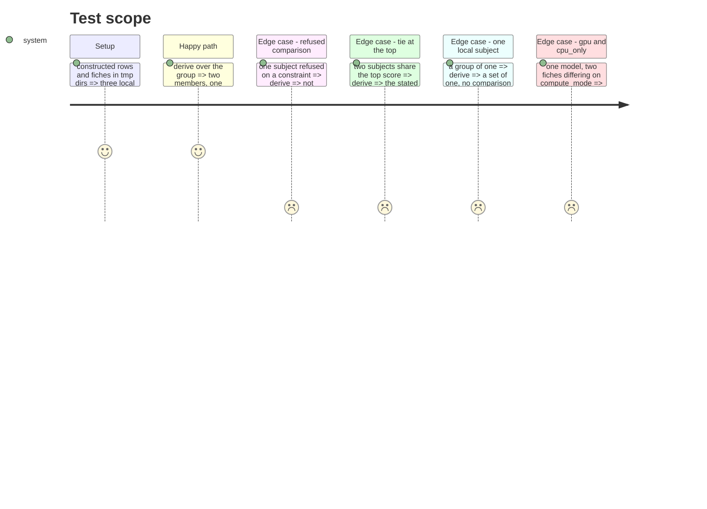

# Instruction: The leader-set derivation and its record

## Architecture projection

```txt
.
├── src/wave_local_ai_v2/leader_set.py   ✅ subjects, machine class, groups, reference + tie rule, needed comparisons, record build, id, heads
└── tests/test_leader_set.py             ✅ constructed groups
```

## User Journey



## Test Scope



## Tasks to do

### `1)` Module

> Pure derivation, no I/O beyond reading fiches through `fiche_registry.read_fiche`.

1. Subjects (`run_id`, `model_id`) from local rows; suite score per subject.
2. Machine class from the fiche; groups keyed by suite id, version and class.
3. Reference and tie rule; the leader comparisons a group needs.
4. Record from a group and its family record; id, supersedes, heads, same-content.

### `2)` Tests

> Every constructed group of the story.

## Test acceptance criteria

| Task | Acceptance criteria |
| ---- | ------------------- |
| 1 | A group's record names suite, level, grouping fields and values, reference, tie rule, family id, and each subject's run id and status. |
| 2 | The six constructed cases of the story pass. |
