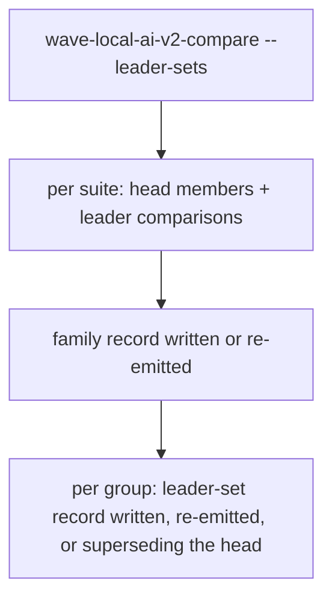
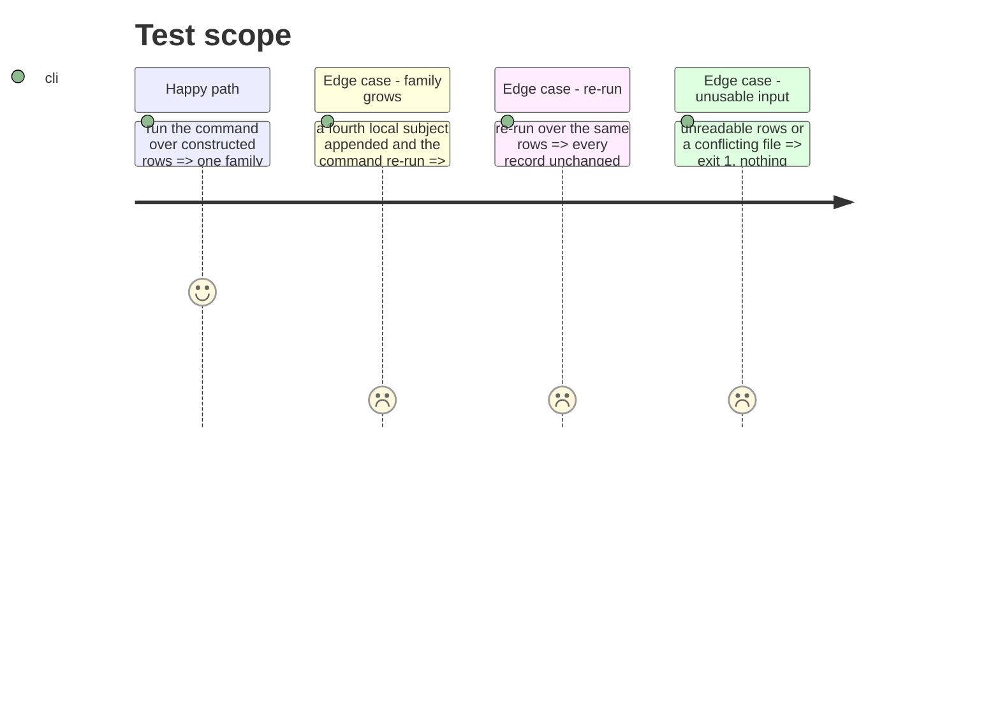

# Instruction: The analysis command writes the family and the leader-set records

## Architecture projection

```txt
.
├── src/wave_local_ai_v2/comparison.py   ✏️ --leader-sets / --leader-sets-dir / --fiche-registry-dir, dispatch to leader_set.publish
├── src/wave_local_ai_v2/leader_set.py   ✏️ publish: grow each suite's family, write it, write or re-emit each leader-set record
└── tests/test_leader_set.py             ✏️ command tests: supersession, byte-identical old file, identical re-run
```

## User Journey



## Test Scope



## Tasks to do

### `1)` Publish

> One invocation: families first, leader sets second, nothing written on an error.

1. Build every record before writing any; refuse an existing file with different content.
2. Console lines: one per family and per leader-set record.

### `2)` Tests

> Supersession and re-run.

## Test acceptance criteria

| Task | Acceptance criteria |
| ---- | ------------------- |
| 1 | The command writes the family and leader-set records; a re-run reports them unchanged. |
| 2 | A grown family yields a new leader-set record whose `supersedes` names the old id; the old file is byte-identical. |
