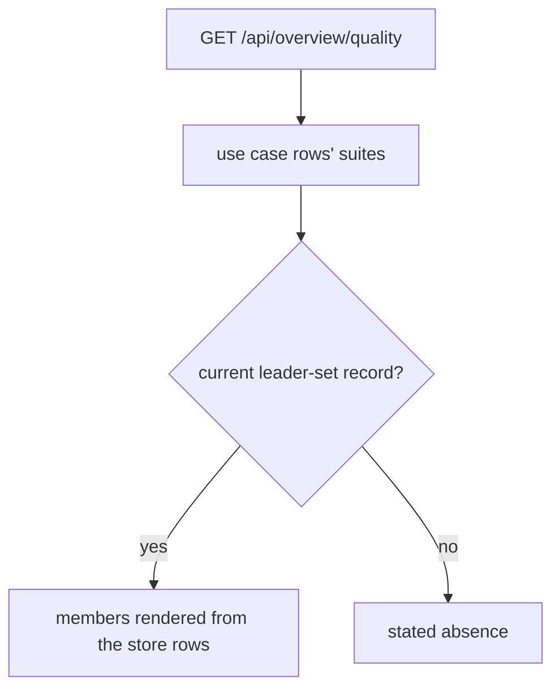
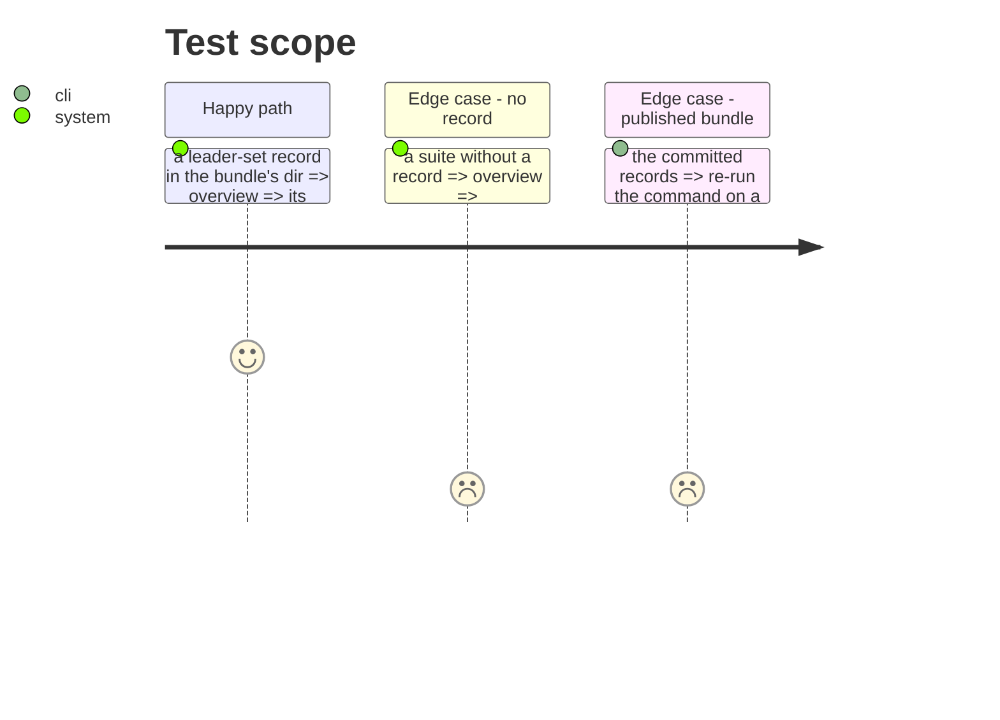

# Instruction: The overview reads the record; the records over the committed bundle; docs

## Architecture projection

```txt
.
├── src/wave_local_ai_v2/read_model.py                 ✏️ leader membership from the current leader-set record; comment on unowned derivation removed
├── src/wave_local_ai_v2/settings.py                   ✏️ ServiceSettings.leader_sets_dir (LEADER_SETS_DIR)
├── src/wave_local_ai_v2/service.py                    ✏️ passes it
├── tests/store_fixtures.py, tests/test_read_model.py, tests/test_service.py, tests/test_settings.py   ✏️
├── tests/test_comparison.py                           ✏️ the bundle's current family now holds three members
├── aidd_docs/results/leader-sets/                     ✅ NOTICE.md + the record over the committed bundle
├── aidd_docs/results/comparisons/                     ✅ the grown family record (old files untouched)
├── LICENSE-DATA                                       ✏️ leader-sets/ in scope
├── aidd_docs/results/README.md, aidd_docs/memory/cli.md, aidd_docs/memory/codebase-map.md, CHANGELOG.md   ✏️
└── evidence/                                          ✅ command output
```

## User Journey



## Test Scope



## Tasks to do

### `1)` Read model and service

### `2)` Publish over the committed bundle, recompute test, docs

## Test acceptance criteria

| Task | Acceptance criteria |
| ---- | ------------------- |
| 1 | The overview renders members from a record and keeps the absence for a suite without one; it scores and ranks nothing. |
| 2 | `leader-sets/` holds the record for `classification-support-routing@2` on the laptop class; the old family files show no diff; README names both new records. |
