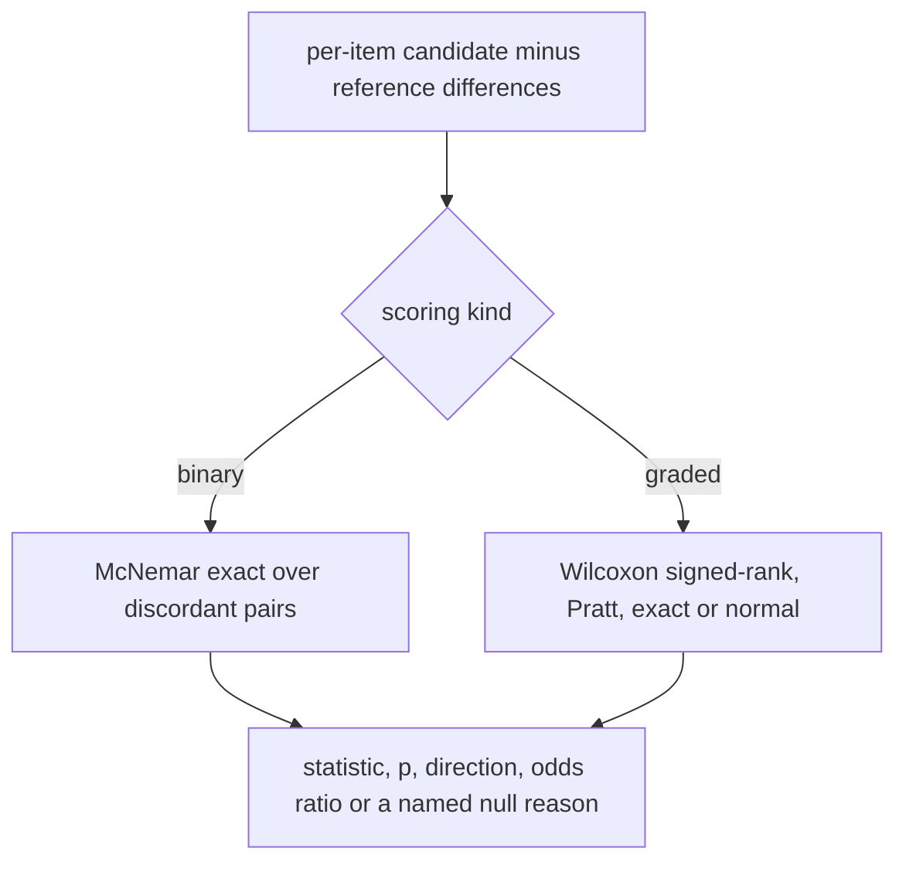
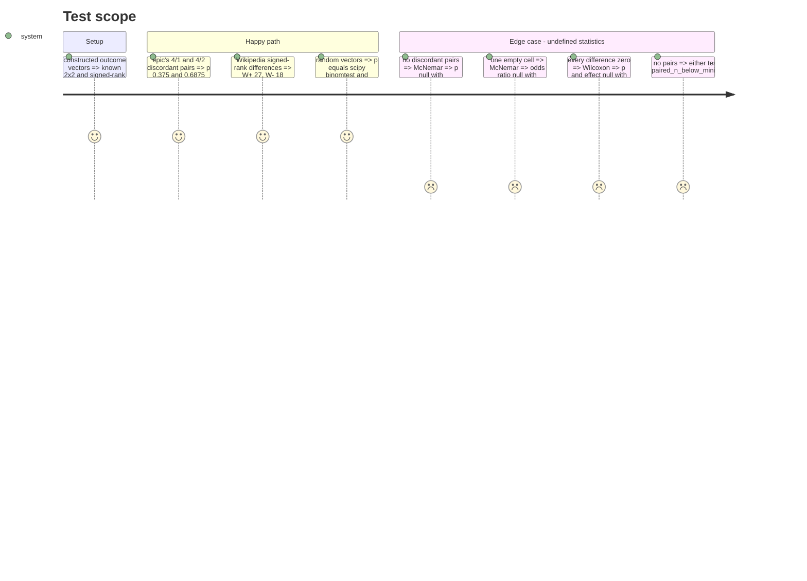

# Instruction: The two paired tests, their effect sizes and their null reasons

## Architecture projection

```txt
.
├── pyproject.toml                         ✏️ scipy in the dev group
├── uv.lock                                ✏️
├── src/wave_local_ai_v2/comparison.py     ✅ mcnemar_exact, wilcoxon_signed_rank
└── tests/test_comparison.py               ✅ worked examples, scipy oracle, null reasons
```

## User Journey



## Test Scope



## Tasks to do

### `1)` McNemar exact

1. Count concordant and discordant pairs; p = min(1, 2 * sum_{k<=min(b,c)} C(n,k) / 2^n) in `Fraction`.
2. Odds ratio c / b, null with `odds_ratio_empty_cell` on an empty cell.

### `2)` Wilcoxon signed-rank

1. Pratt ranks with tie averaging; W+ and W-; tie and zero counts.
2. Exact sign-flip distribution on doubled ranks when non-zero count <= 50, else normal approximation (Cureton, tie correction, no continuity correction).
3. Rank-biserial (W+ - W-) / (W+ + W-).

### `3)` Oracle and worked-example tests

1. Add scipy to the dev group; compare against `binomtest` and `wilcoxon(zero_method="pratt", correction=False)`.

## Test acceptance criteria

| Task | Acceptance criteria |
| ---- | ------------------- |
| 1 | The epic's two published pairs reproduce p = 0.375 and 0.6875; an empty cell or no discordance gives its named reason, never a number |
| 2 | p agrees with scipy within 1e-9 on exact and approximate cases; all-zero differences give `all_differences_zero` |
| 3 | scipy is importable in tests only; no module under `src/` imports it |
