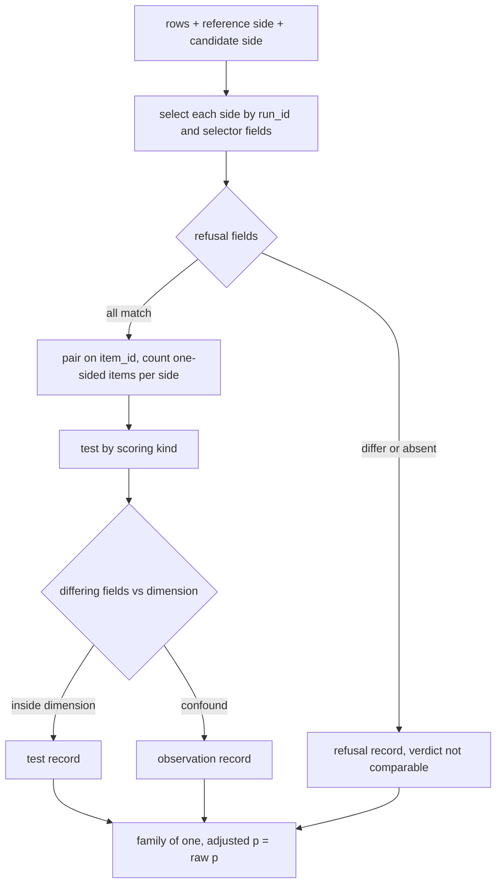
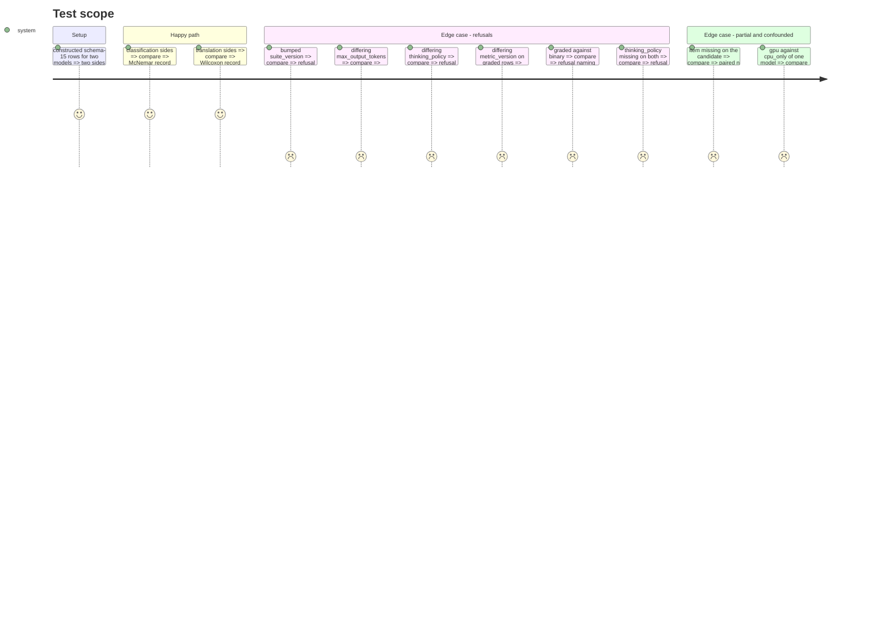

# Instruction: Sides, pairing, refusal list, differing-field set and the family-of-one record

## Architecture projection

```txt
.
├── src/wave_local_ai_v2/comparison.py     ✏️ select_side, compare_sides, build_family_record
└── tests/test_comparison.py               ✏️ routing, refusals, unpaired items, confound
```

## User Journey



## Test Scope



## Tasks to do

### `1)` Sides and pairing

1. A side is a run id plus selector fields; rows matching both are the side.
2. Pair on `item_id`; a null compared value counts as missing from that side.

### `2)` Refusals and differing fields

1. Refusal list per the plan's Decisions, each entry naming field, reason (`differs`/`absent`) and both values.
2. Differing set over non-excluded fields; comparison kind from the declared dimension.

### `3)` Record

1. Member record with every field the acceptance names; family of one with `family_id`.

## Test acceptance criteria

| Task | Acceptance criteria |
| ---- | ------------------- |
| 1 | A side missing an item reduces paired n and names the item with `missing_from` |
| 2 | Each refusal case names its own field; a gpu/cpu_only pair is an observation whose differing set holds `compute_mode` |
| 3 | A family of one states adjusted p equal to raw p; the same inputs give a byte-identical record |
