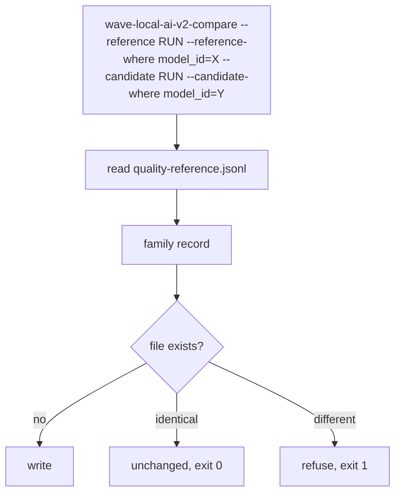
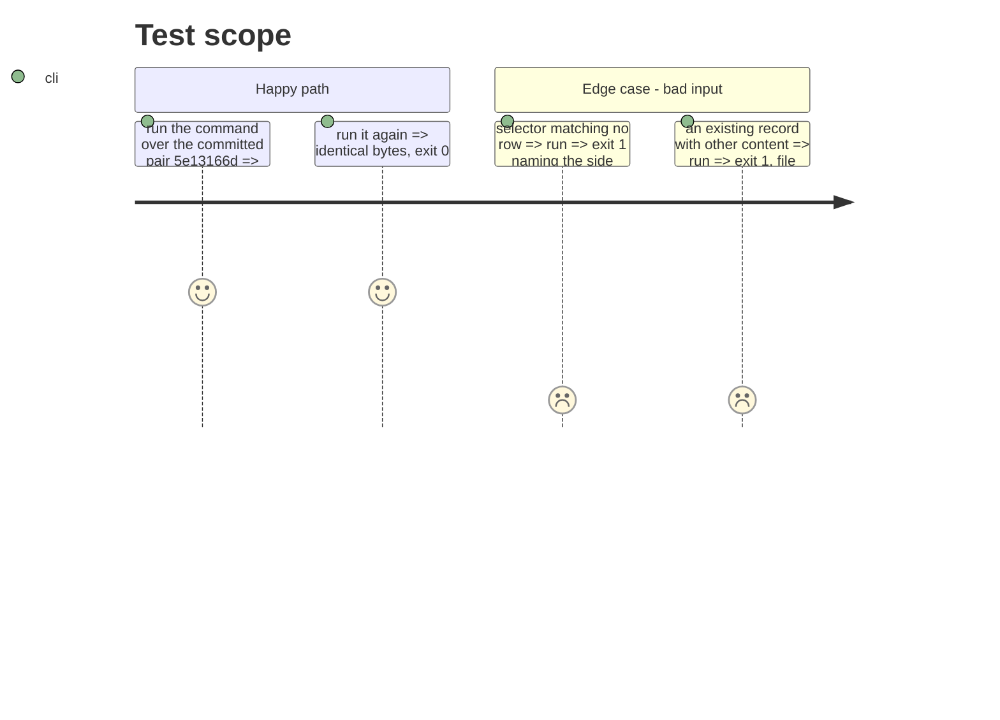

# Instruction: The analysis command and its published output

## Architecture projection

```txt
.
├── pyproject.toml                                   ✏️ wave-local-ai-v2-compare entry point
├── src/wave_local_ai_v2/comparison.py               ✏️ main()
├── tests/test_comparison.py                         ✏️ CLI, write-once, committed-bundle refusal
├── aidd_docs/results/comparisons/*.json             ✅ two published family records
├── aidd_docs/results/README.md                      ✏️ the evidence
├── aidd_docs/memory/cli.md                          ✏️
└── aidd_docs/memory/codebase-map.md                 ✏️
```

## User Journey



## Test Scope



## Tasks to do

### `1)` Command

1. argparse: `--rows`, `--reference`, `--candidate`, repeatable `--reference-where`/`--candidate-where`, `--dimension`, `--alpha`, `--output`.
2. Entry point in `pyproject.toml`.

### `2)` Evidence

1. Run over the two committed pairs into `aidd_docs/results/comparisons/`; record both refusals in the results README; save the command output under `evidence/`.

### `3)` Memory

1. `cli.md` command entry; `codebase-map.md` module and entry point.

## Test acceptance criteria

| Task | Acceptance criteria |
| ---- | ------------------- |
| 1 | The command writes one record and re-running it leaves the file byte-identical |
| 2 | Both committed pairs publish a refusal naming `thinking_policy` as absent, and the README says so instead of a p-value |
| 3 | The memory names the new command and module |
