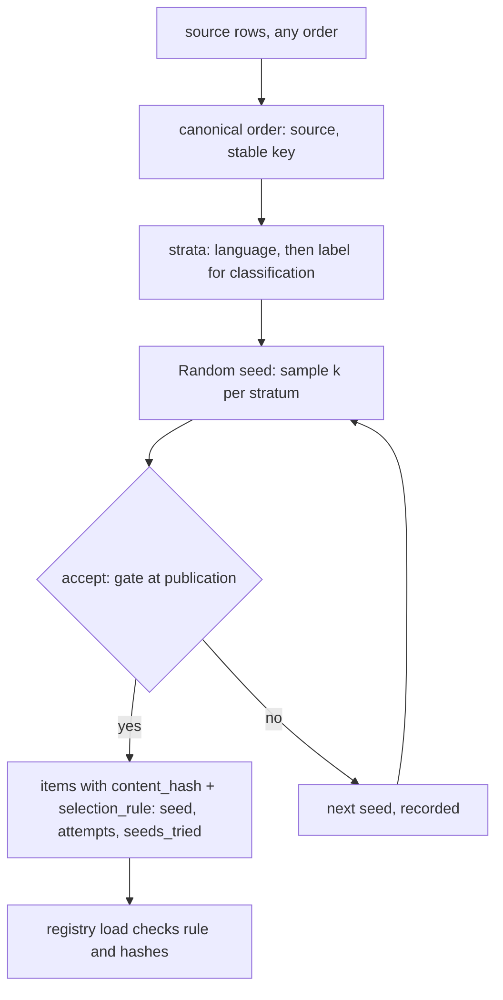
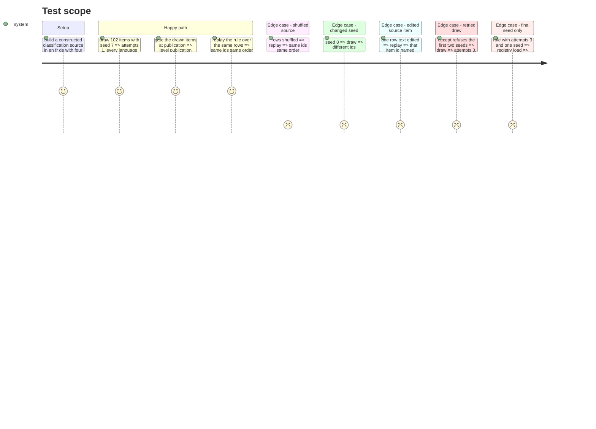

# Instruction: The sampler, the rule record, and the registry's check of the added fields

## Architecture projection

> Tree of the final files. ✅ create · ✏️ modify · ❌ delete

```txt
.
├── src/wave_local_ai_v2/
│   ├── subset_sampler.py      ✅ canonical ordering, stratified seeded draw, retries, content hash, rule record + check, replay comparison
│   └── suite_registry.py      ✏️ checks `selection_rule` and item `content_hash` where declared
└── tests/
    ├── subset_fixtures.py     ✅ the constructed source and a suite drawn from it, shared by three test modules
    ├── test_subset_sampler.py ✅ draw, replay, retry, stratification, gate at publication
    └── test_suite_registry.py ✏️ a drawn definition registers; a malformed rule is refused; the placeholder seam test drops its unreplayable rule
```

## User Journey



## Test Scope



## Tasks to do

### `1)` Sampler core

> A seeded draw that is a function of the seed and the canonical source only.

1. Constants `SAMPLER_VERSION`, `CANONICAL_ORDERING`, `CONTENT_HASH_VERSION`; `SubsetSamplerError`.
2. `normalise_text`, `content_hash(row, content_fields, benchmark)`.
3. `canonical_order(rows, stable_source_key, benchmarks)`: refuse unknown source, missing/duplicate key, language outside `suite_gate.LANGUAGES`.
4. `draw(rows, spec, seed)`: allocate per stratum, refuse an under-filled stratum naming it, `random.Random(seed).sample` per stratum, build drawn items.
5. `draw_with_retries(rows, spec, *, first_seed, accept, loader, max_attempts)`: record every seed; return items and the rule record; exhausted attempts refused naming every seed.

### `2)` Rule check and replay comparison

> The rule's shape is checked; a replay names what moved.

1. `check_selection_rule(rule, task_suite)` and `check_drawn_items(items, rule)` returning problems.
2. `replay(items, rule, rows)` -> `ReplayReport` (recorded ids, redrawn ids, items whose hash moved, items absent from the source, `reproduced`).

### `3)` Registry

> The added fields are checked at load.

1. When `selection_rule` is declared, run both checks and raise `SuiteRegistryError` naming the problems; an item `content_hash` without a rule is still checked for format.

## Test acceptance criteria

| Task | Acceptance criteria              |
| ---- | -------------------------------- |
| 1 | Same seed and source give identical ids and order; shuffled rows give the same; another seed differs; classification draw fills every (language, label) stratum; first seed passes the publication gate; a retried draw records every seed |
| 2 | An edited source row is named by item id on replay; an unedited replay reports reproduced |
| 3 | A drawn definition registers at `publication` and its snapshot carries `selection_rule`; a rule recording only the final seed, a classification rule without label stratification, and a malformed content hash are refused |
