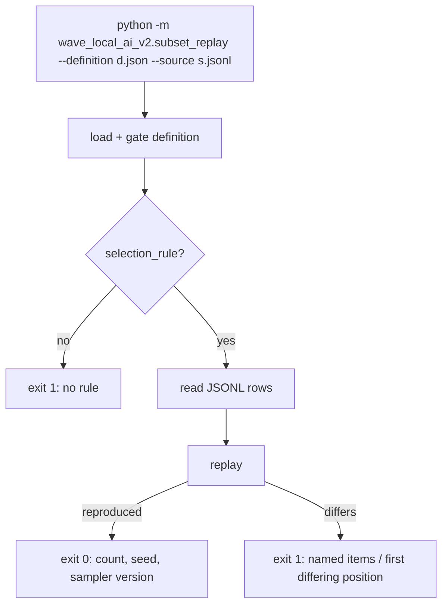
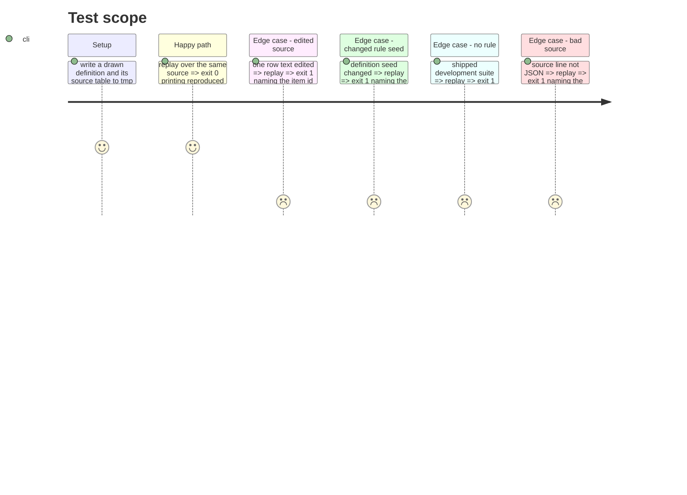

# Instruction: The replay command and the docs naming it

## Architecture projection

> Tree of the final files. ✅ create · ✏️ modify · ❌ delete

```txt
.
├── src/wave_local_ai_v2/
│   ├── subset_replay.py        ✅ `python -m` command: --suite | --definition, --source
│   └── suite_registry.py       ✏️ docstring names where the added fields are checked
├── aidd_docs/memory/
│   ├── cli.md                  ✏️ the replay command
│   └── codebase-map.md         ✏️ the two modules
└── tests/
    └── test_subset_replay.py   ✅ exit codes and named items
```

## User Journey



## Test Scope



## Tasks to do

### `1)` Replay command

> The rule is checked by a command, not described in prose.

1. argparse: mutually exclusive `--suite`/`--definition`, required `--source`.
2. Load, read rows, call `subset_sampler.replay`, print the verdict; exit 0 or 1.

### `2)` Docs

> Memory names the command and the modules.

1. `cli.md`: the command beside `suite_snapshot`/`use_case_coverage`.
2. `codebase-map.md`: the sampler and replay modules.

## Test acceptance criteria

| Task | Acceptance criteria              |
| ---- | -------------------------------- |
| 1 | Unchanged source exits 0; an edited row exits 1 naming its item id; a changed seed exits 1; a suite without a rule exits 1; a malformed source line exits 1 |
| 2 | Memory names the command, its flags and exit codes |
