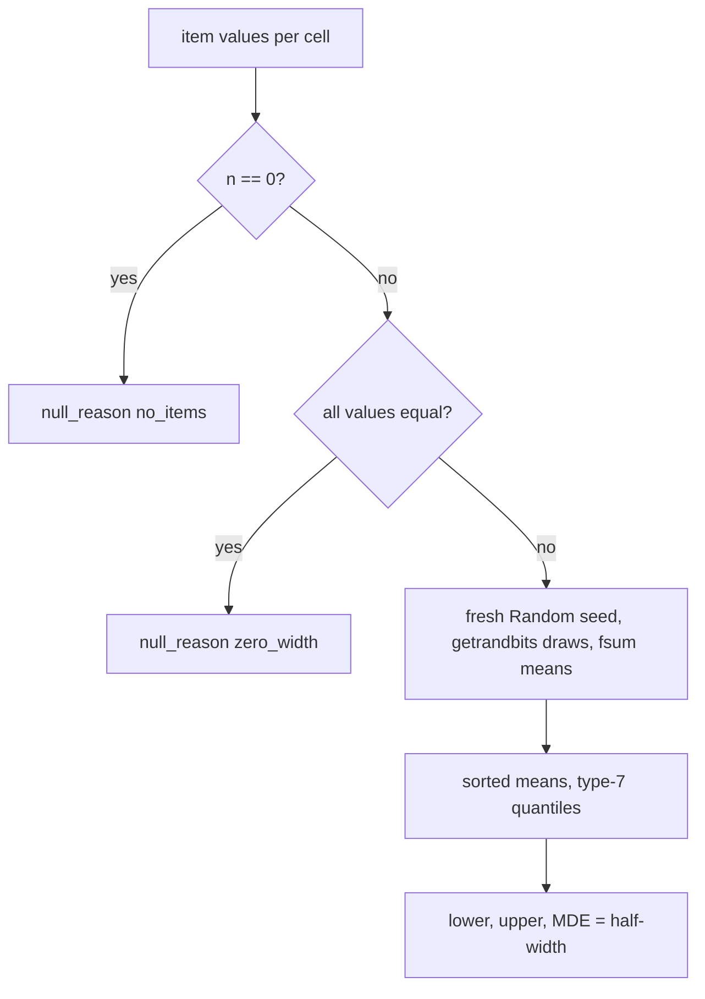
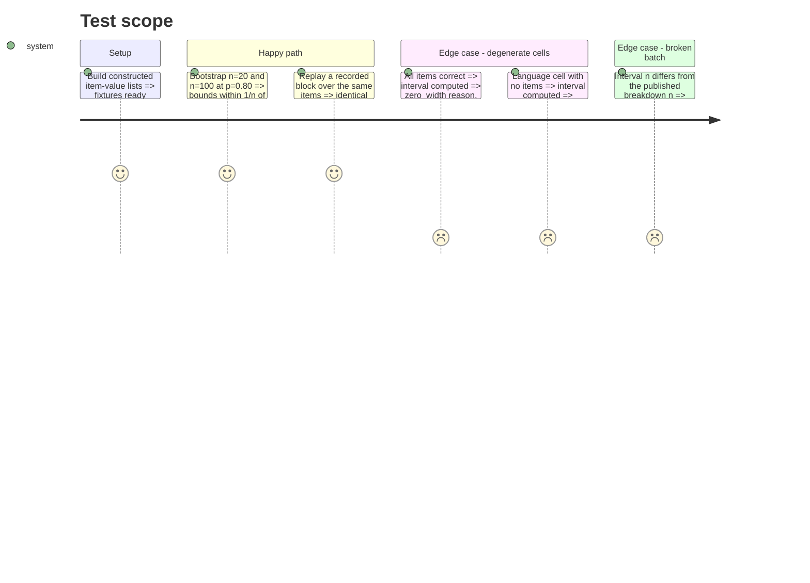

# Instruction: The statistics module and its oracle tests

## Architecture projection

> Tree of the final files. ✅ create · ✏️ modify · ❌ delete

```txt
.
├── src/wave_local_ai_v2/
│   └── score_interval.py        ✅ draw procedure, percentile bootstrap, MDE, null reasons, block, replay, batch invariants
└── tests/
    └── test_score_interval.py   ✅ hand-computed fixture, exact binomial, Wilson, scipy oracle, replay, reasons, invariants, no scipy in src
```

## User Journey



## Test Scope



## Tasks to do

### `1)` The draw procedure and the bootstrap

> Stdlib percentile bootstrap with a versioned, fully specified draw.

1. Constants: level 0.95, resamples 10 000, method `percentile`, `DRAW_PROCEDURE_ID`, `DEFAULT_SEED`, the two reasons.
2. `bootstrap_cell(values, *, seed, resamples, confidence_level)` returns a cell; reasons decided on the values.
3. `interval_block(items, values, *, seed=...)`: suite unstratified, one cell per language, items ordered by `item_id`.

### `2)` Replay and invariants

> Prove a block reproduces and that it qualifies the score it sits beside.

1. `replay(block, items, values)` refuses an unknown method or draw procedure and recomputes.
2. `check_batch_invariants(rows)`: estimate inside interval, n equal to the published breakdown, identical block on every row that carries one.

### `3)` Tests

> Oracles, never the implementation's own output.

1. Hand-computed small fixture; exact binomial at n=20 and n=100; Wilson at n=100 within 0.05; scipy percentile and bootstrap oracle; documented convention differences.
2. Replay bit for bit; a changed seed changes the interval; each reason from its own state only; three invariants including a resumed batch; `src/` imports no scipy.

## Test acceptance criteria

| Task | Acceptance criteria |
| ---- | ------------------- |
| 1 | n=20/p=0.80 and n=100/p=0.80 bounds lie within 1/n of the exact binomial quantiles; Wilson within 0.05 at n=100 |
| 2 | A replayed block returns the identical cells; a broken invariant raises naming it |
| 3 | `uv run pytest tests/test_score_interval.py` passes |
