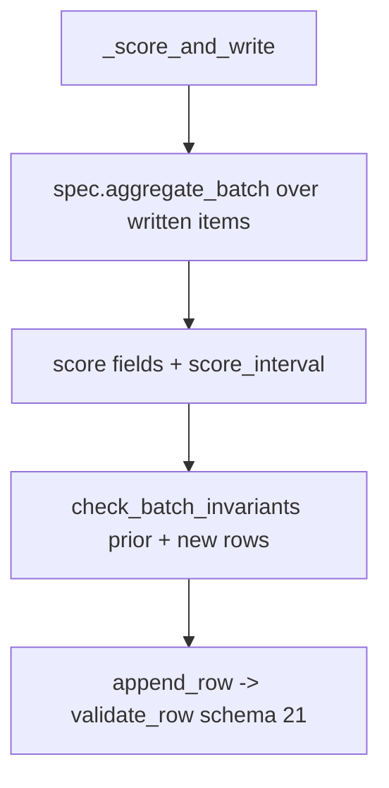
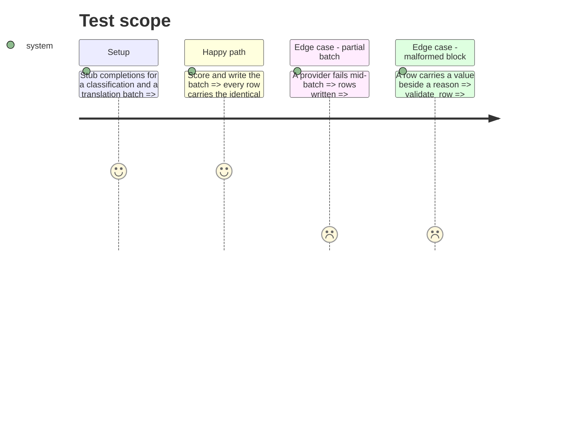

# Instruction: The interval block on every quality row (schema "21")

## Architecture projection

> Tree of the final files. ✅ create · ✏️ modify · ❌ delete

```txt
.
├── CHANGELOG.md                              ✏️ schema "21" entry
├── src/wave_local_ai_v2/
│   ├── scoring_rules.py                      ✏️ both aggregates attach score_interval
│   ├── row_contract.py                       ✏️ SCHEMA_VERSION "21", SCORE_INTERVAL_FIELDS, validation, partial null
│   ├── quality_cli.py                        ✏️ batch invariants before append
│   ├── judge_probe.py                        ✏️ score_interval null on probe rows
│   ├── read_model.py                         ✏️ declared unrendered
│   └── bundle_export.py                      ✏️ column docs for the block
└── tests/
    ├── test_scoring_rules.py / test_row_contract.py / test_quality_cli.py / test_bundle_export.py  ✏️
```

## User Journey



## Test Scope



## Tasks to do

### `1)` Contract

> Declare and validate the block.

1. Bump to "21", owe `score_interval` from "21", add it to `PARTIAL_NULL_SCORE_FIELDS`.
2. Validate shape, header values, cell value-xor-reason, null iff no suite score.

### `2)` Writers

> Compute once per batch, attach to every row.

1. Both aggregates return `score_interval`; judge probe writes null.
2. `_score_and_write` runs the invariants before appending.

### `3)` Readers

> The build passes without any view rendering it.

1. `QUALITY_FIELDS_NOT_RENDERED`, bundle export docs, CHANGELOG.

## Test acceptance criteria

| Task | Acceptance criteria |
| ---- | ------------------- |
| 1 | A schema-21 row without the block, or with a value beside a reason, is refused; a schema-20 row validates unchanged |
| 2 | Every row of a written batch carries the identical block; a partial batch carries null |
| 3 | The read-model partition and bundle-export registry tests pass |
