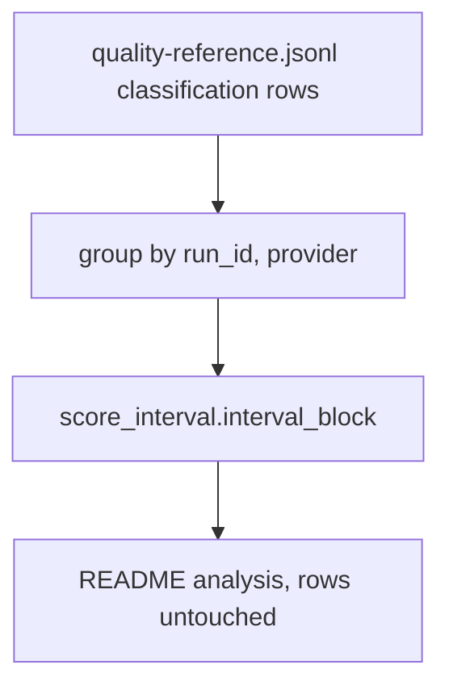
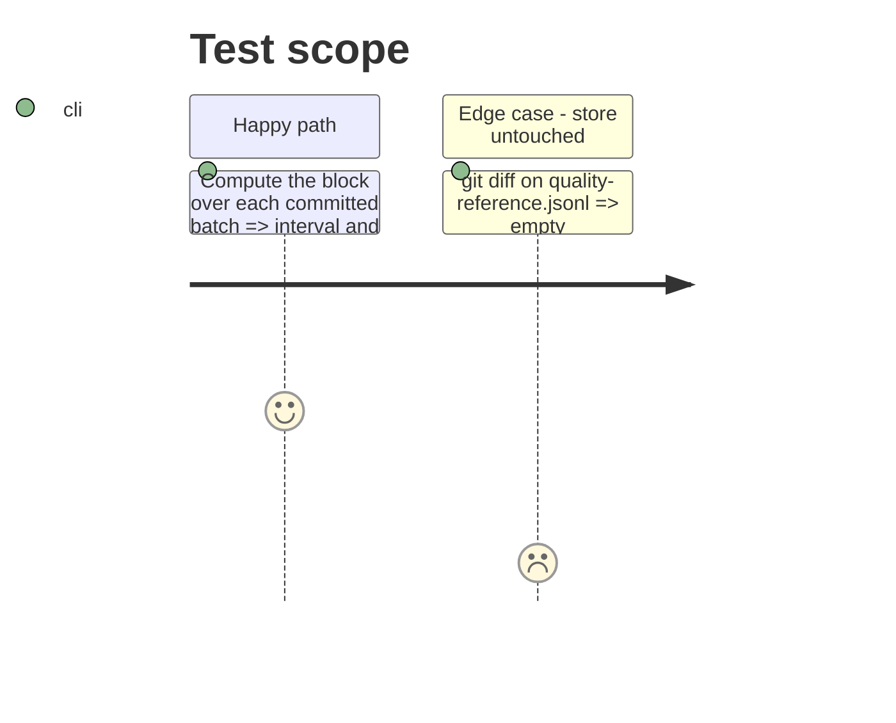

# Instruction: Evidence over the committed classification rows

## Architecture projection

> Tree of the final files. ✅ create · ✏️ modify · ❌ delete

```txt
.
├── aidd_docs/results/README.md                                       ✏️ analysis section
├── aidd_docs/memory/codebase-map.md                                  ✏️ the new module
└── aidd_docs/tasks/2026_10/2026_10_01_quality-batch-interval-and-what-it-could-resolve/evidence/
    └── classification-intervals.txt                                  ✅ the computed blocks
```

## User Journey



## Test Scope



## Tasks to do

### `1)` Compute and record

> An analysis over existing rows, never written back.

1. Run the module over the four committed batches; save the output in `evidence/`.
2. Add a dated README section; add the module to the codebase map.

## Test acceptance criteria

| Task | Acceptance criteria |
| ---- | ------------------- |
| 1 | README cites each batch's interval and MDE, matching the evidence file; the committed store is unchanged |
