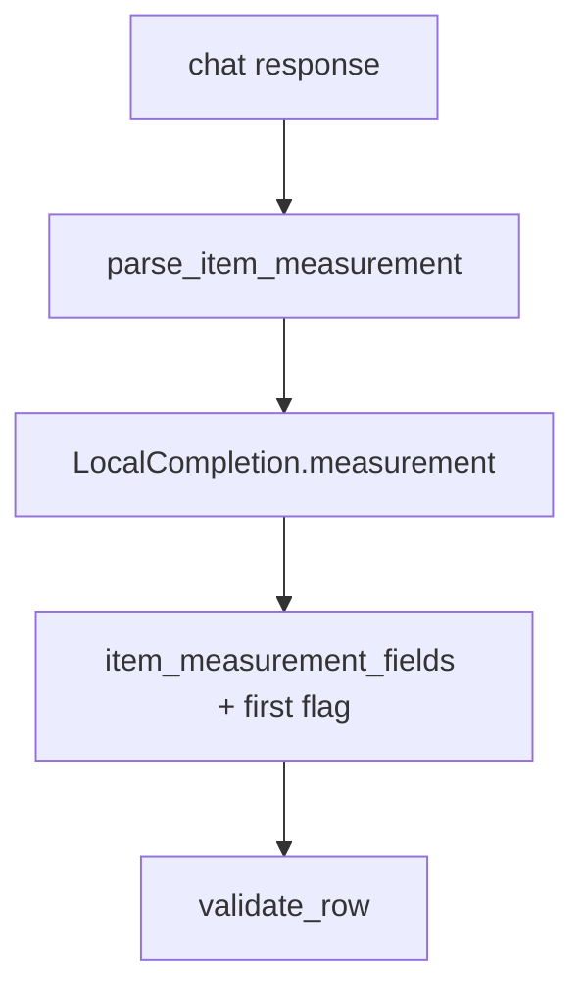
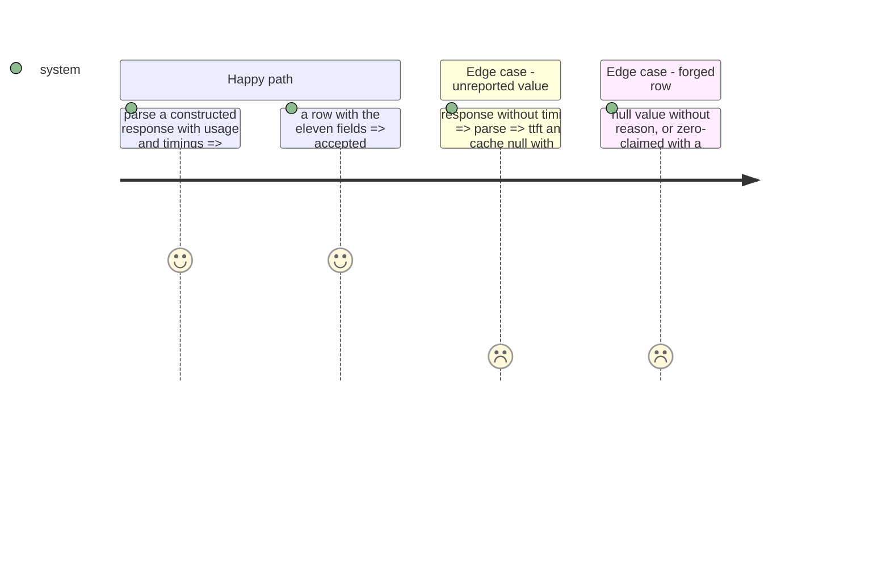

# Instruction: The per-item measurement and its row fields (schema "18")

## Architecture projection

```txt
.
├── src/wave_local_ai_v2/
│   ├── timings.py         ✏️ ItemMeasurement + parse_item_measurement (engine response) + null reasons
│   ├── local_client.py    ✏️ LocalCompletion carries the parsed measurement
│   ├── quality_rows.py    ✏️ item_measurement_fields (row block), cloud_item_measurement
│   └── row_contract.py    ✏️ eleven fields, "18", their gate rules
└── tests/                 ✏️ test_timings, test_local_client, test_row_contract, row fixtures
```

## User Journey



## Test Scope



## Tasks to do

### `1)` Parse

1. `timings.parse_item_measurement(response_json)`: usage tokens, `timings.prompt_ms`, `timings.cache_n`; a missing or non-numeric value is null with `not_reported_by_engine`.
2. `local_client.complete_chat` returns it as `measurement`.

### `2)` Row fields

1. `quality_rows.item_measurement_fields(measurement, first_in_batch=...)` and `cloud_item_measurement(prompt_tokens, generated_tokens)`.
2. Required set, `SCHEMA_VERSION = "18"` with its history comment; gate: value/reason exclusivity, known reasons, non-negative numbers, source present iff TTFT present and recognised, kind constant, bool first flag.

## Test acceptance criteria

| Task | Acceptance criteria              |
| ---- | -------------------------------- |
| 1 | A constructed engine response yields the item's tokens, TTFT and cache count; an unreported one is null with its reason |
| 2 | A row missing any field, a null without a reason, a value with a reason, or an unknown source is refused naming the field |
