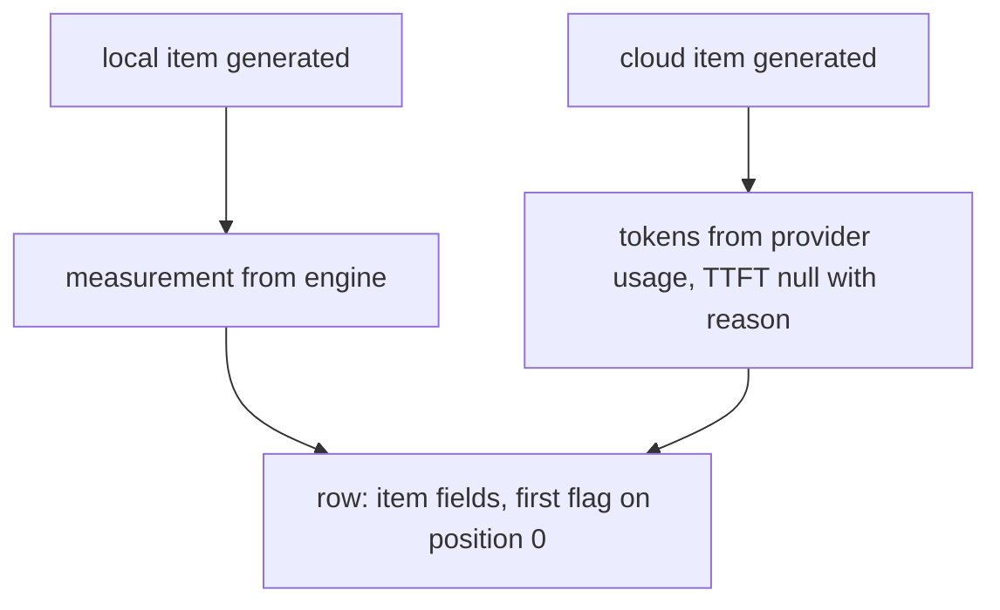
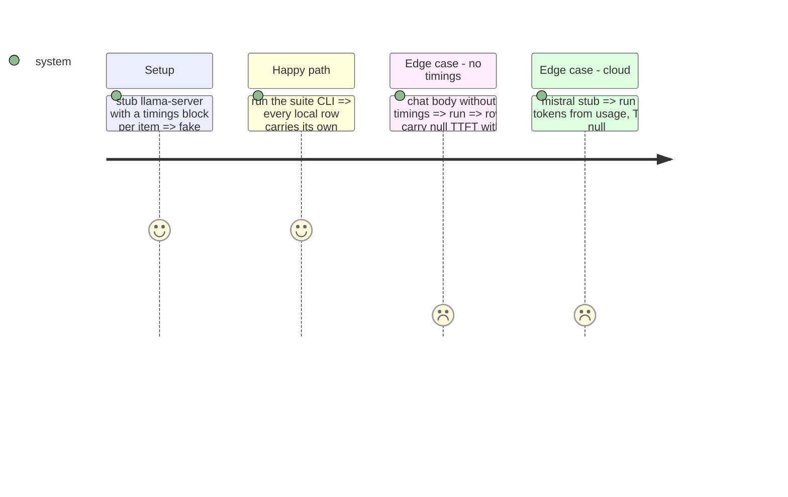

# Instruction: Both quality writers populate the fields

## Architecture projection

```txt
.
├── src/wave_local_ai_v2/
│   ├── quality_cli.py     ✏️ _Completion carries the measurement; local, mistral, google build it; rows publish it
│   └── judge_probe.py     ✏️ same for the probe's local batch and its cloud subject item
└── tests/                 ✏️ test_quality_cli, test_judge_probe
```

## User Journey



## Test Scope



## Tasks to do

### `1)` Suite CLI

1. `_Completion.measurement`; built at the local, Mistral and Google call sites (Google pre-flight refusal => `no_generation_call`).
2. `_score_and_write` adds `item_measurement_fields(...)` per row, first flag on the invocation's first generation.

### `2)` Judged probe

1. Same for `_generate_local_outputs` and `_run_cloud_subject_item`; `_build_row` takes the block.

## Test acceptance criteria

| Task | Acceptance criteria              |
| ---- | -------------------------------- |
| 1 | Each local row's tokens and TTFT equal its own constructed response's, exactly one row of the batch is first |
| 2 | Probe rows pass the gate with the same fields populated |
