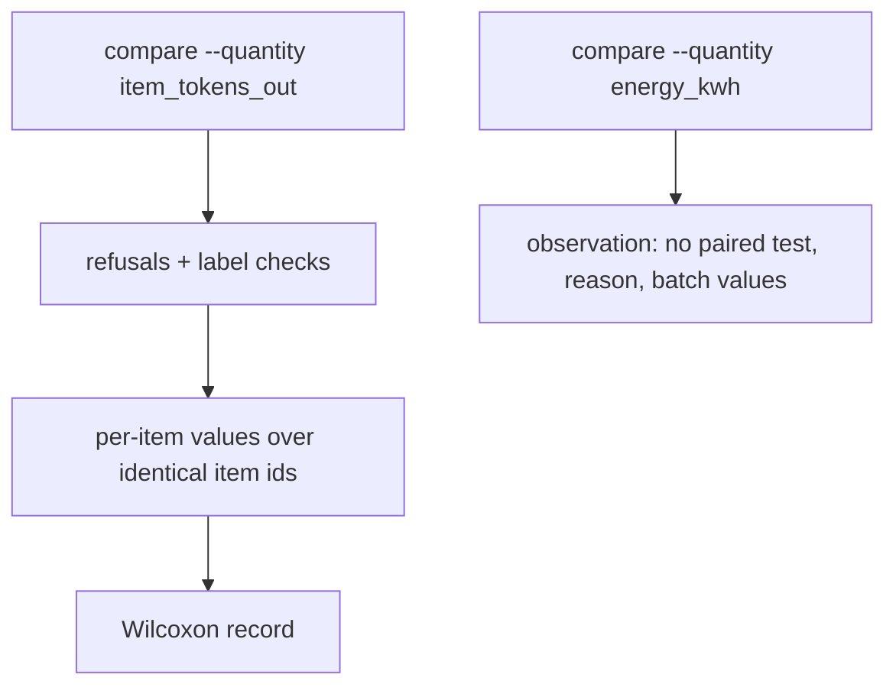
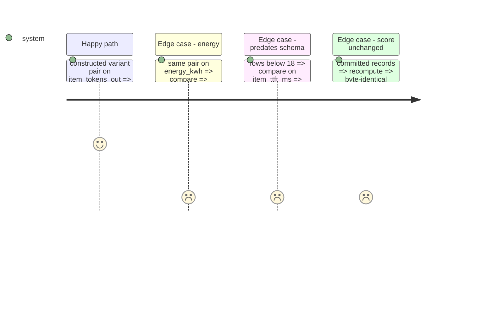

# Instruction: Per-item quantities as compared fields; energy as an observation

## Architecture projection

```txt
.
├── src/wave_local_ai_v2/
│   ├── comparison.py      ✏️ compared quantity, continuous_measurement kind => Wilcoxon, energy observation, family identity
│   ├── read_model.py      ✏️ the eleven fields partitioned (not rendered)
│   └── bundle_export.py   ✏️ the eleven fields described
└── tests/                 ✏️ test_comparison, test_read_model, test_bundle_export
```

## User Journey



## Test Scope



## Tasks to do

### `1)` Comparison

1. Quantity constants, scoring kind `continuous_measurement` in the test table with its reason.
2. `compare_sides(..., quantity=)`; refusals for an absent field or mismatched labels; energy member.
3. Family definition and key and default path carry a non-score quantity; `--quantity` flag.

### `2)` Read side

1. Read-model partition, bundle dictionary, `EXCLUDED_FROM_DIFFERING`.

## Test acceptance criteria

| Task | Acceptance criteria              |
| ---- | -------------------------------- |
| 1 | A constructed baseline/variant pair compared on output tokens produces a Wilcoxon record over identical item ids; energy is an observation saying why |
| 2 | The bundle export and the read-model partition accept a schema "18" row; score records are unchanged |
