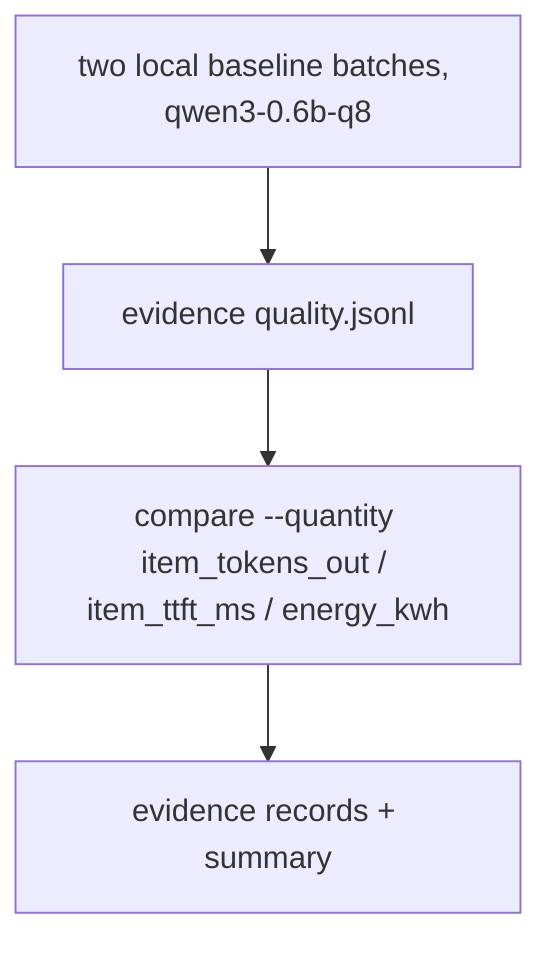
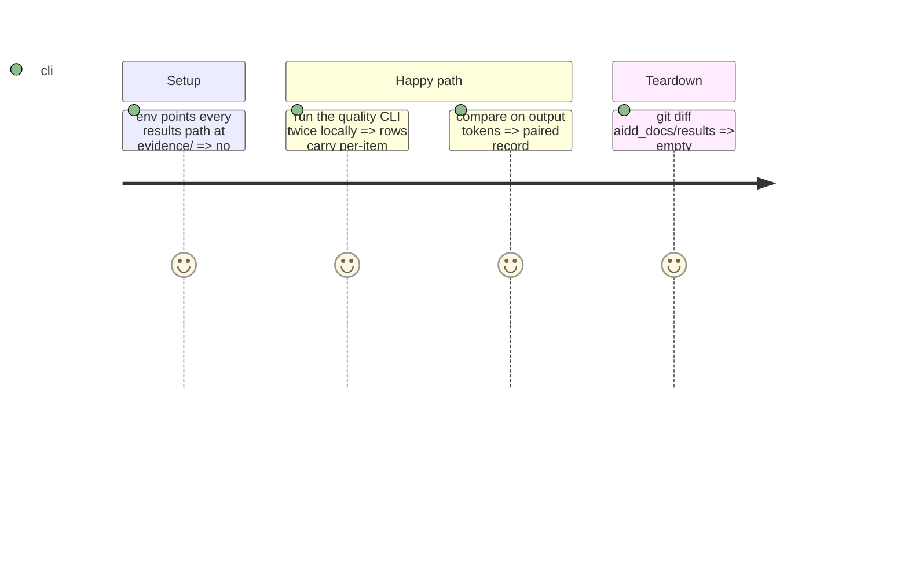

# Instruction: Docs and the local-run evidence

## Architecture projection

```txt
.
├── CHANGELOG.md                         ✏️ schema "18"
├── aidd_docs/memory/cli.md              ✏️ --quantity on the compare command
├── aidd_docs/results/README.md          ✏️ the per-item fields and how to read them (no figures)
└── aidd_docs/tasks/2026_10/2026_10_01_quality-item-tokens-and-first-token-time/evidence/  ✅ run output
```

## User Journey



## Test Scope



## Tasks to do

### `1)` Docs

1. CHANGELOG, cli.md, results README.

### `2)` Evidence

1. Two local runs into `evidence/`, the three comparison records, a summary file.

## Test acceptance criteria

| Task | Acceptance criteria              |
| ---- | -------------------------------- |
| 1 | A reader finds the fields, their labels and the energy rule documented |
| 2 | Real rows carry per-item figures and a paired output-token record exists; committed stores unchanged |
