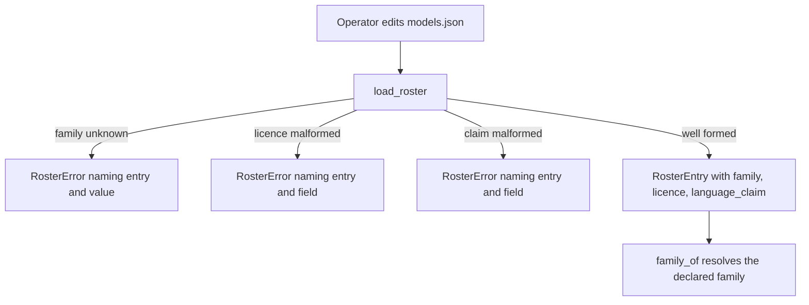
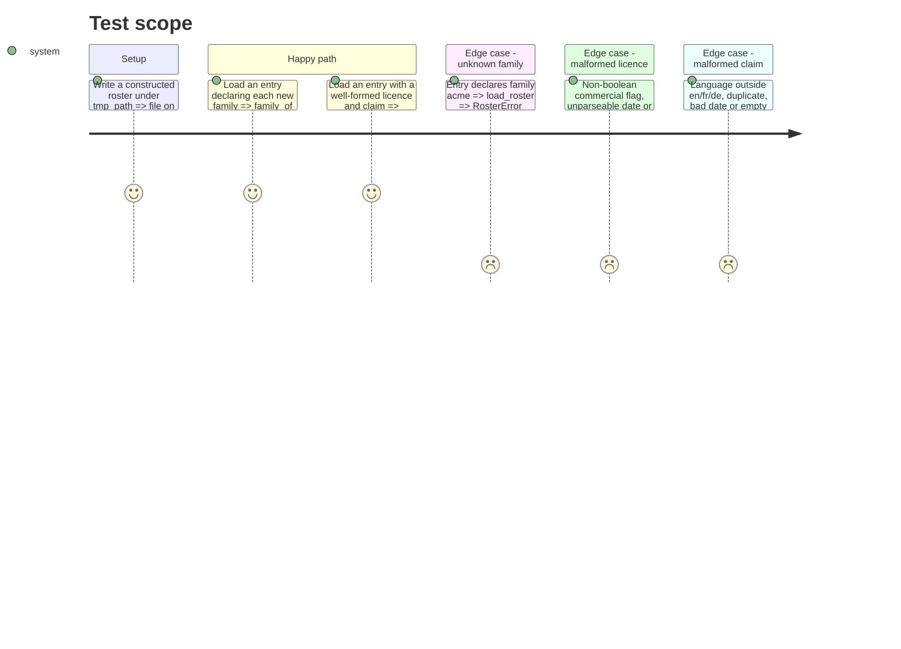

# Instruction: Families, family check and block validation

## Architecture projection

> Tree of the final files. ✅ create · ✏️ modify · ❌ delete

```txt
.
├── src/wave_local_ai_v2/roster.py   ✏️ KNOWN_FAMILIES grown; family checked at load; Licence + LanguageClaim parsed and validated
└── tests/test_roster.py             ✏️ new-family, unknown-family, malformed-licence, malformed-claim tests
```

## User Journey



## Test Scope



## Tasks to do

### `1)` Grow the family set and check it at load

> Every candidate vendor resolves; a declared unknown family never loads.

1. Add `FAMILY_IBM`, `FAMILY_LIQUID`, `FAMILY_MICROSOFT`; add them to `KNOWN_FAMILIES`; comment the vendor-lineage rule (Q11).
2. In `_parse_entry`, refuse a present `family` not in `KNOWN_FAMILIES`, naming entry and value.

### `2)` Licence and language-claim blocks

> Optional, shape-validated blocks on `RosterEntry`.

1. Frozen dataclasses `Licence` and `LanguageClaim`; optional fields on `RosterEntry`.
2. Parsers refusing: non-object block, missing key, empty id, non-bool flag, unparseable ISO date, empty URL, a language outside `en`/`fr`/`de` or repeated, an empty `statement`.

### `3)` Tests

1. Parametrised new-family load + `family_of`; unknown family at load; each malformed field named; absent blocks load as `None`.

## Test acceptance criteria

| Task | Acceptance criteria |
| ---- | ------------------- |
| 1 | An entry with `family` `ibm`, `liquid`, `microsoft`, `google` or `mistral` loads and resolves; `acme` is refused at load naming the entry and `acme`; no previous value is removed. |
| 2 | Each malformed licence or claim field is refused naming the entry and the field; a roster with no blocks still loads. |
| 3 | `uv run pytest tests/test_roster.py` passes. |
