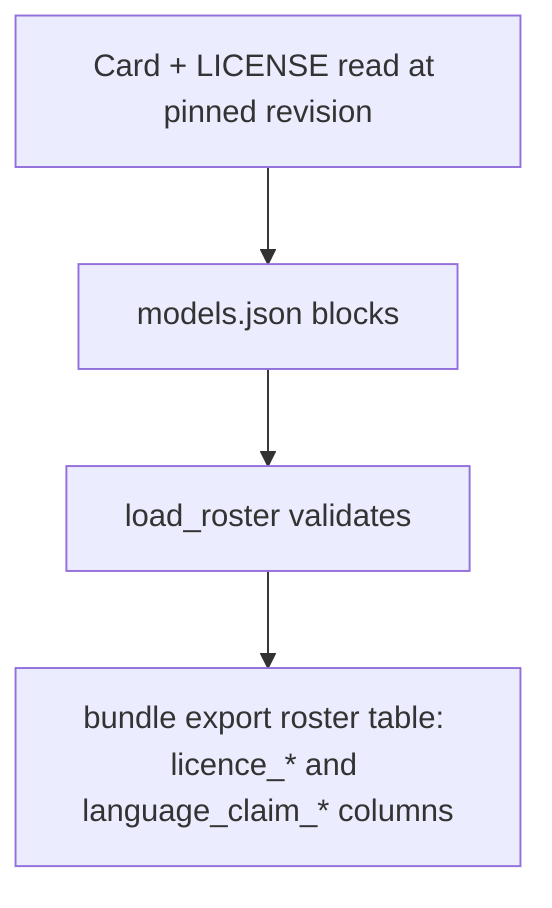
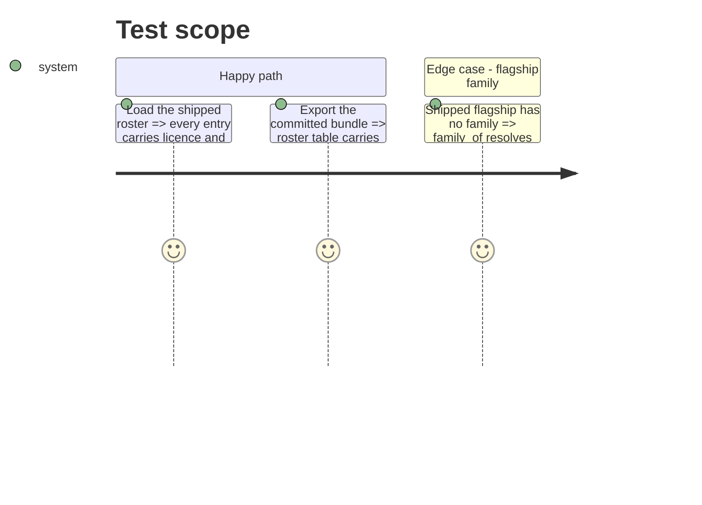

# Instruction: Shipped blocks, version bump and the export

## Architecture projection

> Tree of the final files. ✅ create · ✏️ modify · ❌ delete

```txt
.
├── aidd_docs/roster/models.json                     ✏️ licence + language_claim on four entries; roster_version 3
├── src/wave_local_ai_v2/bundle_export.py            ✏️ dictionary entries for both blocks; owned-elsewhere licence entry removed
├── tests/test_roster.py                             ✏️ shipped entries carry both blocks; shipped version 3
├── tests/test_bundle_export.py                      ✏️ licence columns carried, no longer owned elsewhere
├── aidd_docs/results/README.md                      ✏️ owned-elsewhere list
├── aidd_docs/memory/cli.md                          ✏️ roster_version 3 and the two blocks
└── aidd_docs/tasks/2026_10/2026_10_01_roster-entry-family-licence-language/evidence/ ✅ cards, licences, sources.md
```

## User Journey



## Test Scope



## Tasks to do

### `1)` Fill the shipped file

1. Add both blocks to the four entries from `evidence/sources.md`; bump `roster_version` to 3.

### `2)` Export dictionary

1. `ROSTER_ENTRY_FIELDS` entries for `licence.*` and `language_claim.*`; drop the "roster licence block" owned-elsewhere entry.

### `3)` Tests and docs

1. Shipped-file test asserting both blocks on every entry; version line to 3.
2. Bundle-export test: licence columns are headers of the roster table.
3. Results README and `cli.md` follow.

## Test acceptance criteria

| Task | Acceptance criteria |
| ---- | ------------------- |
| 1 | The shipped roster loads at version 3 with both blocks on all four entries; fiche hashes unchanged. |
| 2 | Export succeeds; every roster column has a dictionary entry. |
| 3 | `uv run pytest` passes at >= 95% coverage; `tests/test_reference_bundle.py` unchanged and passing. |
