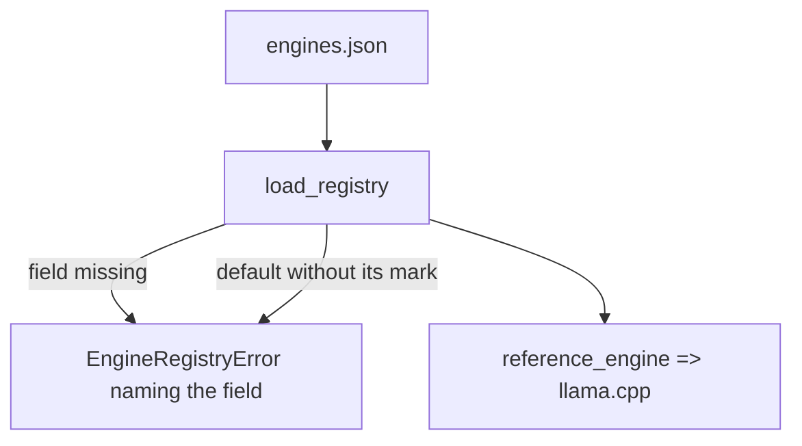
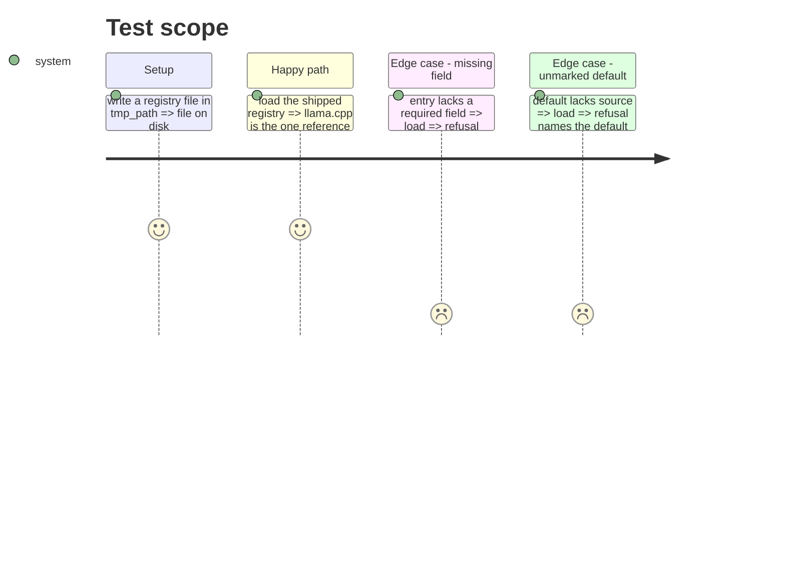

<!-- Fill or omit these sections; never add, rename, or reorder one. -->

# Instruction: Engine registry and its loader

## Architecture projection

```txt
.
├── aidd_docs/roster/engines.json          ✅ one entry, llama.cpp, reference, spawned
├── src/wave_local_ai_v2/engines.py        ✅ loader, refusals, build probe dispatch, config hash, base URL
└── tests/test_engines.py                  ✅ loader, refusals, config hash
```

## User Journey



## Test Scope



## Tasks to do

### `1)` Registry file

> One tracked `llama.cpp` entry.

1. `reference: true`, `build_probe` `{"method": "version_flag"}`, `endpoints` (chat, health, prompt_rendering, template_source), `lifecycle: spawned`, `host`, `default_port: 8080`, `thinking_switch`, `config_normalisation`, `configuration_defaults` (each `value`, `source`, `read_from`).

### `2)` Loader

> `engines.load_registry` refuses like `roster.load_roster`.

1. Required fields per block, named on refusal; lifecycle in `spawned`/`attached`; source in `declared`/`engine_reported`; exactly one reference; known probe method.
2. `reference_engine`, `resolve_engine`, `registered_engine_ids` (cached tracked file), `probe_build`, `config_hash`, `base_url`.

## Test acceptance criteria

| Task | Acceptance criteria              |
| ---- | -------------------------------- |
| 1-2 | The shipped registry loads and names `llama.cpp` as its one reference engine |
| 2 | Removing any required field refuses the load naming it; a default without `declared`/`engine_reported` is refused |
| 2 | The configuration hash is identical for two model directories and ignores host and port |
