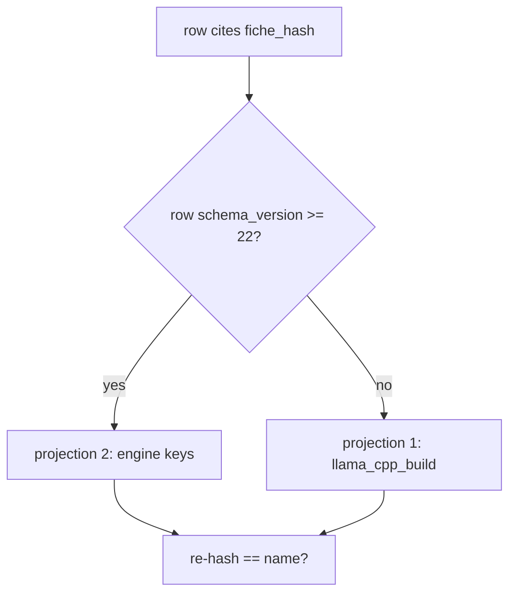
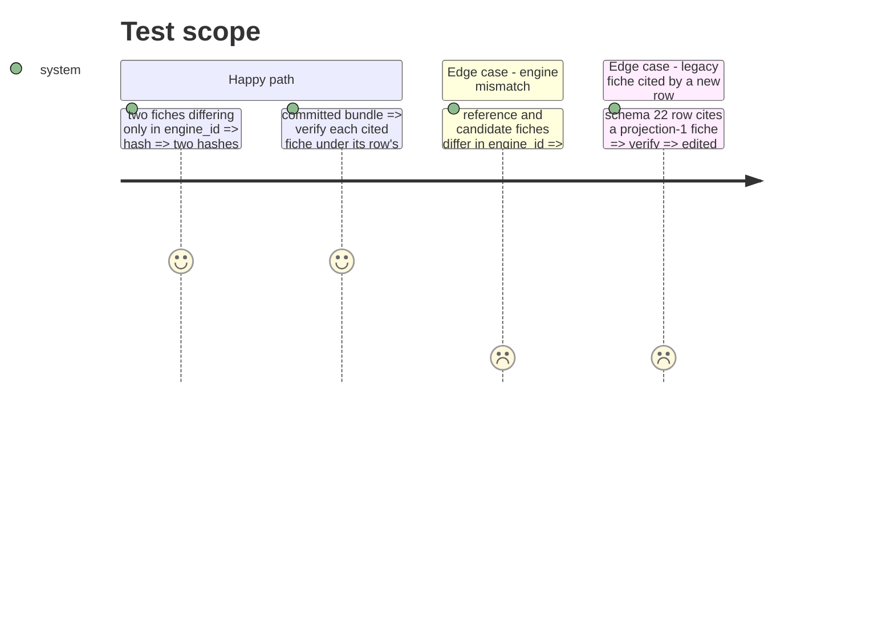

<!-- Fill or omit these sections; never add, rename, or reorder one. -->

# Instruction: Fiche generalised, two projection versions, verdict blocking fields

## Architecture projection

```txt
.
├── src/wave_local_ai_v2/hardware.py          ✏️ engine fields, FICHE_PROJECTIONS
├── src/wave_local_ai_v2/fiche_registry.py    ✏️ verify under the citing row's projection
├── src/wave_local_ai_v2/fiche_validator.py   ✏️ pass the row's schema_version
├── src/wave_local_ai_v2/verdict.py           ✏️ engine_id/engine_build blocking
├── tests/test_hardware.py                    ✏️
├── tests/test_fiche_registry.py              ✏️
├── tests/test_fiche_validator.py             ✏️
├── tests/test_verdict.py                     ✏️
└── tests/test_reference_bundle.py            ✏️ verify_fiche call passes schema_version
```

## User Journey



## Test Scope



## Tasks to do

### `1)` Fiche and projections

1. `Fiche`: `engine_id`, `engine_build`, `engine_config_hash` replace `llama_cpp_build`; `build_fiche` takes them.
2. `FICHE_PROJECTIONS` `"1"`/`"2"`, `CURRENT_FICHE_PROJECTION`; `normalise_fiche`/`fiche_hash` take a projection; a missing key raises `FicheProjectionError`.

### `2)` Verification and verdict

1. `row_contract.ENGINE_FICHE_SCHEMA_VERSION`, `fiche_projection_for`; `verify_fiche(..., schema_version=)`; validator passes it.
2. `_RUNTIME_BLOCKING_FIELDS` = `engine_id`, `engine_build`, `quant`, `gpu_name`, `flags`, read with `.get`.

## Test acceptance criteria

| Task | Acceptance criteria              |
| ---- | -------------------------------- |
| 1 | Fiches identical except `engine_id` (or `engine_build`, or the config hash) hash differently; key order irrelevant |
| 2 | The committed bundle's fiches verify `ok` under the rows' own versions with no bundle file edited |
| 2 | An engine mismatch is `not_comparable` naming `engine_id`, never `not_reproduced` |
