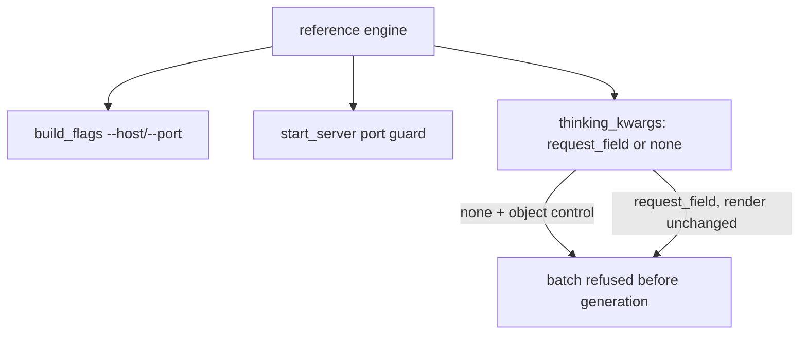
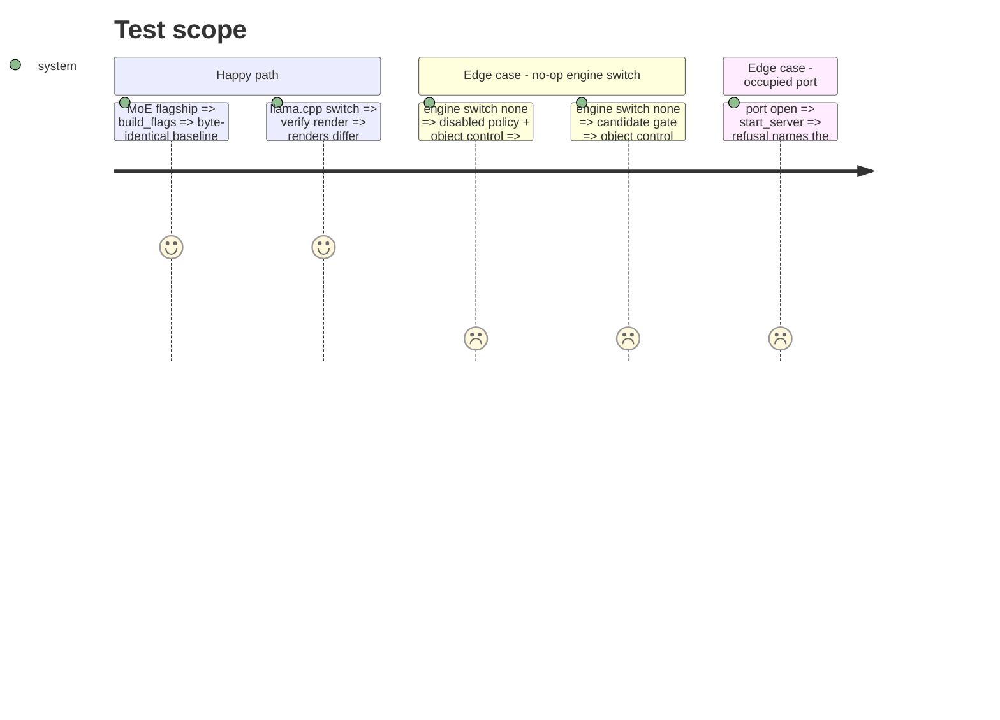

<!-- Fill or omit these sections; never add, rename, or reorder one. -->

# Instruction: Launch, build probe and thinking switch read from the entry

## Architecture projection

```txt
.
├── src/wave_local_ai_v2/server.py          ✏️ host, port, health, lifecycle from the entry
├── src/wave_local_ai_v2/local_client.py    ✏️ thinking switch from the entry, `check_engine_carries`
├── src/wave_local_ai_v2/candidate_gate.py  ✏️ base URL and port guard from the entry; refuses a control the engine cannot carry
├── tests/test_server.py                    ✏️
├── tests/test_roster.py                    ✏️ host/port expectation from the entry
├── tests/test_local_client.py              ✏️
└── tests/test_launch_byte_identical.py     unedited, green
```

## User Journey



## Test Scope



## Tasks to do

### `1)` Server

1. Drop `HOST`/`PORT`; `build_flags`, `start_server`, `running_server` take `engine` (default: the tracked reference engine); refuse a non-`spawned` engine.

### `2)` Thinking switch

1. `thinking_kwargs(policy, entry, engine)` through `check_engine_carries(entry_id, control, engine)`, shared with the candidate gate's `thinking_control` step.

## Test acceptance criteria

| Task | Acceptance criteria              |
| ---- | -------------------------------- |
| 1 | `tests/test_launch_byte_identical.py` passes unedited; an occupied port still refuses |
| 2 | A roster control spelled outside the engine's field is refused naming the engine; an engine declaring `none` refuses a `disabled` batch with an object control, and the candidate gate refuses such a candidate |
