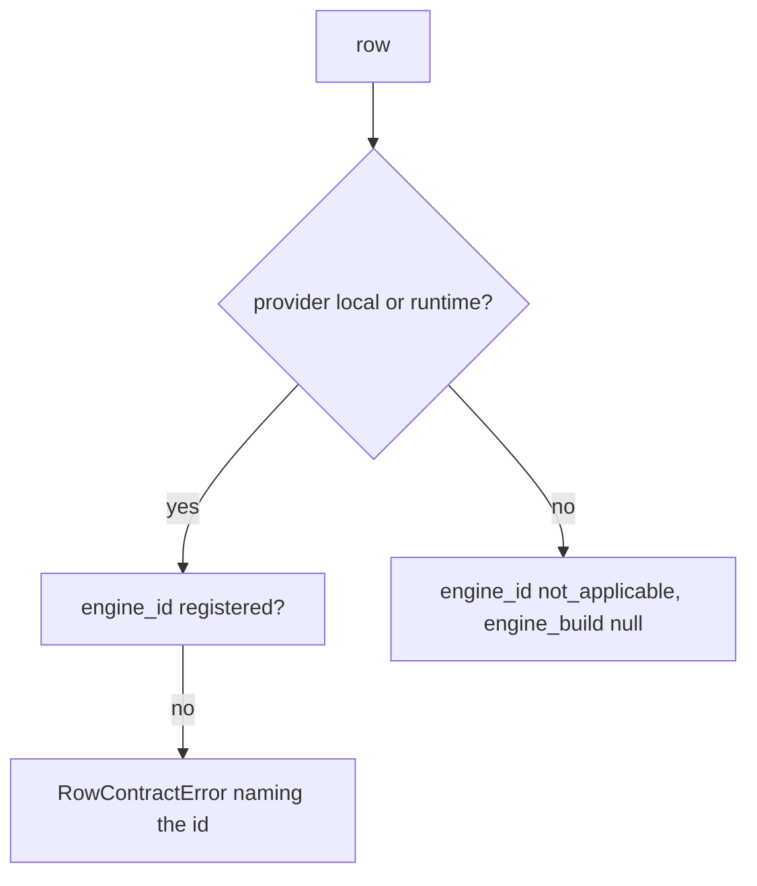

<!-- Fill or omit these sections; never add, rename, or reorder one. -->

# Instruction: Row fields, writer gate, schema 22, writers, resume check, comparison axis, read model, export, docs

## Architecture projection

```txt
.
├── src/wave_local_ai_v2/row_contract.py     ✏️ schema 22, engine_id/engine_build owed from "22", gate
├── src/wave_local_ai_v2/__init__.py         ✏️ runtime row + fiche from the engine
├── src/wave_local_ai_v2/quality_cli.py      ✏️ local vs not-applicable rows, engine fields in the resume check
├── src/wave_local_ai_v2/judge_probe.py      ✏️ same
├── src/wave_local_ai_v2/comparison.py       ✏️ engine fields on the `model` axis only local-vs-cloud
├── src/wave_local_ai_v2/read_model.py       ✏️ two fields rendered in both views
├── src/wave_local_ai_v2/bundle_export.py    ✏️ dictionary entries (row + fiche)
├── tests/ (row_contract, cli, quality_cli, judge_probe, results, read_model, bundle_export, store_fixtures) ✏️
├── CHANGELOG.md                             ✏️
├── aidd_docs/memory/architecture.md         ✏️ fiche description
├── aidd_docs/memory/cli.md                  ✏️ engine registry note
└── aidd_docs/results/README.md              ✏️ projection versions
```

## User Journey



## Test Scope

```mermaid
---
title: Test scope
---
journey
  section Happy path
    runtime CLI with stubbed server => one row => engine_id llama.cpp and probed build: 5: cli
  section Edge case - unregistered engine
    row names ollama => append_row => refused naming ollama: 1: system
  section Edge case - cloud row
    mistral row names llama.cpp => validate => refused; not_applicable passes: 1: system
```

## Tasks to do

### `1)` Contract

1. `SCHEMA_VERSION = "22"` with history; both fields owed on both kinds from "22" (`ENGINE_FIELDS`); `_validate_engine`.

### `2)` Writers and readers

1. Three writers build the fiche from `engines` and stamp the rows; read model and export describe the fields.
2. The quality CLI's and the judge probe's `--resume` configuration check compares `engine_id` / `engine_build`.
3. `comparison._axis`: along `model`, the engine fields join the axis only between a local and a cloud side.

### `3)` Docs

1. CHANGELOG Unreleased, architecture fiche gotcha, cli.md, results README.

## Test acceptance criteria

| Task | Acceptance criteria              |
| ---- | -------------------------------- |
| 1 | A local row missing either field, or naming an unregistered engine, is refused naming it; a cloud row must state not applicable |
| 2 | Runtime rows and local quality rows carry `engine_id` and the probed `engine_build`; cloud rows carry `not_applicable` |
| 2 | The export refuses no field; read-model partition tests stay set-equal |
| 2 | A resume over rows of another engine or build is refused naming the field, writing nothing |
| 2 | Two local sides on another engine or build compare as an observation naming the confound; local versus cloud stays a test |
