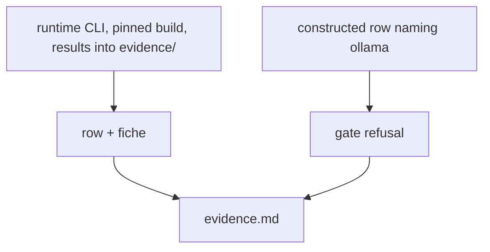

<!-- Fill or omit these sections; never add, rename, or reorder one. -->

# Instruction: Live evidence on qwen3-0.6b-q8

## Architecture projection

```txt
.
└── aidd_docs/tasks/2026_10/2026_10_01_row-names-engine-fiche-hashes-it/evidence/  ✅ run output, fiche, gate refusal
```

## User Journey



## Test Scope

```mermaid
---
title: Test scope
---
journey
  section Happy path
    run wave-local-ai-v2 on qwen3-0.6b-q8 => row shows engine_id, engine_build, fiche_hash; fiche shows engine_config_hash: 5: cli
  section Edge case - unregistered engine
    validate a row naming ollama => refusal names ollama: 1: cli
```

## Tasks to do

### `1)` Runtime run

1. `LLAMA_SERVER_PATH`, `SLM_MODELS_DIR`, `ROSTER_ENTRY_ID=qwen3-0.6b-q8`, results and fiche registry under `evidence/`.

### `2)` Gate refusal and thinking switch

1. Constructed row through `append_row`; a local-only quality run printing the verified render difference.

## Test acceptance criteria

| Task | Acceptance criteria              |
| ---- | -------------------------------- |
| 1 | The evidence file shows `engine_id`, the live `engine_build`, `engine_config_hash` and the new `fiche_hash` |
| 2 | The evidence file shows the gate refusal naming the unregistered engine |
