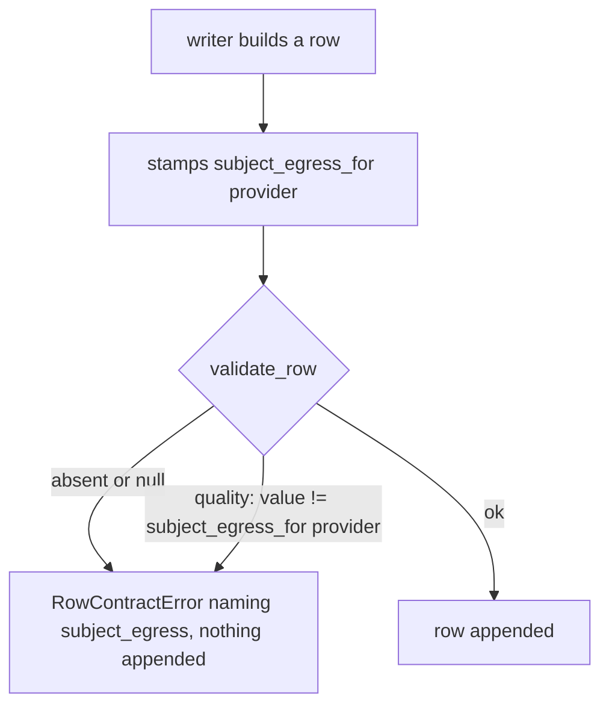
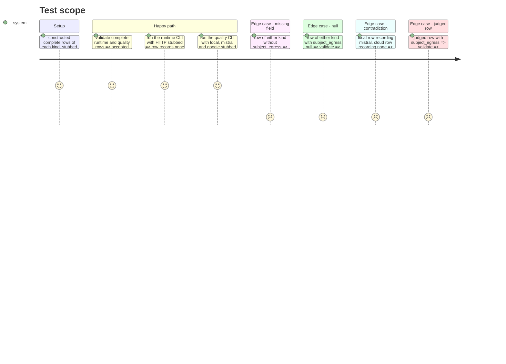

# Instruction: The field on the contract, its refusals, the three writers stamping it, and the registries that partition the contract

## Architecture projection

> Tree of the final files. ✅ create · ✏️ modify · ❌ delete

```txt
.
├── src/wave_local_ai_v2/
│   ├── row_contract.py      ✏️ `subject_egress` on both kinds, null/consistency refusals, helper, schema "16"
│   ├── __init__.py          ✏️ runtime writer stamps `none`
│   ├── quality_cli.py       ✏️ quality writer stamps `none` or the provider id
│   ├── judge_probe.py       ✏️ probe writer stamps it (same gate)
│   ├── read_model.py        ✏️ field in both not-rendered sets
│   ├── bundle_export.py     ✏️ dictionary entry
│   └── comparison.py        ✏️ field in the `model` dimension
└── tests/
    ├── test_row_contract.py     ✏️ refusals, schema pin
    ├── test_cli.py              ✏️ runtime row records `none`
    ├── test_quality_cli.py      ✏️ local `none`, mistral and google their ids
    ├── test_judge_probe.py      ✏️ probe rows record their subject egress beside an unchanged judge block
    ├── test_comparison.py       ✏️ local vs cloud not refused on `subject_egress`
    ├── test_results.py          ✏️ complete fixture rows
    ├── test_prompt_provenance.py ✏️ minimal fixture rows
    └── test_bundle_export.py    ✏️ field named as a contract field
```

## User Journey



## Test Scope



## Tasks to do

### `1)` The contract

> `subject_egress` is required, non-null and consistent with `provider`.

1. Add `subject_egress` to both `REQUIRED_FIELDS` sets; constants `SUBJECT_EGRESS_NONE`, `SUBJECT_PROVIDER_LOCAL`; helper `subject_egress_for(provider)`.
2. `_validate_subject_egress(kind, row)`: refuse null, non-string/empty; on quality refuse a value other than `subject_egress_for(provider)`.
3. Bump `SCHEMA_VERSION` to "16" with its reason in the comment block.

### `2)` The writers

> Every row is stamped where it is built.

1. `__init__.py`: `subject_egress_for("local")`-equivalent `none`.
2. `quality_cli._score_and_write` and `judge_probe._build_row`: `subject_egress_for(provider)`.

### `3)` The registries

> Every partition of the contract describes the field.

1. `read_model`: both not-rendered sets. `bundle_export`: common dictionary entry. `comparison`: `model` dimension.

### `4)` Tests

1. Row-contract refusals, schema pin moves to "16"; CLI and probe assertions; comparison regression; fixtures gain the field.

## Test acceptance criteria

| Task | Acceptance criteria              |
| ---- | -------------------------------- |
| 1 | A row of either kind missing `subject_egress`, or carrying it as null, is refused naming the field; a `local` quality row recording a provider and a cloud row recording `none` are refused |
| 1 | A judged row validates its judge egress block unchanged |
| 2 | A runtime row and a local quality row record `none`; Mistral and Google subject rows record `mistral` and `google`; probe rows record theirs |
| 3 | The read-model and bundle partition tests pass; a local vs cloud model comparison is not refused on `subject_egress` |
| 4 | `uv run pytest` passes at the 95% floor; committed stores still validate |
