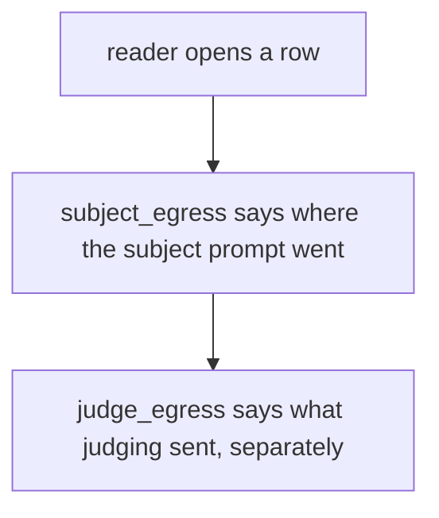
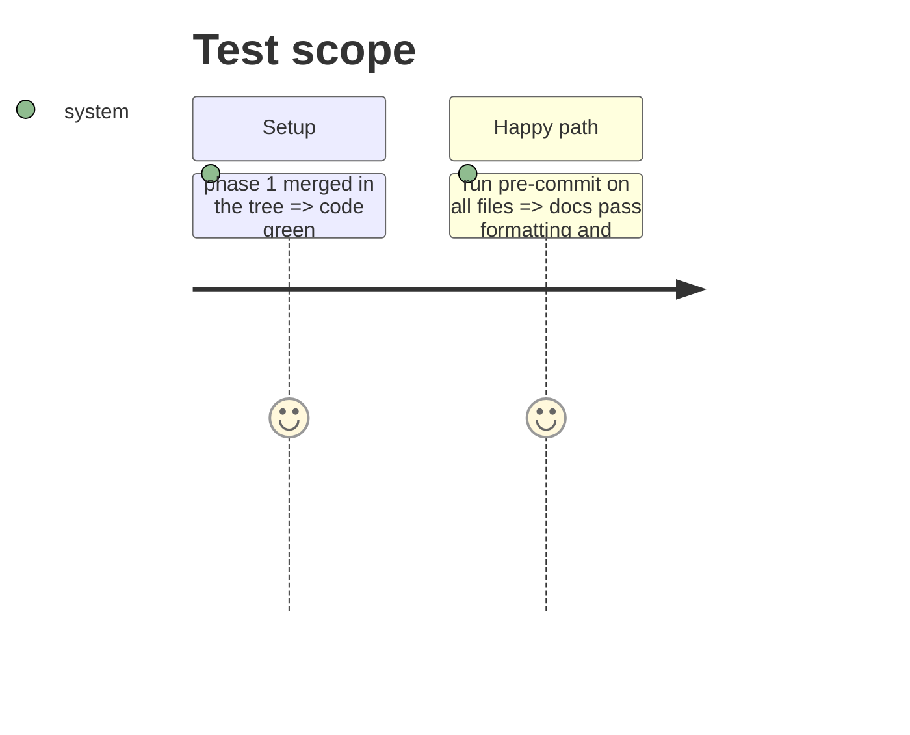

# Instruction: CHANGELOG, results README and memory describe schema "16"

## Architecture projection

> Tree of the final files. ✅ create · ✏️ modify · ❌ delete

```txt
.
├── CHANGELOG.md                   ✏️ Added entry for schema "16"
├── aidd_docs/results/README.md    ✏️ dictionary paragraph + a section on what `subject_egress` records
└── aidd_docs/memory/architecture.md ✏️ one gotcha line: subject vs judge egress
```

## User Journey



## Test Scope



## Tasks to do

### `1)` Docs

> A reader learns the field and its limits without reading the code.

1. CHANGELOG `### Added` entry naming the field, the refusals and the schema bump.
2. Results README: add the field to the dictionary paragraph's list of post-"7" fields; short section stating what it records, that it covers the subject call only, and that committed rows predate it.
3. Memory: one line under architecture Gotchas.

## Test acceptance criteria

| Task | Acceptance criteria              |
| ---- | -------------------------------- |
| 1 | The CHANGELOG, README and memory name `subject_egress`, schema "16", and that judge egress stays separate |
