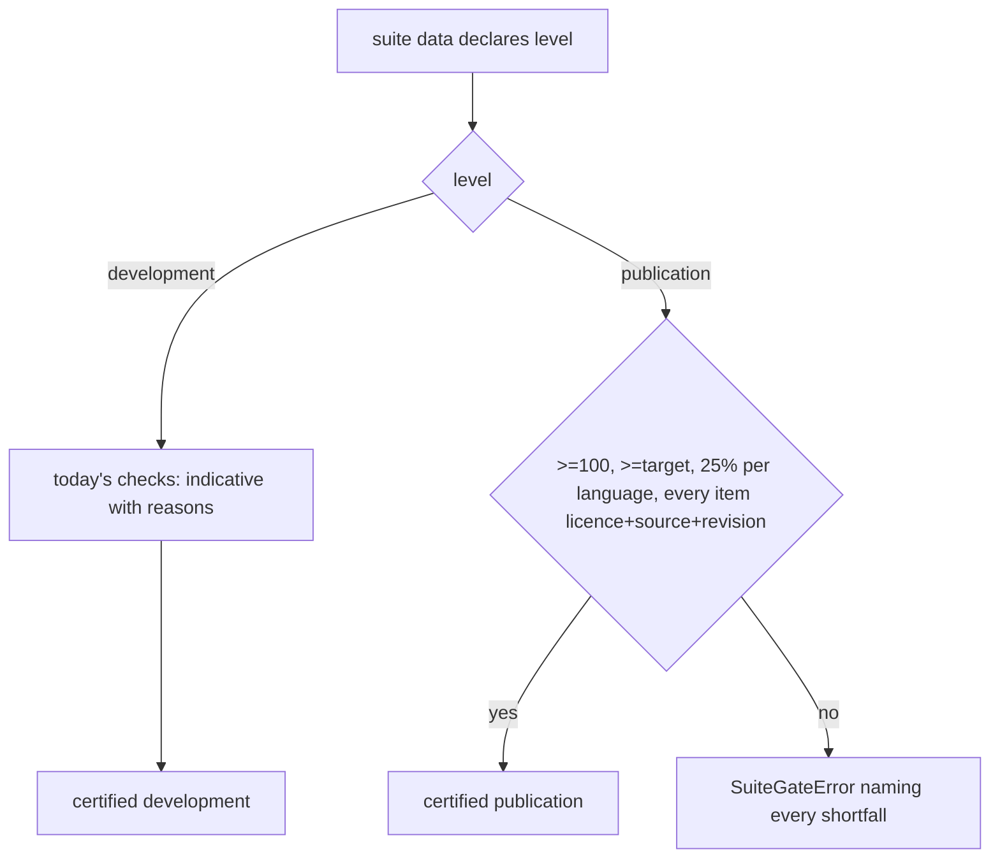
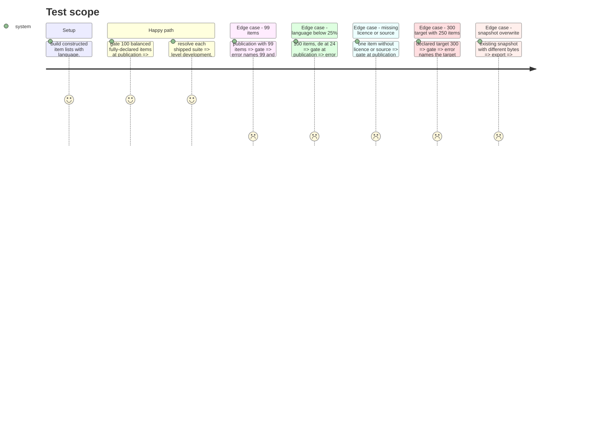

# Instruction: The two-level gate, the declarations in the suite data, the version bump and write-once snapshots

## Architecture projection

> Tree of the final files. ✅ create · ✏️ modify · ❌ delete

```txt
.
├── src/wave_local_ai_v2/
│   ├── suite_gate.py                         ✏️ levels, publication checks, `level` in the result
│   ├── suite_registry.py                     ✏️ `level` core key, size target passed to the gate
│   ├── suite_snapshot.py                     ✏️ `level` exported, write-once export
│   ├── classification_suite.py               ✏️ rationale for "4", level and licence
│   ├── translation_suite.py                  ✏️ rationale for "3", level and licence
│   └── suite_data/
│       ├── classification-support-routing.json   ✏️ version "4", level, item licence
│       └── translation-business-short-form.json  ✏️ version "3", level, item licence
├── aidd_docs/results/suite-definitions/
│   ├── classification-support-routing@4.json ✅
│   └── translation-business-short-form@3.json ✅
└── tests/
    ├── test_suite_gate.py                    ✏️ publication cases
    ├── test_suite_registry.py                ✏️ new versions, level key
    ├── test_suite_snapshot.py                ✏️ predecessors, write-once refusal
    └── test_classification_suite.py          ✏️ version pin
```

## User Journey



## Test Scope



## Tasks to do

### `1)` Gate levels

> `gate_suite` certifies a declared level or refuses it.

1. Add `LEVEL_DEVELOPMENT`, `LEVEL_PUBLICATION`, `SUITE_LEVELS`, `MIN_PUBLICATION_SUITE_ITEMS = 100`, `PUBLICATION_SIZE_TARGETS = (100, 300)`, `HAND_WRITTEN_LICENCE = "CC-BY-4.0"`.
2. `gate_suite(items, *, level=development, size_target=None, size_target_reason=None)`; validate optional item `licence`/`source`/`source_revision` as non-empty strings; refuse an unknown level and a size target on a development suite.
3. At publication: collect every shortfall (count vs floor and target, missing/invalid target or reason, language share, items missing licence/source/revision) and raise one `SuiteGateError` naming them; else return the result with `level`.

### `2)` Data and registry

> The shipped suites declare `development` and each item's licence.

1. `level` into `_CORE_KEYS`, `SuiteDefinition.level`; pass `level`, `size_target`, `size_target_reason` (from data) to the gate.
2. Both JSON files: `level: "development"`, each item `licence: "CC-BY-4.0"`, version bump.
3. Suite modules' docstrings: why the bump, why the level, why the licence.

### `3)` Snapshots

> The export carries `level` and never overwrites a published file.

1. `build_snapshot` exports `level`.
2. `main()` refuses a differing existing file; re-export writes the two new files.

## Test acceptance criteria

| Task | Acceptance criteria              |
| ---- | -------------------------------- |
| 1 | 99 items at publication fails naming the count; 100 with one language at 24% fails naming it; an item without licence or source fails naming the item; target 300 with 250 items fails naming the target; a compliant publication suite returns `level` `publication` |
| 2 | Both shipped suites resolve at `development`, `indicative` False, same per-language cells and prompt-set hashes as before |
| 3 | `@4`/`@3` snapshots carry `level` and every item's `licence`; `@3`/`@2` bytes untouched; overwriting a differing snapshot is refused |
