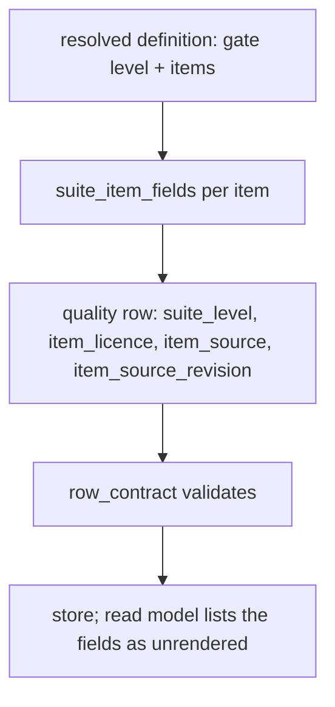
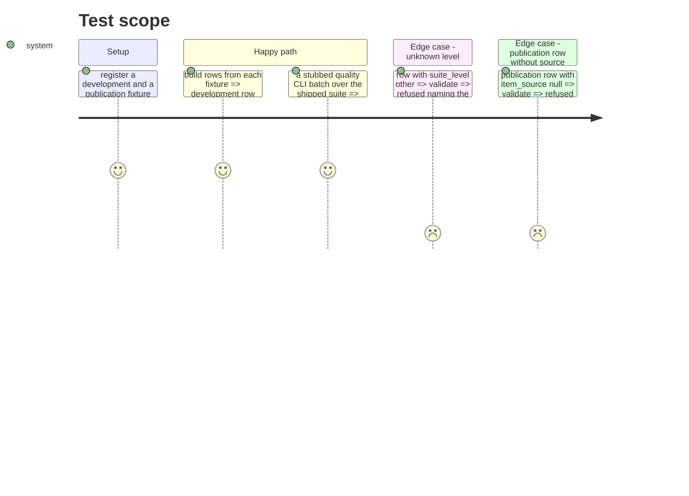

# Instruction: The level and the item licence/source on every quality row, the view partition, the export dictionary, docs and evidence

## Architecture projection

> Tree of the final files. ✅ create · ✏️ modify · ❌ delete

```txt
.
├── src/wave_local_ai_v2/
│   ├── row_contract.py        ✏️ four required quality fields, SCHEMA_VERSION "15", level checks
│   ├── quality_rows.py        ✏️ `suite_item_fields`
│   ├── quality_cli.py         ✏️ rows carry the four fields
│   ├── judge_probe.py         ✏️ rows carry the four fields; items declare their licence
│   ├── read_model.py          ✏️ the four fields declared unrendered
│   └── bundle_export.py       ✏️ dictionary entries; owned-elsewhere block dropped
├── aidd_docs/results/README.md            ✏️ licence/source are declarations, not verified
├── aidd_docs/memory/cli.md                ✏️ level, write-once export
├── CHANGELOG.md                           ✏️
├── aidd_docs/tasks/.../evidence/          ✅ snapshot export evidence
└── tests/ (row fixtures + new row-level tests) ✏️
```

## User Journey



## Test Scope



## Tasks to do

### `1)` Row contract

> Every quality row names its level and its item's licence and source.

1. Add the four fields to `REQUIRED_FIELDS["quality"]`, bump to `"15"` with its history note.
2. Validate `suite_level` in `suite_gate.SUITE_LEVELS`; item fields null or non-empty string; non-null at publication.

### `2)` Writers

> Both writers build the fields through one helper.

1. `quality_rows.suite_item_fields(gate_result, item)`.
2. Use it in `quality_cli._score_and_write` and `judge_probe`'s row builder; probe items declare `licence`.

### `3)` Read and export

> The new fields are declared, not silently blank.

1. `read_model.QUALITY_FIELDS_NOT_RENDERED` gains the four.
2. `bundle_export.ROW_FIELDS` gains four `FieldDoc`s; drop the `item licence and source` owned-elsewhere entry and adjust its test.

### `4)` Docs and evidence

> The limit is disclosed, the export is shown.

1. `aidd_docs/results/README.md`: a section stating the levels and that licence/source are author declarations nothing verifies; fix the dictionary paragraph.
2. `cli.md`, `CHANGELOG.md`.
3. Run the snapshot export; save the decisive output (new files, hashes unchanged, predecessors untouched) under `evidence/`.

## Test acceptance criteria

| Task | Acceptance criteria              |
| ---- | -------------------------------- |
| 1 | A row missing any of the four fields is refused; an unknown level and a publication row with a null item source are refused |
| 2 | Rows from a development and a publication fixture each name their level; shipped-suite rows name `development` and `CC-BY-4.0` |
| 3 | The read-model partition and the dictionary/contract partition tests pass with the four fields |
| 4 | README states nothing verifies a declared licence or source; evidence shows `@4`/`@3` with level and licences and unchanged hashes |
