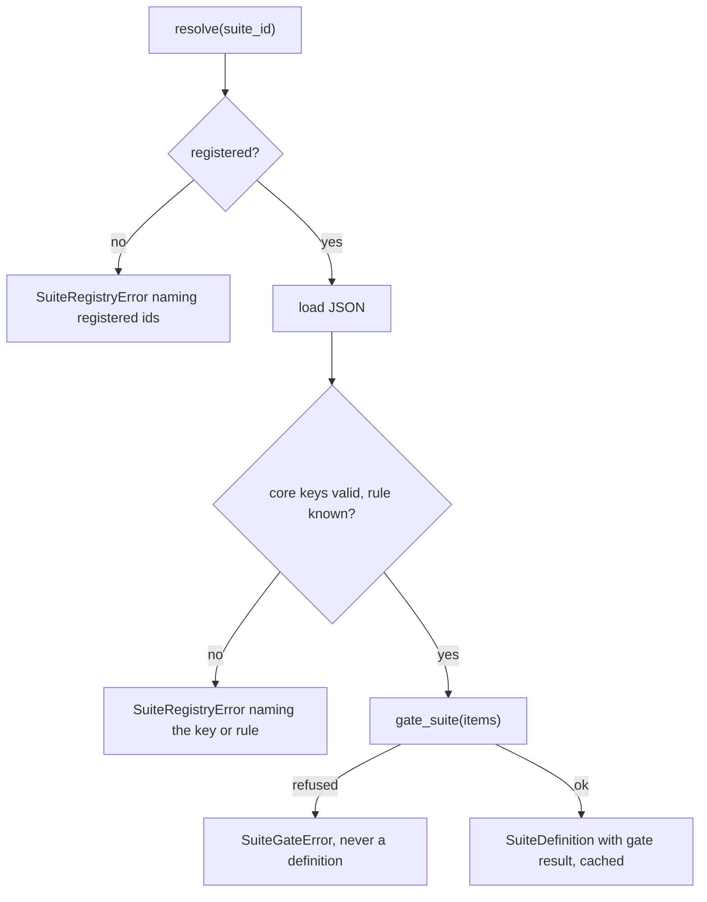
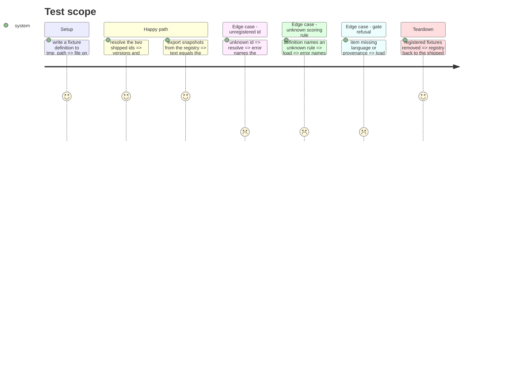

# Instruction: The suite registry, the data files, the named scoring rules, snapshots from the registry

## Architecture projection

> Tree of the final files. ✅ create · ✏️ modify · ❌ delete

```txt
.
├── src/wave_local_ai_v2/
│   ├── suite_registry.py                          ✅ SuiteDefinition, load/register/resolve, prompt_set_hash
│   ├── scoring_rules.py                           ✅ the two named scoring rules + their table
│   ├── suite_data/
│   │   ├── classification-support-routing.json    ✅ items, caps, rule name as data
│   │   └── translation-business-short-form.json   ✅ items, caps, rule name as data
│   ├── classification_suite.py                    ✏️ only LABELS + ClassificationItem + rationale remain
│   ├── translation_suite.py                       ✏️ only TranslationItem + rationale remain
│   ├── suite_snapshot.py                          ✏️ exports every registered definition
│   ├── row_contract.py                            ✏️ baseline check resolves suites through the registry
│   ├── judge_probe.py                             ✏️ prompt_set_hash from suite_registry
│   └── mistral_client.py                          ✏️ comment no longer names a removed constant
└── tests/
    ├── test_suite_registry.py                     ✅ load, refusals, gate at load, extras, pinned hashes
    ├── test_scoring_rules.py                      ✅ the two rules (moved from the CLI tests' reach)
    ├── test_classification_suite.py               ✏️ reads the registered definition
    ├── test_translation_suite.py                  ✏️ reads the registered definition
    ├── test_suite_snapshot.py                     ✏️ registry-driven builders, byte-equal files
    ├── test_suite_gate.py / test_results.py / test_row_contract.py  ✏️ registry instead of module constants
```

## User Journey



## Test Scope



## Tasks to do

### `1)` Data files

> Move both suites' items and caps into JSON with no value changed.

1. Generate both files from today's module constants with a one-off script (scratchpad), keys: `suite_id`, `suite_version`, `task_suite`, `scoring_rule`, `max_output_tokens`, `stop_sequences`, `context_length`, `thinking_policy`, `items`.
2. Check the generated items equal today's items field for field.

### `2)` Scoring rules

> The CLI's two batch scorers become named rules taking the cap as an argument.

1. `scoring_rules.py`: `exact_label_match`, `chrf_against_reference`, `SCORING_RULES`.

### `3)` Registry

> Load, validate, gate, register, resolve.

1. `SuiteDefinition` with the snapshot fields, `task_suite`, `scoring_rule`, `items`, `extra`, `gate`, and `score_batch(completions)`.
2. `load_definition(path)`: core-key validation, unknown rule refused by name, `gate_suite` at load.
3. `register`, `resolve`, `registered_ids`, `prompt_set_hash`.

### `4)` Migrate the suite modules and consumers

1. Strip items and caps from the two suite modules; keep `LABELS` and the TypedDicts; rationale into docstrings.
2. `suite_snapshot.py`, `row_contract._authored_prompt`, `judge_probe.py` onto the registry.

## Test acceptance criteria

| Task | Acceptance criteria              |
| ---- | -------------------------------- |
| 1 | Both shipped suites resolve with today's version and `PROMPT_SET_HASH` (pinned literals) |
| 2 | Each rule returns the same per-item and batch fields the CLI scorers returned |
| 3 | Unregistered id refused naming registered ids; unknown rule refused naming it; item missing language or provenance refused by the gate at load; extra suite and item keys carried |
| 4 | Regenerated snapshots equal the committed `@3`/`@2` files byte for byte (modulo platform newline); `git status` shows them unchanged |
