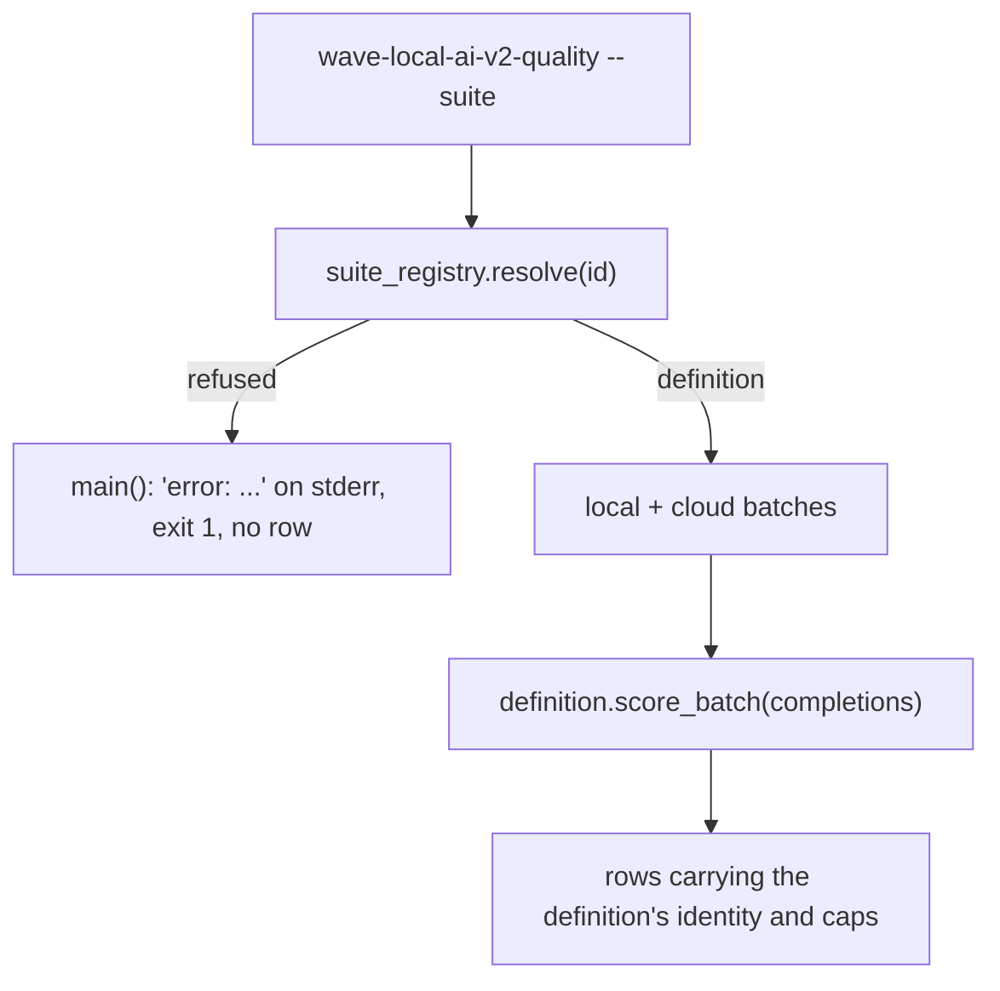
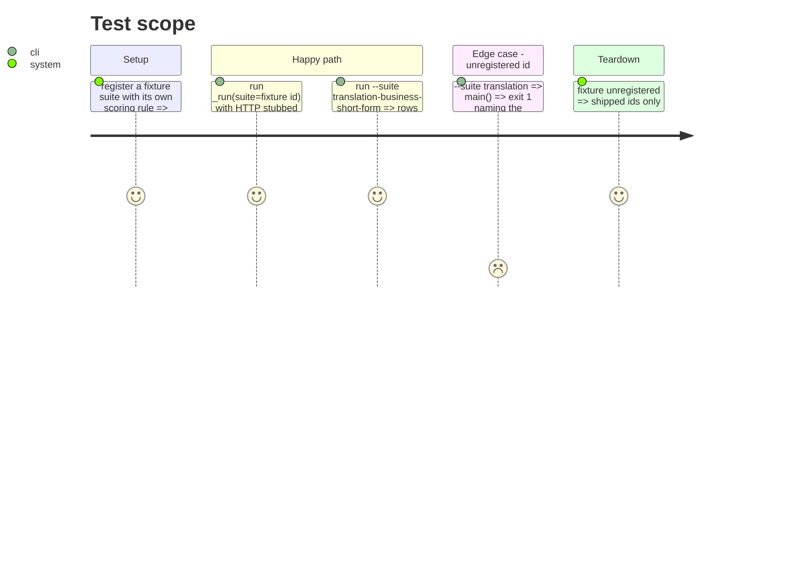

# Instruction: The quality CLI resolves --suite through the registry; fixture suite end to end; docs

## Architecture projection

> Tree of the final files. ✅ create · ✏️ modify · ❌ delete

```txt
.
├── src/wave_local_ai_v2/
│   └── quality_cli.py            ✏️ _SUITES/SuiteSpec/batch scorers removed; registry resolve; gate from the definition
├── tests/
│   └── test_quality_cli.py       ✏️ suite ids; fixture suite registered and run end to end
├── README.md                     ✏️ suite ids, where suite data lives
├── docs/setup.md                 ✏️ --suite takes suite ids
├── CHANGELOG.md                  ✏️ Unreleased entry
└── aidd_docs/memory/
    ├── cli.md                    ✏️ --suite and suite_snapshot descriptions
    └── codebase-map.md           ✏️ registry, scoring rules, suite_data
```

## User Journey



## Test Scope



## Tasks to do

### `1)` CLI onto the registry

1. Drop `SuiteSpec`, `_SUITES`, both batch scorers and the suite-module imports from `quality_cli.py`; `_run` resolves `suite_registry.resolve(suite)`, uses `definition.gate`, `definition.score_batch`.
2. `--suite` default `classification-support-routing`, no `choices`; `main()` catches `SuiteRegistryError`.

### `2)` Tests

1. Update the CLI tests to suite ids and the registered definitions.
2. Fixture suite + fixture rule registered in the test, run end to end with HTTP stubbed.

### `3)` Docs

1. README, `docs/setup.md`, `cli.md`, `codebase-map.md`, CHANGELOG.

## Test acceptance criteria

| Task | Acceptance criteria              |
| ---- | -------------------------------- |
| 1 | `quality_cli.py` imports no suite module and holds no suite table |
| 2 | A suite registered only in the test runs through `_run` and writes rows that pass the writer gate |
| 2 | An unregistered `--suite` exits 1 with the registered ids on stderr, writing no row |
| 3 | The README names `src/wave_local_ai_v2/suite_data/` as where suite definitions live |
