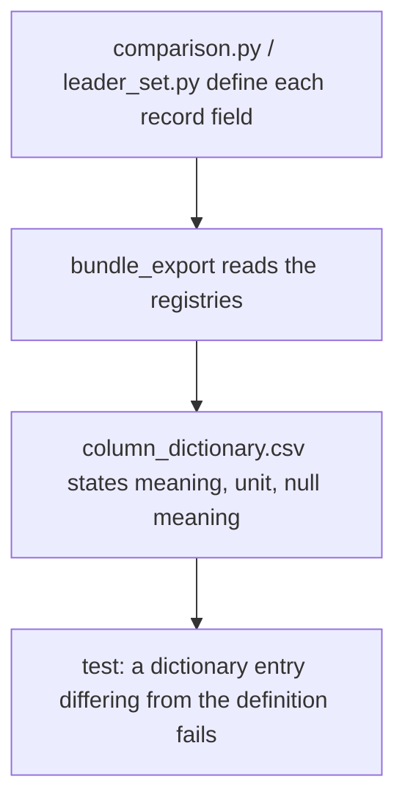
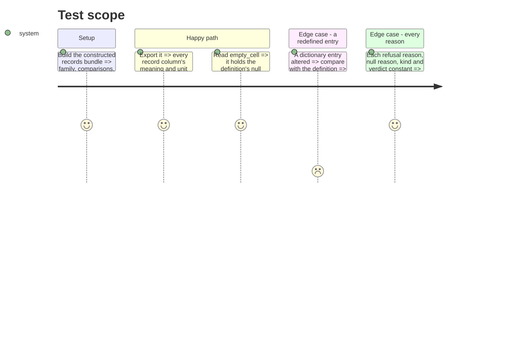

# Instruction: Record column definitions supplied by the statistics modules

## Architecture projection

> Tree of the final files. ✅ create · ✏️ modify · ❌ delete

```txt
.
├── src/wave_local_ai_v2/field_doc.py      ✅ FieldDoc: meaning, unit, what an empty cell (or a null) means
├── src/wave_local_ai_v2/comparison.py     ✏️ FAMILY_RECORD_FIELDS, COMPARISON_RECORD_FIELDS; null-reason constant for the batch difference
├── src/wave_local_ai_v2/leader_set.py     ✏️ LEADER_SET_RECORD_FIELDS, SUBJECT_RECORD_FIELDS
├── src/wave_local_ai_v2/bundle_export.py  ✏️ reads those registries; joins row-kind and null meanings in empty_cell
└── tests/test_bundle_export.py            ✏️ dictionary entry == record definition; every reason constant defined
```

## User Journey



## Test Scope



## Tasks to do

### `1)` Shared field-description type

1. Move `FieldDoc` to `field_doc.py`; `bundle_export` imports it (the name stays importable from `bundle_export`).

### `2)` Definitions in the writing modules

1. `comparison.py`: family and comparison field registries (current texts, plus each enumerated reason, kind and verdict, built from the module's constants); a constant for `no_single_batch_value_on_a_side`.
2. `leader_set.py`: leader-set and subject registries, statuses and roles from the constants.
3. `bundle_export.py`: drop the four local registries; the record sources use the imported ones.

### `3)` Empty-cell meaning

1. Record sources' empty text says only the row-kind half; the dictionary appends the field's own null meaning, or "Otherwise the record holds null."

### `4)` Tests

1. Dictionary entries of record columns equal the definitions (constructed and committed bundle).
2. Every null-reason, refusal-reason, kind, verdict, status and role constant appears in its field's definition.
3. Existing member-field coverage test reads `comparison.COMPARISON_RECORD_FIELDS`.

## Test acceptance criteria

| Task | Acceptance criteria |
| ---- | ------------------- |
| 1-2  | `bundle_export` defines no record field; the record registries live in `comparison.py` and `leader_set.py` |
| 3    | A comparison column's `empty_cell` names both the row-kind case and the field's null reasons |
| 4    | Altering one record entry's meaning in the dictionary makes the agreement test fail |
