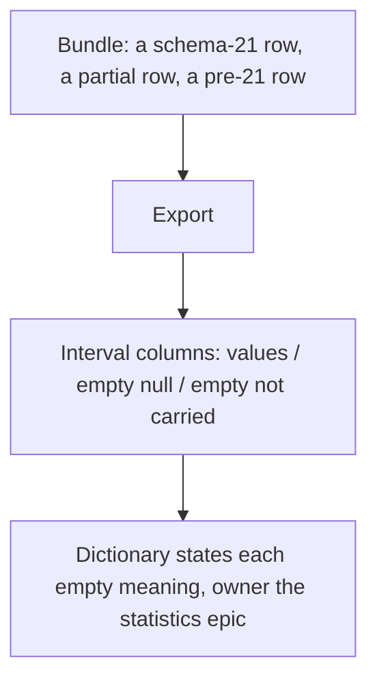
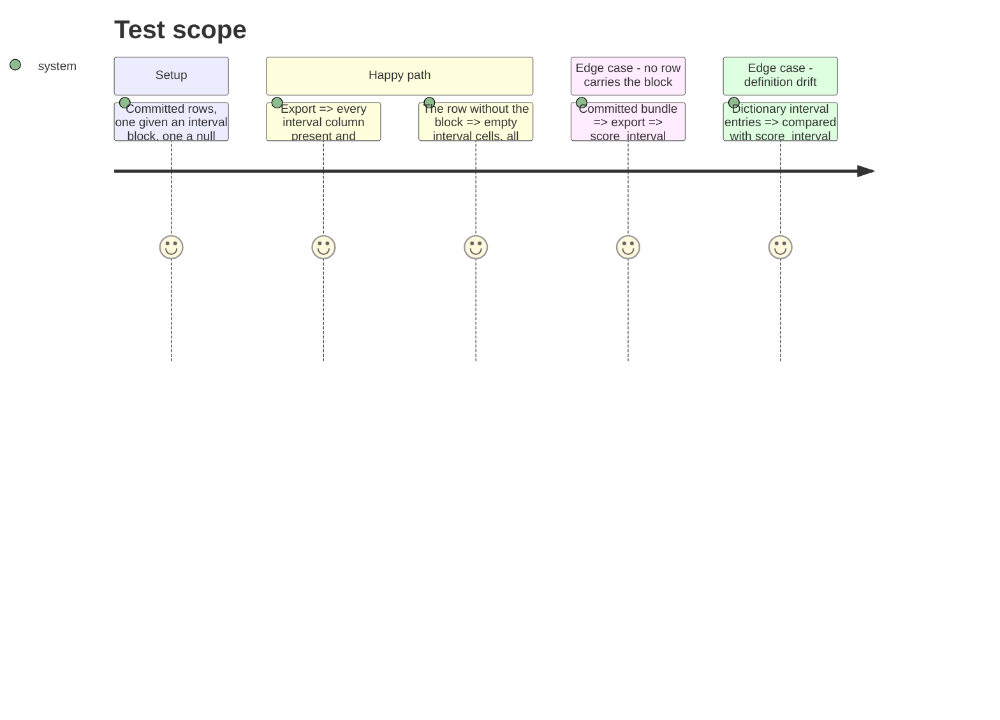

# Instruction: Interval columns: empty cells, owner, agreement with the block

## Architecture projection

> Tree of the final files. ✅ create · ✏️ modify · ❌ delete

```txt
.
├── src/wave_local_ai_v2/bundle_export.py  ✏️ interval empty-cell meaning; owned-elsewhere entry and mechanism removed; score_interval owner
└── tests/test_bundle_export.py            ✏️ pre-21 row exports empty cells listed not carried; dictionary agrees with score_interval
```

## User Journey



## Test Scope



## Tasks to do

### `1)` Empty-cell meaning

1. `_INTERVAL_EMPTY` and the `null_reason` empty text: a row written before schema 21 does not carry the block (listed in `fields_not_carried`); a partial or judge-probe row records null; never zero, never back-filled.

### `2)` Owner and stale entry

1. Remove `OwnedElsewhere`, `NOT_CARRIED_ELSEWHERE` and their loop.
2. `_not_carried_by_contract` names the statistics epic as owner of `score_interval`.

### `3)` Agreement with the block

1. Interval texts read the constants (`CONFIDENCE_LEVEL`, `RESAMPLES`, `METHOD_PERCENTILE`, null reasons).
2. Test: every key of `score_interval`'s header, generator and cell sets has a dictionary entry; each null reason is named.

## Test acceptance criteria

| Task | Acceptance criteria |
| ---- | ------------------- |
| 1    | A pre-21 row's interval cells are empty and listed not carried; its dictionary meaning says so |
| 2    | No dictionary entry says the interval block is absent when a row carries it; when none does, `score_interval` is named with the statistics epic |
| 3    | A key added to the block without a dictionary entry fails a test |
