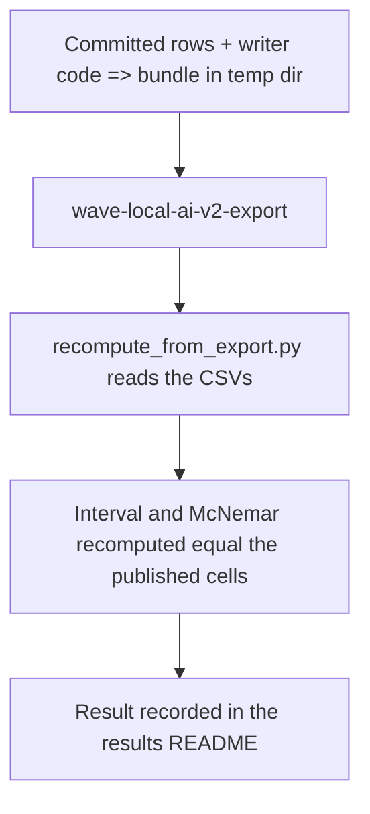
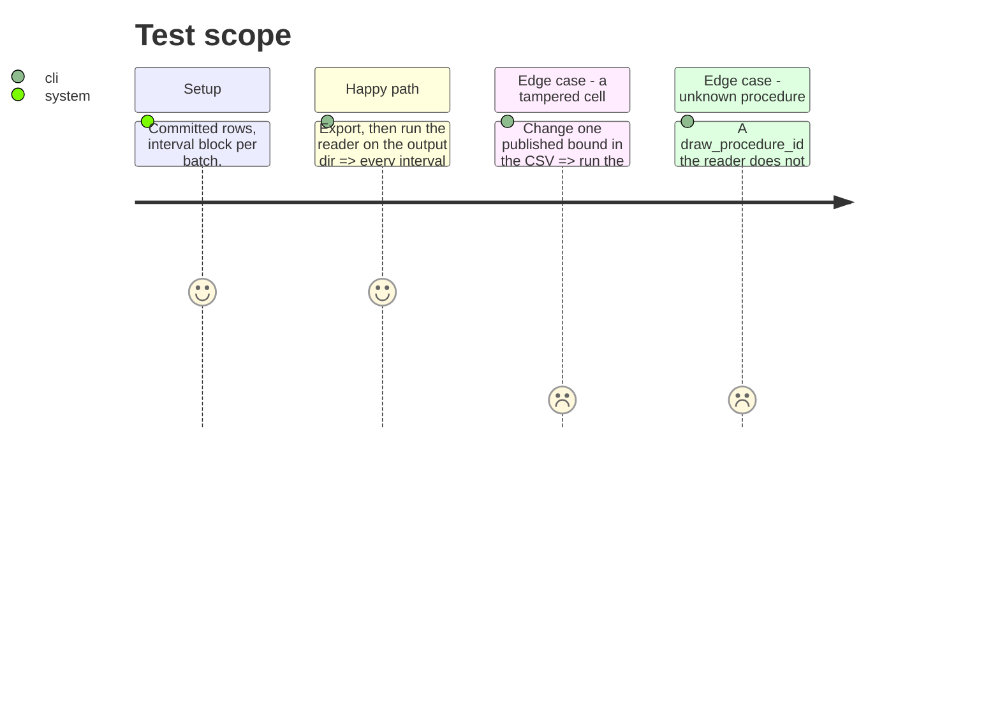

# Instruction: Recomputation from the exported tables alone, and its evidence

## Architecture projection

> Tree of the final files. ✅ create · ✏️ modify · ❌ delete

```txt
.
├── scripts/recompute_from_export.py       ✅ stdlib reader: intervals, McNemar, Holm from the CSVs only
├── tests/test_bundle_export.py            ✏️ constructed bundle with intervals + a tested family; reader lands on published values
├── aidd_docs/results/README.md            ✏️ recomputation result; interval owner line updated
├── aidd_docs/memory/cli.md                ✏️ the reader script
├── aidd_docs/memory/codebase-map.md       ✏️ field_doc.py; record definitions' home
└── aidd_docs/tasks/2026_10/2026_10_01_tabular-export-carries-interval-and-comparison/
    └── evidence/                          ✅ bundle-building script and the reader's output
```

## User Journey



## Test Scope



## Tasks to do

### `1)` Reader

1. Group `quality_items.csv` by batch; for each batch carrying a block, recompute the suite and each language cell from `correct`/`item_score` with the recorded seed, resamples, level; compare to the published cells.
2. For each `comparison` row with `mcnemar_exact`: select sides by run id and selector columns, pair on `item_id`, recompute the contingency and p; recompute each family's Holm-adjusted p from the raw p of its non-refused rows.
3. Print one line per check; exit 1 on any mismatch or unknown procedure.

### `2)` Test

1. Constructed bundle, export, reader passes; a tampered cell fails; an unknown procedure is refused.

### `3)` Evidence and docs

1. Evidence script builds the bundle into a temp dir, exports, runs the reader; output saved in `evidence/`.
2. README section; memory lines.

## Test acceptance criteria

| Task | Acceptance criteria |
| ---- | ------------------- |
| 1    | The reader imports nothing from `wave_local_ai_v2` |
| 2    | Recomputed interval bounds, MDE, McNemar p and adjusted p equal the exported cells exactly |
| 3    | The README states what was recomputed, over which bundle, and why not over the committed one |
