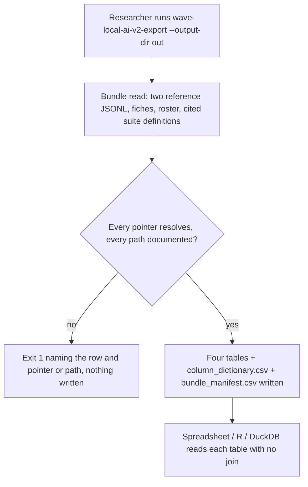
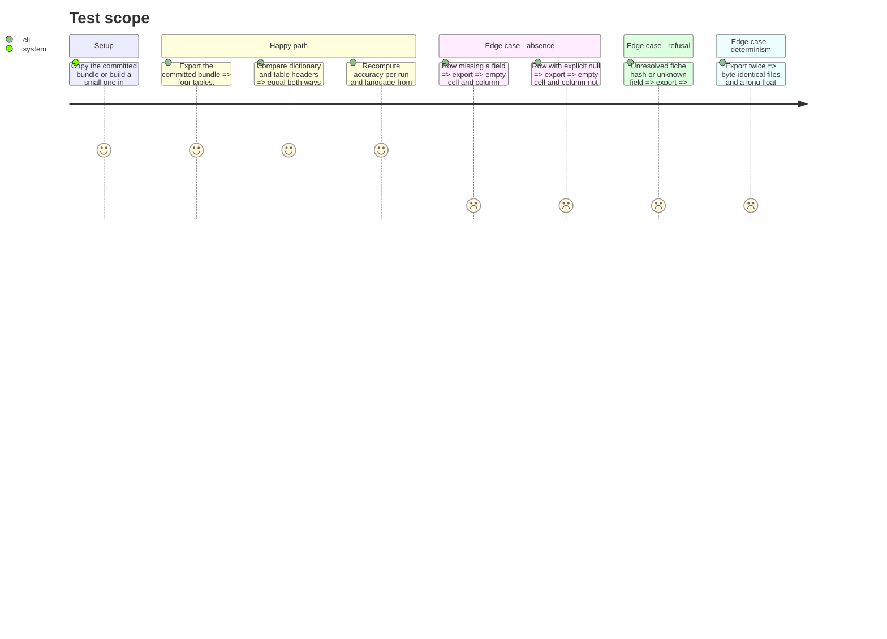

# Instruction: Export module, column registry, entry point and tests

## Architecture projection

> Tree of the final files. ✅ create · ✏️ modify · ❌ delete

```txt
.
├── pyproject.toml                               ✏️ [project.scripts] wave-local-ai-v2-export
├── src/wave_local_ai_v2/bundle_export.py        ✅ reader, flattener, registry, CSV writer, main()
└── tests/test_bundle_export.py                  ✅ committed-bundle + constructed-bundle tests
```

## User Journey



## Test Scope



## Tasks to do

### `1)` Reader and flattener

> Read the five bundle parts and flatten each record into leaf paths.

1. Read rows with `results.read_rows`, fiches via `fiche_registry.read_fiche`, roster validated by `roster.load_roster` then flattened from its raw JSON, suite definitions by `suite_snapshot.snapshot_filename`.
2. Flatten dicts recursively; lists become one compact JSON cell; skip the per-repetition arrays.
3. Resolve `fiche_hash`, `roster_entry_id`, `suite_id`+`suite_version` into prefixed columns; refuse an unresolved pointer.

### `2)` Column registry and dictionary

> Describe every column; refuse an undocumented one.

1. Registry keyed by source path (with `*`) per source: row, fiche, roster entry, suite definition.
2. Dictionary rows: `table, column, carried, source, meaning, unit, empty_cell, owner`; not-carried contract fields and the four externally owned blocks as `carried=false`.

### `3)` Writer, manifest and entry point

> Pin the CSV format and declare what was read.

1. Format cells explicitly; write with `newline=""`, `lineterminator="\r\n"`.
2. `bundle_manifest.csv` declares each part's entries read and the distinct `schema_version` values the rows carry.
3. `main()` with `--output-dir` required and input paths defaulting to `settings`; entry point in `pyproject.toml`.

### `4)` Tests

1. Committed bundle: four tables, manifest declares `"7"`, every pointer column populated, dictionary both ways, accuracy recomputation, bundle bytes unchanged.
2. Constructed bundle: missing field, recorded null, long float, byte-identical reruns, refusals.
3. Registry partition against `row_contract`.

## Test acceptance criteria

| Task | Acceptance criteria |
| ---- | ------------------- |
| 1 | Each quality row carries its fiche, roster-entry and suite-definition fields as columns; no runtime column holds a per-repetition array |
| 2 | Every carried dictionary entry names a header of its table and every header has one; every not-carried entry is in no table and names an owner |
| 3 | Two runs produce byte-identical files; the manifest states `"7"` for both row files; `pyproject.toml` runtime dependencies unchanged |
| 4 | `uv run pytest` passes with the coverage floor |
