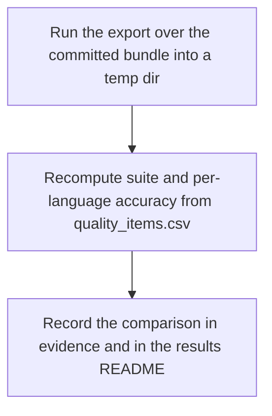
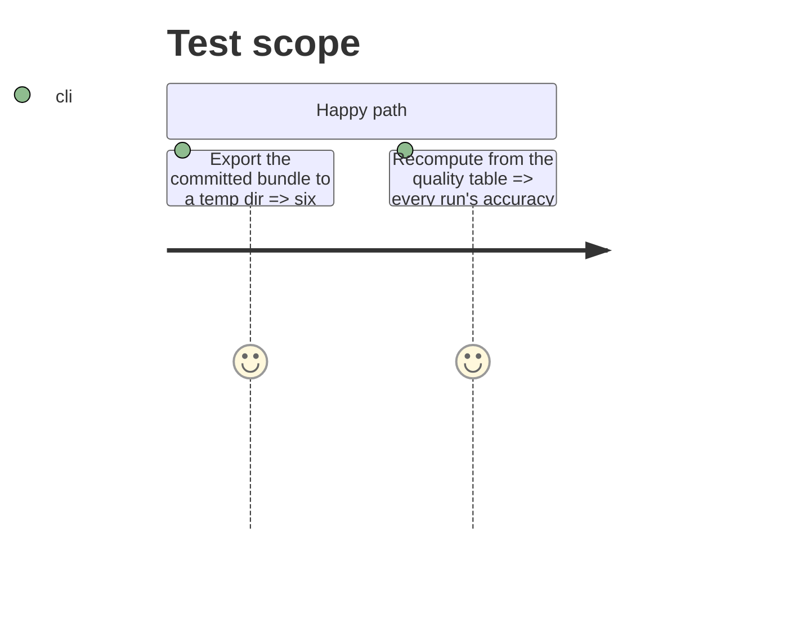

# Instruction: Run over the committed bundle, recomputation evidence, README

## Architecture projection

> Tree of the final files. ✅ create · ✏️ modify · ❌ delete

```txt
.
├── aidd_docs/results/README.md                                                      ✏️ how to produce the tables, recomputation result
└── aidd_docs/tasks/2026_10/2026_10_01_the-published-bundle-reads-as-four-flat-tables/
    └── evidence/
        ├── export-run.txt                                                           ✅ command output and manifest
        └── recomputation.md                                                         ✅ per-run accuracy recomputed from the quality table, with the script
```

## User Journey



## Test Scope



## Tasks to do

### `1)` Evidence

1. Run `uv run wave-local-ai-v2-export --output-dir <temp>`; save the output and manifest.
2. Recompute each run's `suite_accuracy` and per-language accuracy from `correct` using only the CSV module; save the table.

### `2)` README

1. Add a section to `aidd_docs/results/README.md`: the command, the files, the format pins, the schema declaration, and the recomputation result.

## Test acceptance criteria

| Task | Acceptance criteria |
| ---- | ------------------- |
| 1 | Evidence shows four runs, each recomputed accuracy equal to the published one |
| 2 | The results README names the command and records the recomputation |
