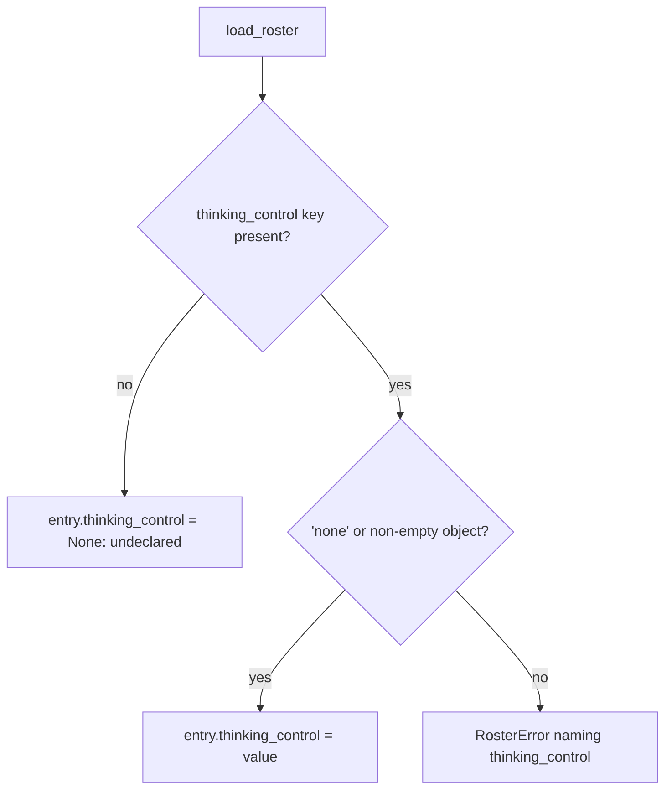
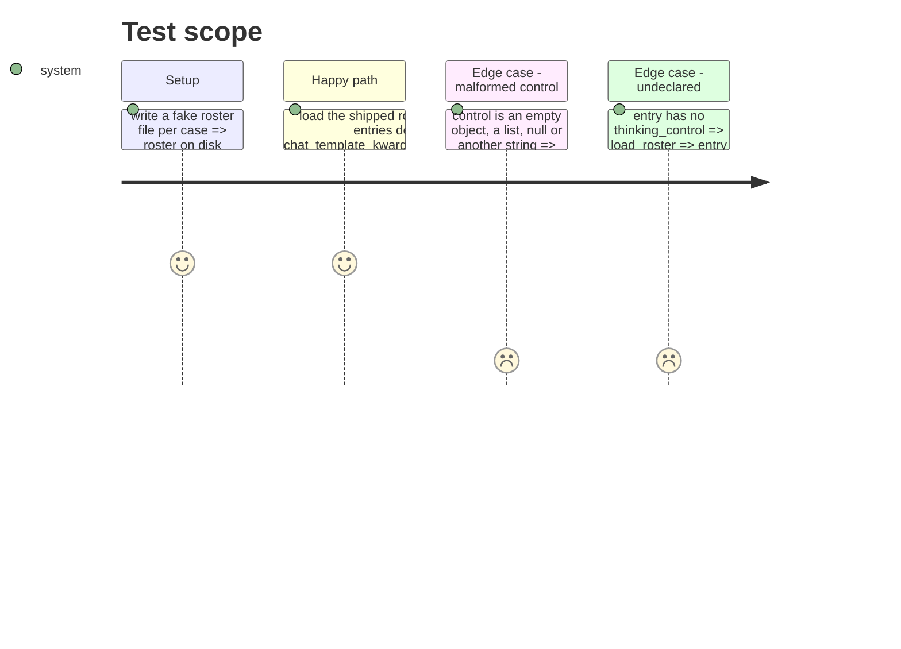

# Instruction: The thinking-control declaration on a roster entry

## Architecture projection

> Tree of the final files. ✅ create · ✏️ modify · ❌ delete

```txt
.
├── aidd_docs/roster/models.json            ✏️ thinking_control on the four Qwen entries
├── src/wave_local_ai_v2/
│   ├── roster.py                           ✏️ THINKING_CONTROL_NONE, RosterEntry.thinking_control, shape validation
│   └── bundle_export.py                    ✏️ roster-table thinking_control column as one JSON cell
└── tests/
    ├── test_roster.py                      ✏️ malformed control refused naming the field; shipped entries declare one
    └── test_bundle_export.py               ✏️ only if a roster-table column assertion moves
```

## User Journey



## Test Scope



## Tasks to do

### `1)` Declaration and validation

> An entry carries its control, and a malformed one never loads.

1. Add `THINKING_CONTROL_NONE = "none"` and an optional `thinking_control` on `RosterEntry`.
2. Validate in `_parse_entry`: absent => `None`; `"none"` or a non-empty object with string keys => kept; anything else => `RosterError` naming `thinking_control`.

### `2)` Shipped entries and export

> The four Qwen entries declare what they already run under, and the export still describes every roster field.

1. Add `"thinking_control": {"chat_template_kwargs": {"enable_thinking": false}}` to each entry of `models.json`.
2. Add a `("thinking_control",)` FieldDoc to `ROSTER_ENTRY_FIELDS` and mark it a JSON cell on the roster table's entry source.

## Test acceptance criteria

| Task | Acceptance criteria              |
| ---- | -------------------------------- |
| 1 | A malformed control is refused naming `thinking_control`; `"none"`, an object and an absent key all load |
| 2 | Every shipped entry declares the Qwen control; the export writes one `thinking_control` JSON cell per roster row |
