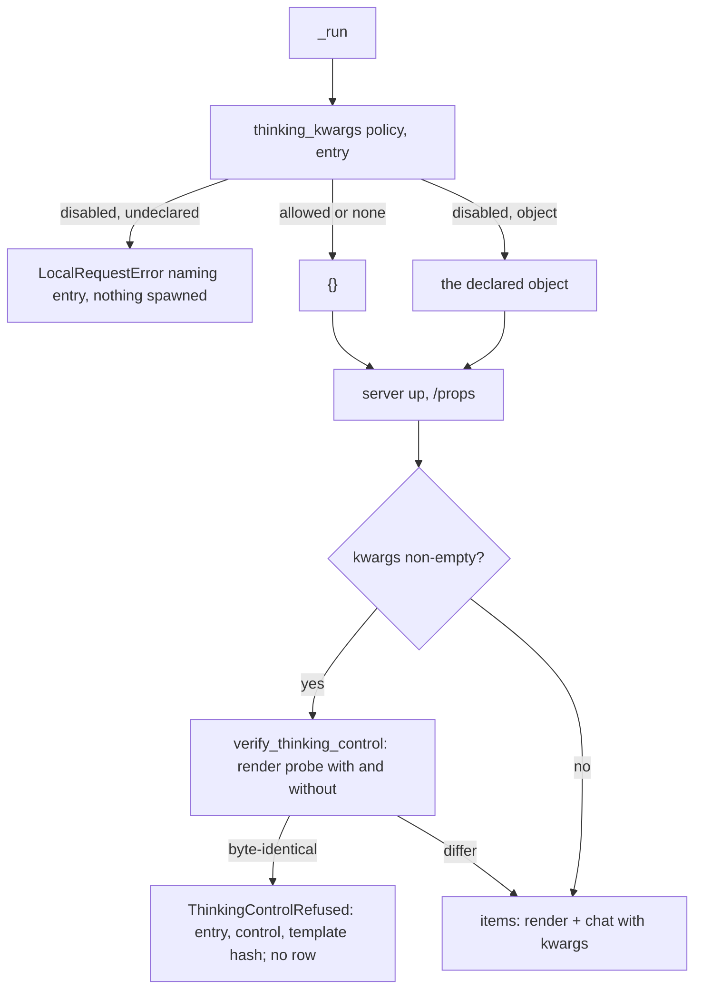

# Instruction: The client sends the entry's control and verifies it once per batch

## Architecture projection

> Tree of the final files. ✅ create · ✏️ modify · ❌ delete

```txt
.
├── src/wave_local_ai_v2/
│   ├── local_client.py        ✏️ thinking_kwargs(policy, entry), verify_thinking_control, THINKING_PROBE_MESSAGE, ThinkingControlRefused
│   ├── quality_cli.py         ✏️ resolve once before launch, verify before the first item
│   └── judge_probe.py         ✏️ same wiring
└── tests/
    ├── test_local_client.py   ✏️ identical renders refuse before any chat call; differing pass; declared control is what is sent
    ├── test_quality_cli.py    ✏️ refused verification writes no row; shipped spelling renders the same prompt; stubs honour the control
    └── test_judge_probe.py    ✏️ fake roster declares the control; stub honours it
```

## User Journey



## Test Scope

```mermaid
---
title: Test scope
---
journey
  section Setup
    stub /props, /apply-template and /v1/chat/completions => deterministic local server: 5: system
  section Happy path
    run a disabled batch whose stub render differs with the control => rows written with the same rendered prompt as before: 5: cli
  section Edge case - ignored control
    stub renders identically with and without => run the batch => refused naming entry, control, template hash; zero chat calls; no row: 1: cli
  section Edge case - none
    entry declares none => run under disabled => no control sent, no probe render: 1: cli
  section Edge case - undeclared
    entry has no control => run under disabled => refused naming the entry before launch: 1: cli
```

## Tasks to do

### `1)` Client

> The control comes from the entry; the verification is one named function.

1. Replace `_thinking_kwargs(policy)` with public `thinking_kwargs(policy, entry)`.
2. `render_prompt` / `complete_chat` take `thinking_kwargs: Mapping[str, Any]`.
3. Add `THINKING_PROBE_MESSAGE`, `ThinkingControlProbe`, `ThinkingControlRefused`, `verify_thinking_control`.

### `2)` Batch wiring

> Verified once, before the first item.

1. `quality_cli._run`: resolve before `server.build_flags`; pass to `_run_local_suite`; verify after `/props` when non-empty.
2. `judge_probe`: same.

### `3)` Tests

> Every acceptance condition against a stubbed server.

1. Update stubs so a render without `chat_template_kwargs` differs, add the control to fake rosters, exclude probe renders from the two policy assertions, adjust call counts by two.
2. Add the refusal, pass, `none`, undeclared and no-row tests.

## Test acceptance criteria

| Task | Acceptance criteria              |
| ---- | -------------------------------- |
| 1 | Identical renders raise naming entry, control and template hash before any chat call; differing renders return both strings; the chat body carries the entry's declared control |
| 2 | A refused verification writes no row and runs no cloud batch; a shipped-spelling batch stores the same rendered prompt and hash as before |
| 3 | `uv run pytest` passes at the 95% floor |
