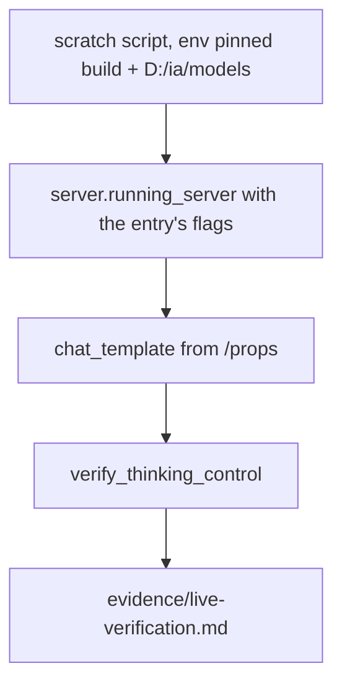
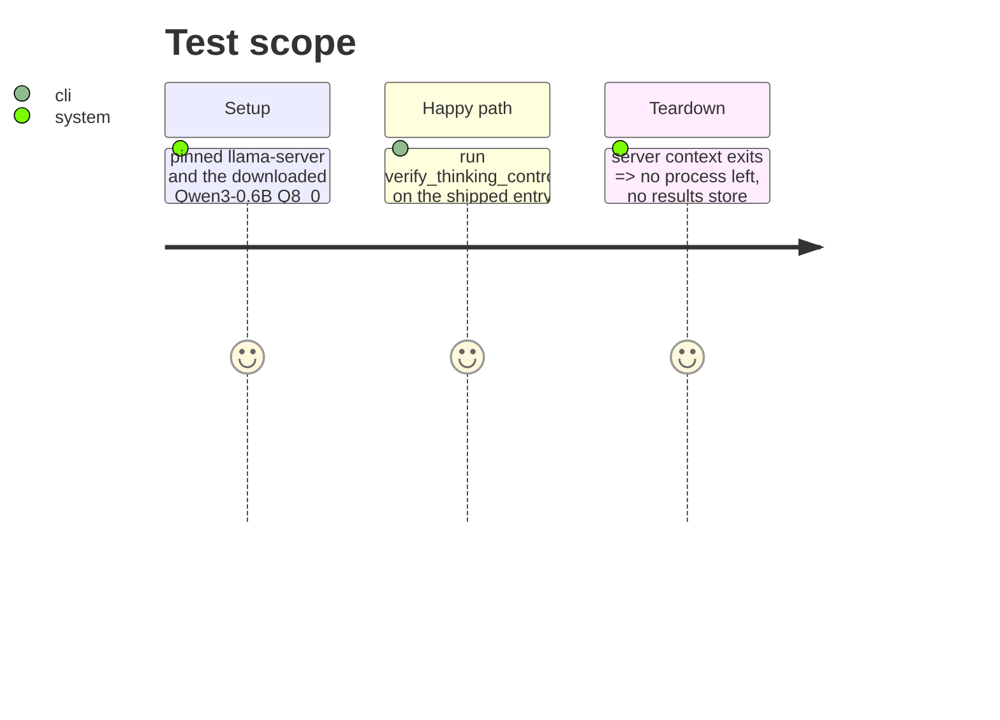

# Instruction: One live verification against qwen3-0.6b-q8

## Architecture projection

> Tree of the final files. ✅ create · ✏️ modify · ❌ delete

```txt
.
├── aidd_docs/tasks/2026_10/2026_10_01_thinking-switch-refused-not-published-as-disabled/evidence/
│   └── live-verification.md     ✅ entry, build, template hash, control, both renders, pass, how it was produced
└── aidd_docs/memory/cli.md      ✏️ one line: entries declare their thinking control, verified per batch
```

## User Journey



## Test Scope



## Tasks to do

### `1)` Live run

> The shipped control verifies against the real template.

1. Run a scratch script (outside the repo) that launches the entry and calls `verify_thinking_control`; write both renders and the pass into `evidence/`.
2. No results file is written; no model is downloaded.

### `2)` Memory

> The next reader finds the rule.

1. One line in `aidd_docs/memory/cli.md` under the roster section.

## Test acceptance criteria

| Task | Acceptance criteria              |
| ---- | -------------------------------- |
| 1 | `evidence/live-verification.md` holds two renders that differ and records the pass |
| 2 | `cli.md` names `thinking_control` and the per-batch verification |
