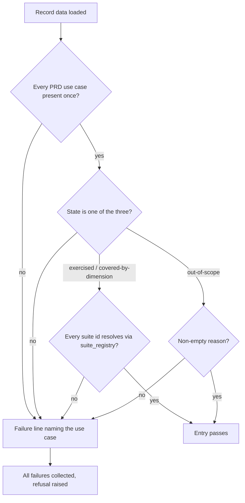
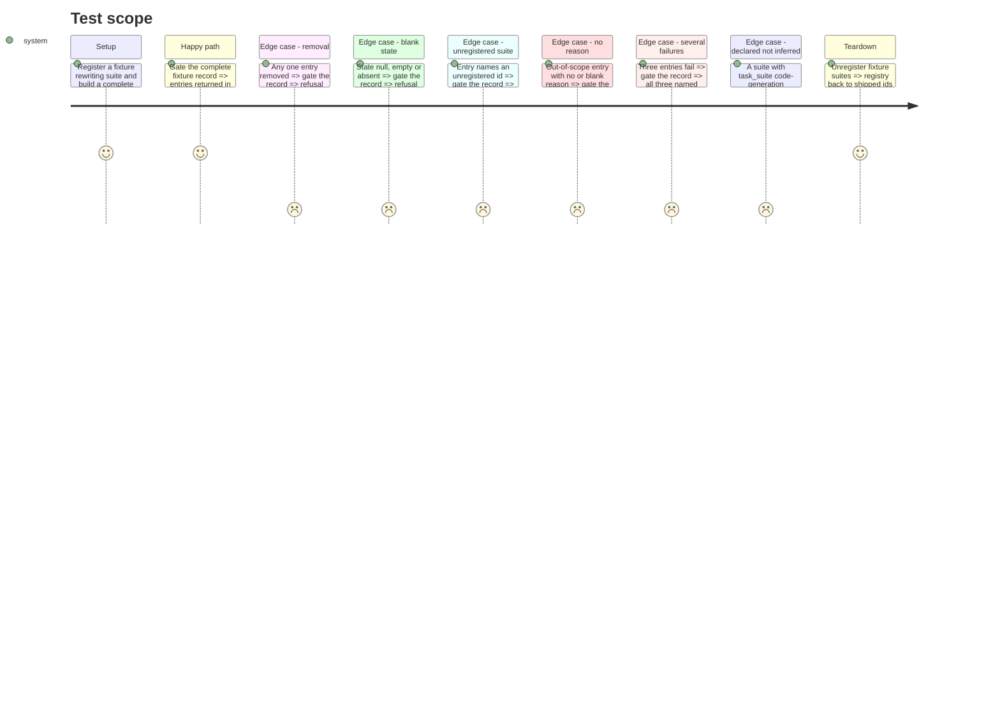

# Instruction: The coverage record as data and the gate over it

## Architecture projection

> Tree of the final files. ✅ create · ✏️ modify · ❌ delete

```txt
.
├── src/wave_local_ai_v2/
│   ├── use_case_coverage.json   ✅ the declared record, ten entries
│   └── use_case_coverage.py     ✅ USE_CASES, STATES, check/gate, load
└── tests/
    └── test_use_case_coverage.py ✅ gate tests over fixture records
```

## User Journey



## Test Scope



## Tasks to do

### `1)` The record as data

> Ten entries, declared as the story's "run today" reading requires.

1. Write `use_case_coverage.json`: classification and translation `exercised` with their shipped ids; `text-rewriting` `exercised` with `rewriting-business-email`; `multilingual-en-fr-de` `covered-by-dimension` with the three suites; the six unbuilt use cases with `"state": null`.

### `2)` The gate

> Collect every failure, one line per failing entry, raise once.

1. `USE_CASES`, `STATES`, `CoverageRefusal(ValueError)` carrying `failures`.
2. `check_record(data) -> list[str]` and `gate_record(data) -> list[dict]` (PRD-ordered entries or `CoverageRefusal`); suite ids resolved through `suite_registry.resolve`, catching `SuiteRegistryError` and `SuiteGateError`.
3. `load_record(path)` reading JSON; the default is the packaged file.

### `3)` Tests

> Each acceptance refusal shown by a fixture, not by reading the writer.

1. Complete fixture passes; parametrized removal of each of the ten refuses naming it.
2. Blank state, unregistered suite, missing/blank reason, three failures, declared-not-inferred, structural refusals (unknown use case, duplicate, mixed fields, bad shapes).

## Test acceptance criteria

| Task | Acceptance criteria              |
| ---- | -------------------------------- |
| 1 | The packaged record holds exactly the ten PRD use cases, multilingual `covered-by-dimension` naming the classification, translation and rewriting suites |
| 2 | A record with N failing entries raises one refusal naming all N; a complete record returns its entries in PRD order |
| 3 | Removing any one entry from the complete fixture refuses naming that use case; registering a suite never changes an entry's state |
