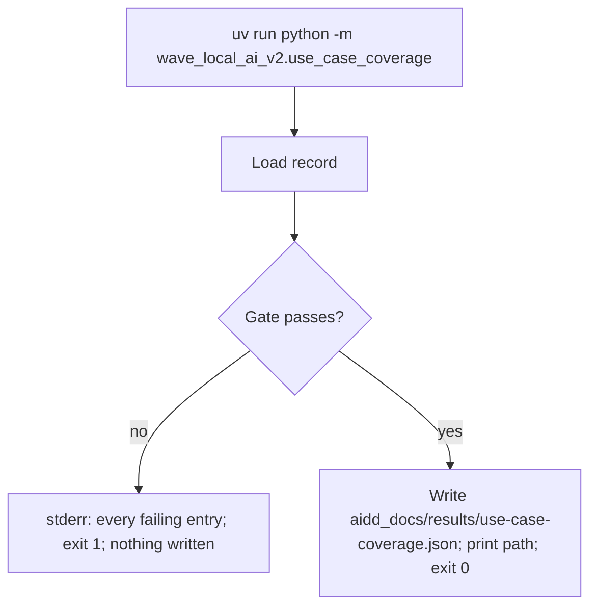
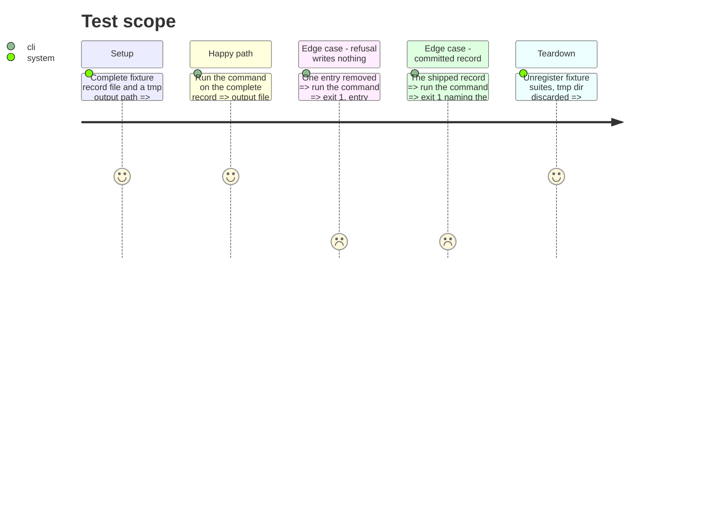

# Instruction: The publish command, its refusal evidence, and the docs

## Architecture projection

> Tree of the final files. ✅ create · ✏️ modify · ❌ delete

```txt
.
├── src/wave_local_ai_v2/
│   ├── settings.py              ✏️ DEFAULT_USE_CASE_COVERAGE_PATH
│   └── use_case_coverage.py     ✏️ main(argv): gate, then write or refuse
├── tests/
│   └── test_use_case_coverage.py ✏️ command tests, shipped-record refusal
├── aidd_docs/
│   ├── results/README.md        ✏️ what the coverage record is and when it appears
│   ├── memory/cli.md            ✏️ the command
│   ├── memory/codebase-map.md   ✏️ the module and its data file
│   └── tasks/2026_10/2026_10_01_use-case-coverage-state-or-refusal/
│       └── evidence/coverage-refusal.txt ✅ refusal against the committed record
```

## User Journey



## Test Scope



## Tasks to do

### `1)` The command

> Publish only a record the gate passes.

1. `settings.DEFAULT_USE_CASE_COVERAGE_PATH = "aidd_docs/results/use-case-coverage.json"`.
2. `main(argv) -> int` with `--record`/`--output`; refusal header plus one line per failing entry on stderr, exit 1, nothing written; on pass, write JSON and print the path.

### `2)` Evidence and docs

> The refusal is today's coverage reading.

1. Run the command against the committed record; save stdout/stderr and exit code to `evidence/coverage-refusal.txt`.
2. `aidd_docs/results/README.md`: a section on the coverage record, its refusal, and when the file appears.
3. `cli.md` and `codebase-map.md`: name the command and the module.

## Test acceptance criteria

| Task | Acceptance criteria              |
| ---- | -------------------------------- |
| 1 | A passing record lands as `use-case-coverage.json`; a refused one leaves no file and exits 1 naming every failing entry |
| 2 | The evidence file shows the committed record refused, naming the six unbuilt use cases, text rewriting and multilingual |
