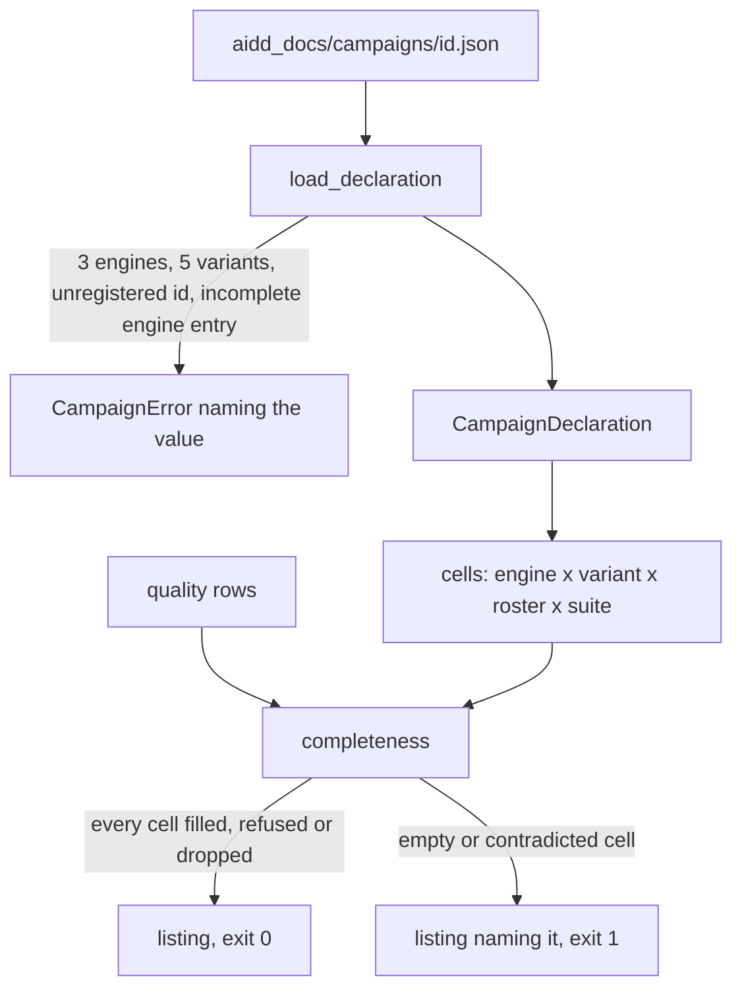
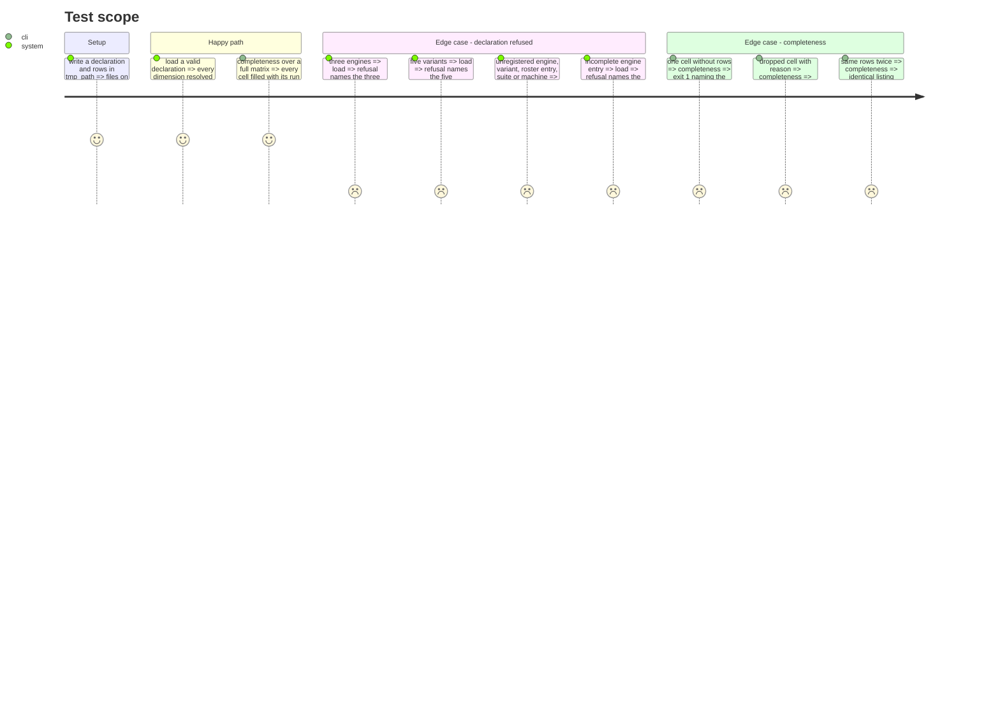

<!-- Fill or omit these sections; never add, rename, or reorder one. -->

# Instruction: Campaign declaration loader and completeness command

## Architecture projection

> Tree of the final files. ✅ create · ✏️ modify · ❌ delete

```txt
.
├── pyproject.toml                         ✏️ wave-local-ai-v2-campaign-completeness entry point
├── src/wave_local_ai_v2/campaigns.py      ✅ declaration loader, caps, registry resolution, exclusions, cells, completeness listing, CLI
└── tests/test_campaigns.py                ✅ refusals, full matrix, empty cell, dropped/refused cell, contradicted cell, determinism, CLI exit codes
```

## User Journey



## Test Scope



## Tasks to do

### `1)` Loader

> `campaigns.load_declaration(path, *, engines_path, roster_path, machines_path)`.

1. JSON object with exactly the declared keys; stem equals `campaign_id`; `campaign_id` not `none`.
2. Caps, empty and duplicate dimensions; each id resolved against its registry; machine and mode checked.
3. Exclusions parsed, coordinates checked against the declaration, overlaps refused.
4. `resolve_declaration(campaign_id, campaigns_dir, ...)` through `path_guard`.

### `2)` Cells and completeness

> A deterministic listing from declaration and rows.

1. `cells(declaration)` in declaration order.
2. `completeness(declaration, rows)` -> per cell `filled` (run ids) / `empty` / `refused` / `dropped` / `contradicted`.
3. `main`: `--campaign`, `--campaigns-dir`, `--rows` (repeatable); one line per cell; exit 0/1/2.

## Test acceptance criteria

<!-- Each criterion is an observable behavior, not a command. -->

| Task | Acceptance criteria              |
| ---- | -------------------------------- |
| 1 | Three engines, five variants, each unregistered id and an incomplete engine entry each refuse naming the offending value |
| 2 | A full matrix exits 0 listing run ids; one empty cell exits 1 naming it; a dropped cell is listed with its reason and passes; a re-run prints the same listing |
