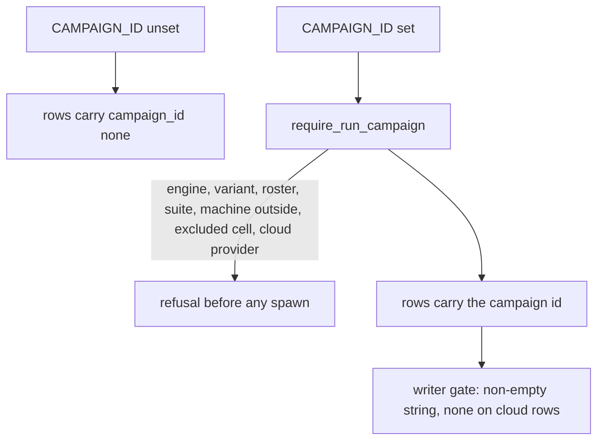
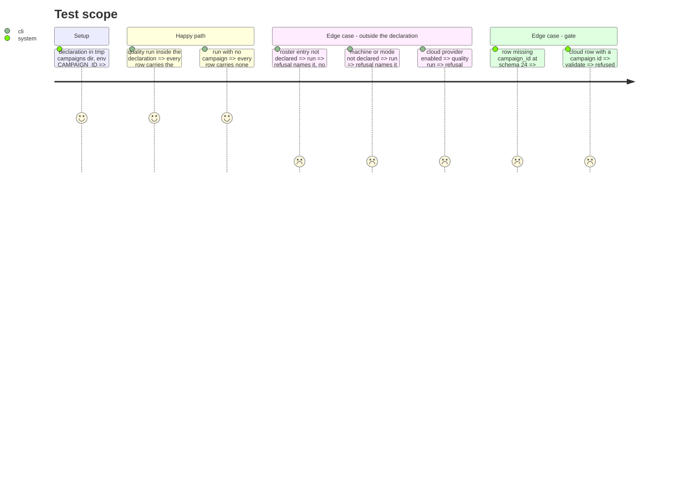

<!-- Fill or omit these sections; never add, rename, or reorder one. -->

# Instruction: `campaign_id` on every row and the pre-launch run check

## Architecture projection

> Tree of the final files. ✅ create · ✏️ modify · ❌ delete

```txt
.
├── src/wave_local_ai_v2/settings.py        ✏️ CAMPAIGN_ID, CAMPAIGNS_DIR
├── src/wave_local_ai_v2/campaigns.py       ✏️ require_run_campaign
├── src/wave_local_ai_v2/row_contract.py    ✏️ SCHEMA_VERSION "24", campaign_id required, NO_CAMPAIGN, gate rule
├── src/wave_local_ai_v2/__init__.py        ✏️ runtime: run check, campaign_id on the row
├── src/wave_local_ai_v2/quality_cli.py     ✏️ quality: run check, cloud refusal, campaign_id on every row, resume check
├── src/wave_local_ai_v2/judge_probe.py     ✏️ refuses a campaign, stamps none, resume check
├── src/wave_local_ai_v2/comparison.py      ✏️ campaign_id is bookkeeping
├── src/wave_local_ai_v2/read_model.py      ✏️ campaign_id not rendered
├── src/wave_local_ai_v2/bundle_export.py   ✏️ campaign_id column description
└── tests/                                  ✏️ row fixtures gain campaign_id; gate, settings, writer tests
```

## User Journey



## Test Scope



## Tasks to do

### `1)` Settings and run check

1. `Settings.campaign_id` (None when unset), `campaigns_dir`.
2. `campaigns.require_run_campaign(settings, *, engine_id, prompt_variant, roster_entry_id, suite_id, machine_id, compute_mode, cloud_providers)` -> campaign id or `NO_CAMPAIGN`.

### `2)` Row contract

1. `SCHEMA_VERSION = "24"` with history comment; `CAMPAIGN_SCHEMA_VERSION`; `campaign_id` in both kinds; `_validate_campaign`.

### `3)` Writers

1. Runtime, quality: check after machine/variant/engine are known, before the build probe; stamp the id.
2. Judge probe: refuse `CAMPAIGN_ID`; stamp `none`. Resume checks include `campaign_id`.
3. Comparison, read model, export: place the field.

## Test acceptance criteria

<!-- Each criterion is an observable behavior, not a command. -->

| Task | Acceptance criteria              |
| ---- | -------------------------------- |
| 1 | A run outside the declaration refuses naming the dimension before any server starts |
| 2 | A schema-24 row without `campaign_id` is refused; a cloud row naming a campaign is refused; older rows validate |
| 3 | A run with no campaign writes `campaign_id: "none"`; a campaign run writes the id on every row |
