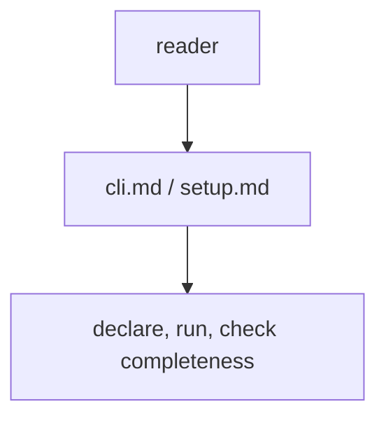
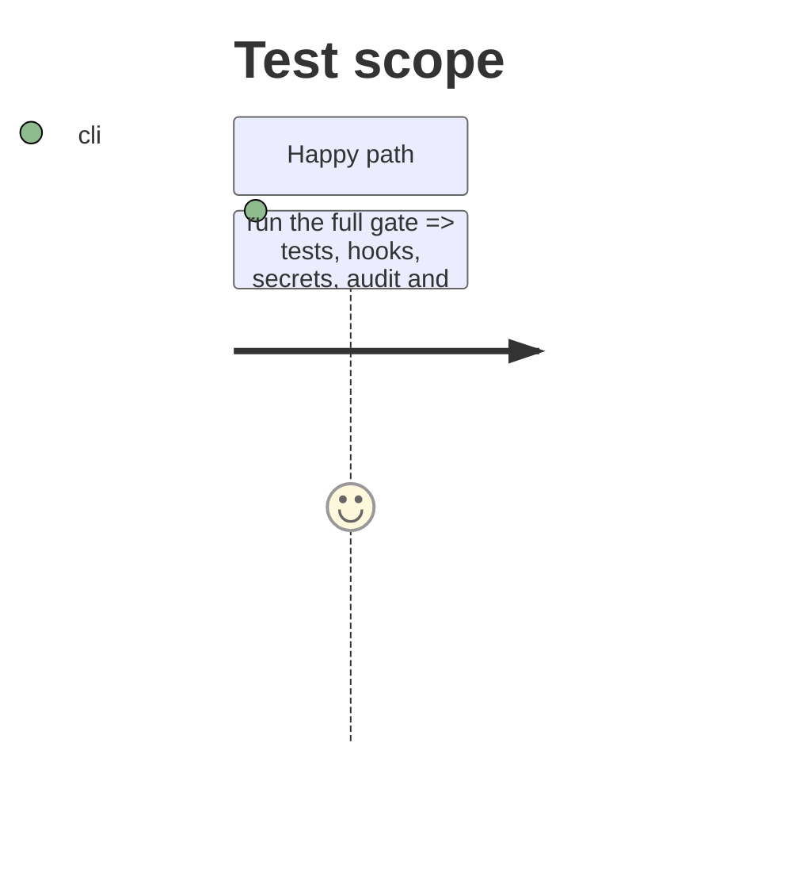

<!-- Fill or omit these sections; never add, rename, or reorder one. -->

# Instruction: Docs, memory and CHANGELOG

## Architecture projection

> Tree of the final files. ✅ create · ✏️ modify · ❌ delete

```txt
.
├── CHANGELOG.md                         ✏️ Unreleased entry, schema "24"
├── .env.example                         ✏️ CAMPAIGN_ID, CAMPAIGNS_DIR
├── docs/setup.md                        ✏️ CAMPAIGN_ID beside MACHINE_ID
├── aidd_docs/memory/cli.md              ✏️ the completeness command and CAMPAIGN_ID
└── aidd_docs/memory/codebase-map.md     ✏️ campaigns.py and the new entry point
```

## User Journey



## Test Scope



## Tasks to do

### `1)` Docs

1. CHANGELOG entry; `.env.example`; `docs/setup.md`; `cli.md`; `codebase-map.md`.

### `2)` Gate

1. `uv run pytest`, `uv run pre-commit run --all-files`, secrets scan on changed files, dependency audit, validator on both reference files.

## Test acceptance criteria

<!-- Each criterion is an observable behavior, not a command. -->

| Task | Acceptance criteria              |
| ---- | -------------------------------- |
| 1 | A reader finds the declaration format, `CAMPAIGN_ID` and the completeness command documented |
| 2 | Every gate command exits 0 |
