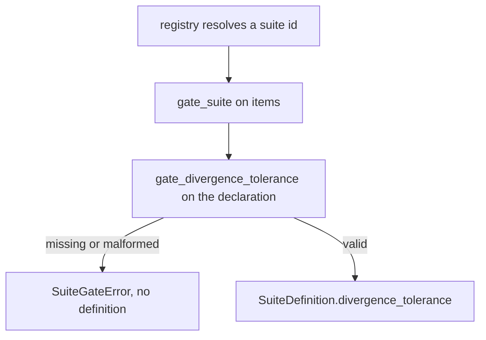
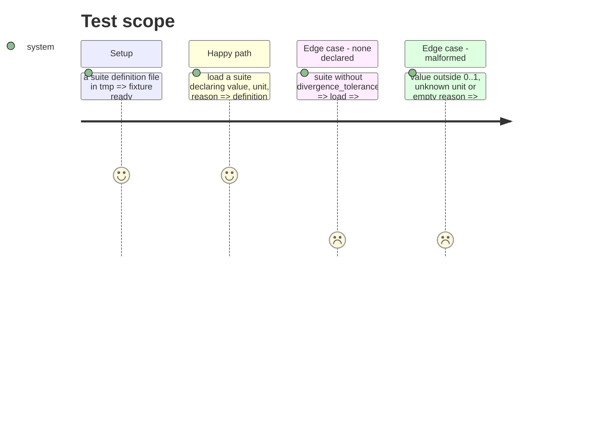

<!-- Fill or omit these sections; never add, rename, or reorder one. -->

# Instruction: Declared tolerance: gate, registry, suite data and snapshots

## Architecture projection

```txt
.
├── src/wave_local_ai_v2/
│   ├── suite_gate.py                 ✏️ gate_divergence_tolerance, DivergenceTolerance
│   ├── suite_registry.py             ✏️ gate it at load, expose on SuiteDefinition
│   └── suite_data/
│       ├── classification-support-routing.json   ✏️ tolerance, version 5
│       └── translation-business-short-form.json  ✏️ tolerance, version 4
├── aidd_docs/results/suite-definitions/
│   ├── classification-support-routing@5.json     ✅ exported snapshot
│   └── translation-business-short-form@4.json    ✅ exported snapshot
└── tests/
    ├── test_suite_gate.py            ✏️ refusal tests
    ├── test_suite_registry.py        ✏️ shipped versions, missing-tolerance refusal
    └── (suite JSON fixtures)         ✏️ declare a tolerance
```

## User Journey



## Test Scope



## Tasks to do

### `1)` Gate

1. `suite_gate.py`: `TOLERANCE_UNITS = {"fraction_of_items"}`, `DivergenceTolerance` TypedDict, `gate_divergence_tolerance(declaration)` refusing None, non-dict, value not a number in [0, 1], unknown unit, empty reason.

### `2)` Registry and data

1. `suite_registry.py`: call the gate at load, `SuiteDefinition.divergence_tolerance`; the key stays in `extra` so the snapshot exports it.
2. Both suite JSON files declare it and bump `suite_version`; export the new snapshots with the exporter.
3. Update test fixtures that write suite definitions.

## Test acceptance criteria

| Task | Acceptance criteria              |
| ---- | -------------------------------- |
| 1 | A missing or malformed tolerance is refused by the gate, naming the problem |
| 2 | Both shipped suites resolve with their tolerance; the regenerated snapshots equal the committed ones; old snapshots are untouched |
