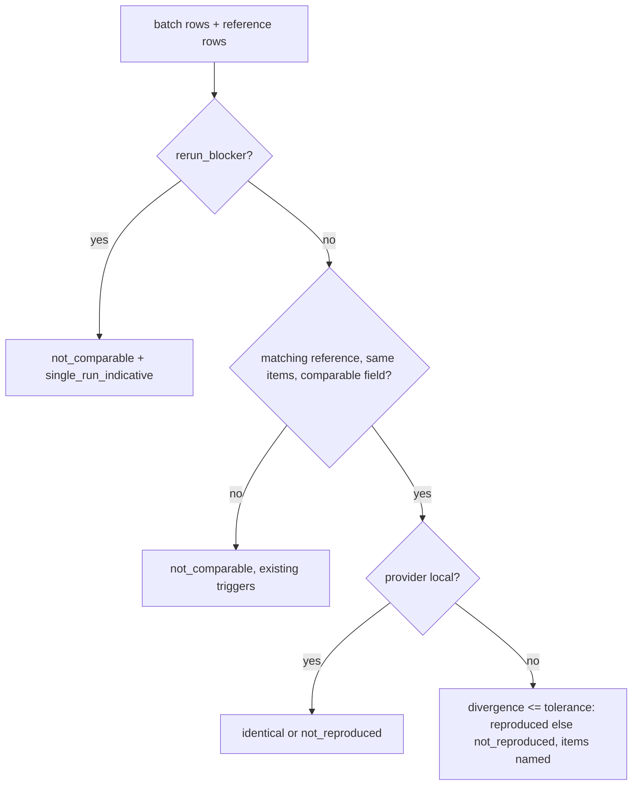
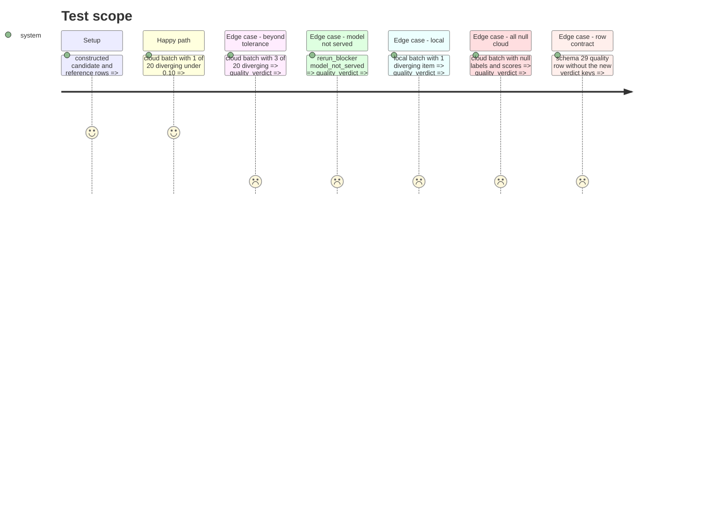

<!-- Fill or omit these sections; never add, rename, or reorder one. -->

# Instruction: Per-item cloud verdict, verdict fields (schema "29"), CLI wiring, export docs

## Architecture projection

```txt
.
├── src/wave_local_ai_v2/
│   ├── verdict.py         ✏️ provider/tolerance/rerun_blocker, the four new block keys
│   ├── row_contract.py    ✏️ SCHEMA_VERSION "29", verdict block check on quality rows
│   ├── quality_cli.py     ✏️ pass provider, tolerance, no_seed blocker; model_not_served stderr mark
│   └── bundle_export.py   ✏️ FieldDocs for the new verdict columns
├── aidd_docs/memory/cli.md   ✏️ verdict block description
└── tests/
    ├── test_verdict.py       ✏️ cloud within/beyond, single-run indicative, local, all-null
    ├── test_row_contract.py  ✏️ missing fields refused, local row validates
    └── test_quality_cli.py   ✏️ verdict wiring
```

## User Journey



## Test Scope



## Tasks to do

### `1)` Verdict rule

1. `quality_verdict(candidate, reference, *, provider, tolerance, rerun_blocker=None)`; new keys on every returned block; local + blocker refused.

### `2)` Row contract

1. `SCHEMA_VERSION = "29"` with its comment; `VERDICT_TOLERANCE_SCHEMA_VERSION`; quality rows from "29" carry the four keys, shapes checked, cloud tolerance names the row's suite, single-run indicative never `not_reproduced`.

### `3)` CLI and export

1. `_score_and_write` passes `provider`, `spec.divergence_tolerance` + suite identity, and `no_seed` when the sampling carries no seed; `_try_run_cloud_provider` prints the `model_not_served` mark on a `ModelUnavailableError` pre-flight.
2. `bundle_export.py` FieldDocs; `cli.md` memory line.

## Test acceptance criteria

| Task | Acceptance criteria              |
| ---- | -------------------------------- |
| 1 | Each story test case returns the stated verdict and names items, rule, tolerance and suite version |
| 2 | A "29" quality row missing a verdict key is refused; a deterministic local row validates; "28" rows still validate |
| 3 | A CLI run writes rows whose verdict block names the provider's rule and the suite's tolerance |
