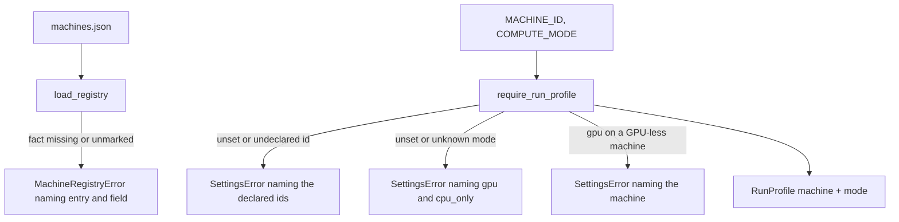
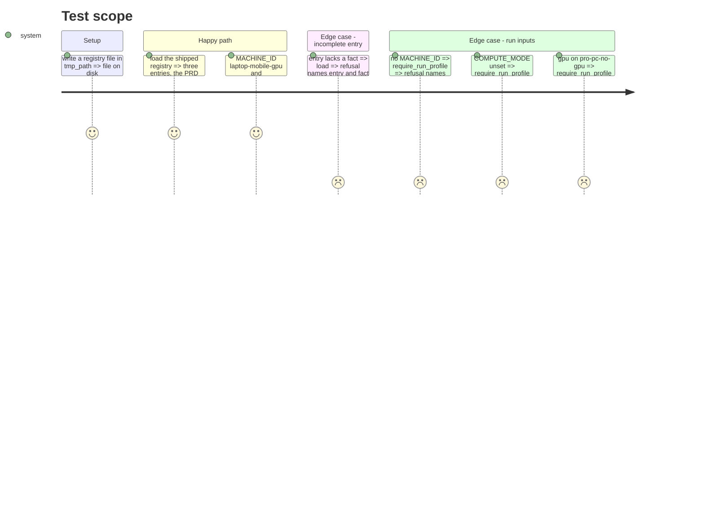

<!-- Fill or omit these sections; never add, rename, or reorder one. -->

# Instruction: Machine registry, its loader, and the two required run inputs

## Architecture projection

> Tree of the final files. ✅ create · ✏️ modify · ❌ delete

```txt
.
├── aidd_docs/roster/machines.json        ✅ the three PRD machines, every fact {value, source, read_from}
├── src/wave_local_ai_v2/machines.py      ✅ loader, refusals, compute modes, declared ids, GPU presence
├── src/wave_local_ai_v2/settings.py      ✏️ MACHINE_ID, COMPUTE_MODE read with no default; require_run_profile
├── tests/test_machines.py                ✅ loader refusals, shipped registry
└── tests/test_settings.py                ✏️ missing / undeclared machine, missing / unknown mode, gpu on a GPU-less machine
```

## User Journey



## Test Scope



## Tasks to do

### `1)` Registry file

> One tracked English entry per PRD machine.

1. `registry_version`, `machines` keyed by id; `description`; facts `cpu_model`, `cpu_cores`, `cpu_threads`, `instruction_set_notes`, `ram_installed_gb`, `memory_type`, `memory_rated_speed_mts`, `memory_configured_speed_mts`, `memory_channels`, `gpu_present`, `gpu_model`, `vram_nominal_gb`, `vram_allocatable_gb`, `os`.
2. Laptop from the probes and `context_input/hardware.md` (allocatable VRAM); tower and pro PC: PRD-defined facts declared, the rest `not_yet_declared`.

### `2)` Loader

> `machines.load_registry` refuses like `roster.load_roster`.

1. Missing fact, unknown `source`, `not_yet_declared` with a value, `gpu_present` not a declared boolean => `MachineRegistryError`.
2. `tracked_registry` (cached), `declared_machine_ids`, `resolve_machine`, `COMPUTE_MODES`.

### `3)` Settings

> Required run inputs, never defaults.

1. `Settings.machine_id` / `compute_mode` default `None`; `load_settings` reads the env with no fallback.
2. `require_run_profile(settings) -> RunProfile`, raising `SettingsError` per refusal.

## Test acceptance criteria

<!-- Each criterion is an observable behavior, not a command. -->

| Task | Acceptance criteria              |
| ---- | -------------------------------- |
| 1 | The shipped registry loads with the three PRD machines, every fact marked |
| 2 | An entry missing a fact refuses naming entry and fact |
| 3 | A missing or undeclared machine id refuses naming the declared ids; a missing mode names `gpu` and `cpu_only`; `gpu` on the no-GPU machine names it |
