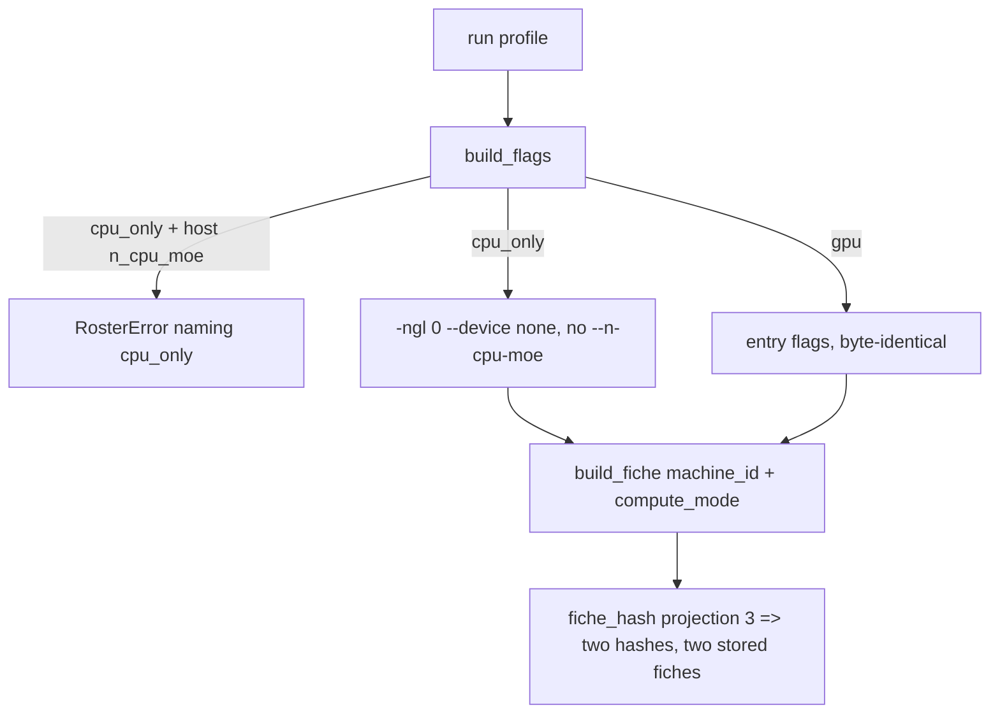
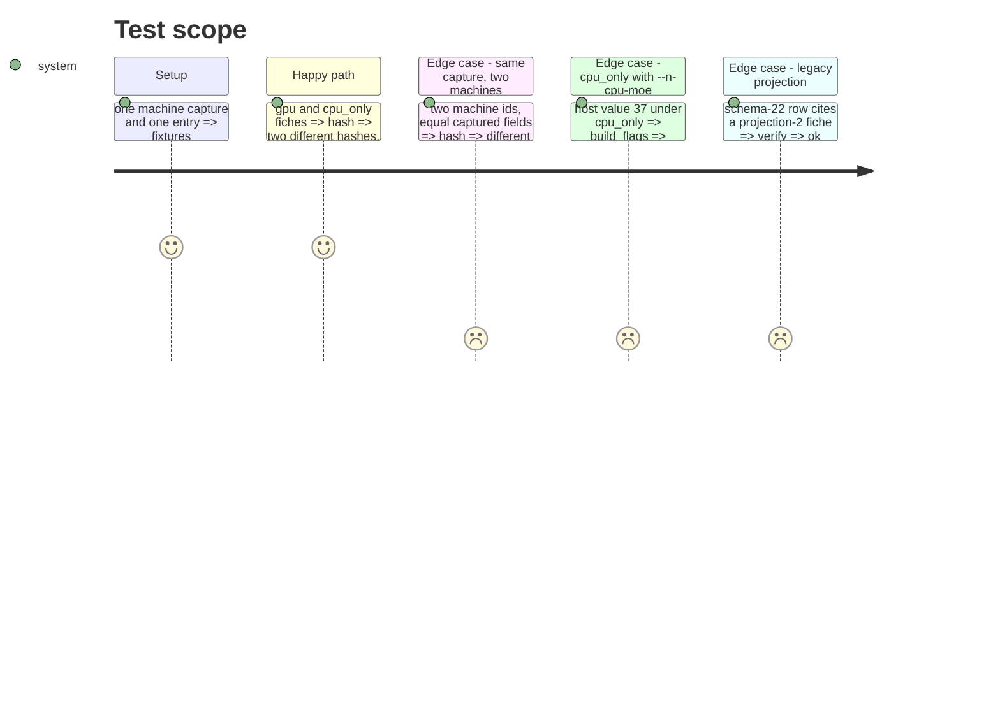

<!-- Fill or omit these sections; never add, rename, or reorder one. -->

# Instruction: Fiche fields, projection "3", `cpu_only` launch and host-fit mode check

## Architecture projection

> Tree of the final files. ✅ create · ✏️ modify · ❌ delete

```txt
.
├── src/wave_local_ai_v2/hardware.py        ✏️ Fiche gains machine_id, compute_mode; projection "3" current
├── src/wave_local_ai_v2/row_contract.py    ✏️ MACHINE_FICHE_SCHEMA_VERSION "23"; fiche_projection_for three-way
├── src/wave_local_ai_v2/server.py          ✏️ build_flags(compute_mode=...): cpu_only => -ngl 0 --device none, no --n-cpu-moe
├── src/wave_local_ai_v2/roster.py          ✏️ validate_host_fit gains compute_mode
├── tests/test_hardware.py                  ✏️ two modes hash apart; two machines hash apart; key order irrelevant
├── tests/test_fiche_registry.py            ✏️ both fiches stored, own flags; verification by projection
├── tests/test_server.py                    ✏️ cpu_only flag set; supplied --n-cpu-moe refused
└── tests/test_roster.py                    ✏️ host-fit mode refusal
```

## User Journey



## Test Scope



## Tasks to do

### `1)` Fiche and projection

> Mode and machine inside the identity.

1. `build_fiche(..., machine_id=, compute_mode=)`; `FICHE_PROJECTIONS["3"]`; `CURRENT_FICHE_PROJECTION = "3"`.
2. `row_contract.MACHINE_FICHE_SCHEMA_VERSION = "23"`, `fiche_projection_for` picks `"1"`/`"2"`/`"3"`.

### `2)` Launch

> `cpu_only` changes the launch.

1. `server.CPU_ONLY_DEVICE_FLAGS = ("--device", "none")`; `build_flags(..., compute_mode=None)`.
2. `roster.validate_host_fit(entry, n_cpu_moe, *, compute_mode)` refuses any value under `cpu_only`.

## Test acceptance criteria

<!-- Each criterion is an observable behavior, not a command. -->

| Task | Acceptance criteria              |
| ---- | -------------------------------- |
| 1 | `gpu` and `cpu_only` fiches of one machine hash differently and both are stored with their own flags; committed fiches verify under their citing rows' versions |
| 2 | `cpu_only` emits `-ngl 0 --device none` and no `--n-cpu-moe`; a supplied value refuses naming the mode; `tests/test_launch_byte_identical.py` passes unedited |
