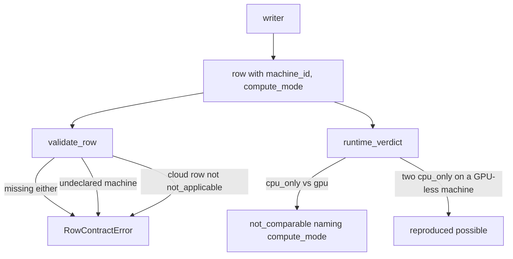
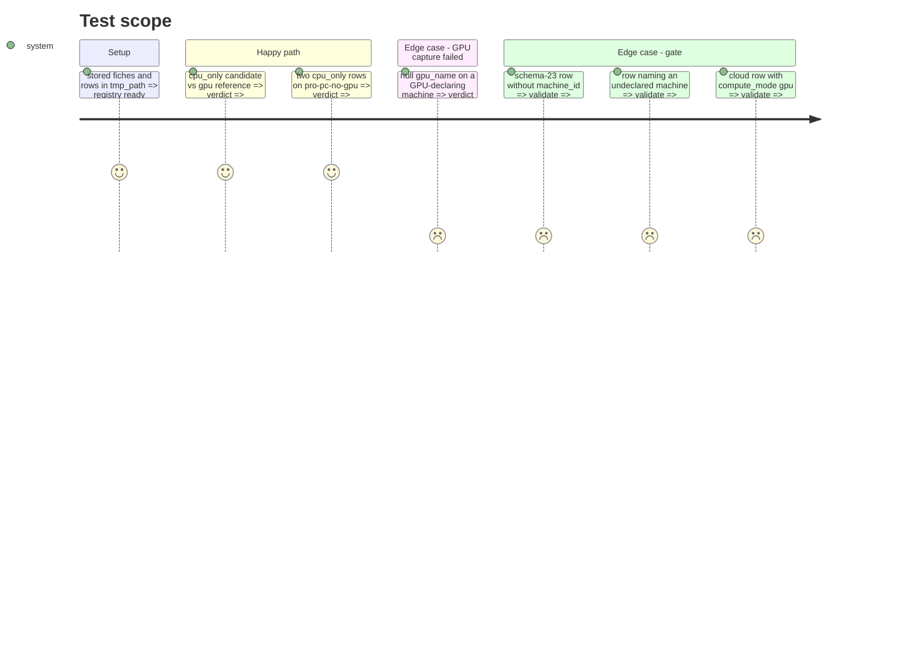

<!-- Fill or omit these sections; never add, rename, or reorder one. -->

# Instruction: Row fields and writer gate across the three writers, verdict blocking, declared-absent GPU

## Architecture projection

> Tree of the final files. ✅ create · ✏️ modify · ❌ delete

```txt
.
├── src/wave_local_ai_v2/row_contract.py    ✏️ SCHEMA_VERSION "23"; MACHINE_FIELDS required from "23"; _validate_machine
├── src/wave_local_ai_v2/quality_rows.py    ✏️ local_producer_fields, NO_LOCAL_PRODUCER_FIELDS
├── src/wave_local_ai_v2/__init__.py        ✏️ require_run_profile; mode into build_flags and fiche; row fields
├── src/wave_local_ai_v2/quality_cli.py     ✏️ same; resume compares machine and mode
├── src/wave_local_ai_v2/judge_probe.py     ✏️ same
├── src/wave_local_ai_v2/verdict.py         ✏️ compute_mode blocking; declared-absent GPU
├── src/wave_local_ai_v2/comparison.py      ✏️ machine/mode move with the local-vs-cloud axis
├── src/wave_local_ai_v2/read_model.py      ✏️ both fields placed as not rendered
├── src/wave_local_ai_v2/bundle_export.py   ✏️ column dictionary for the two row and two fiche fields
├── tests/test_row_contract.py              ✏️ fields required from "23"; undeclared machine; cloud not_applicable
├── tests/test_verdict.py                   ✏️ mode mismatch not_comparable; declared-absent reproduces; failed capture never matches
├── tests/test_reference_bundle.py          ✏️ committed bundle still verifies, no file edited
└── tests/test_cli.py, test_quality_cli.py, test_judge_probe.py ✏️ run inputs threaded through
```

## User Journey



## Test Scope



## Tasks to do

### `1)` Row contract

> Both fields on every row from "23".

1. `MACHINE_FIELDS`, `MACHINE_FIELD_NOT_APPLICABLE`, `SCHEMA_VERSION = "23"` with its history comment.
2. `_validate_machine`: runtime and local rows name a declared id and `gpu`/`cpu_only`; other quality rows `not_applicable` for both.

### `2)` Writers

> One run profile per invocation, threaded into flags, fiche and rows.

1. `require_run_profile` right after `load_settings` in the three CLIs.
2. `build_flags(..., compute_mode=)`, `build_fiche(..., machine_id=, compute_mode=)`, producer fields on rows and in both resume checks.

### `3)` Verdict and readers

> Mode blocks; a declared-absent GPU matches itself.

1. `_RUNTIME_BLOCKING_FIELDS` gains `compute_mode`; `runtime_blocking_fields` reads a declared-absent GPU.
2. Comparison axis, read-model partition, export column dictionary.

## Test acceptance criteria

<!-- Each criterion is an observable behavior, not a command. -->

| Task | Acceptance criteria              |
| ---- | -------------------------------- |
| 1 | A schema-23 row missing either field, or naming an undeclared machine, is refused; a schema-22 row is not held to them |
| 2 | Each CLI refuses a missing run input before any server starts; rows and fiche carry the run's machine and mode |
| 3 | Mode mismatch => `not_comparable` naming `compute_mode`; two `cpu_only` runs on a declared GPU-less machine can reproduce; a failed GPU capture still never matches |
