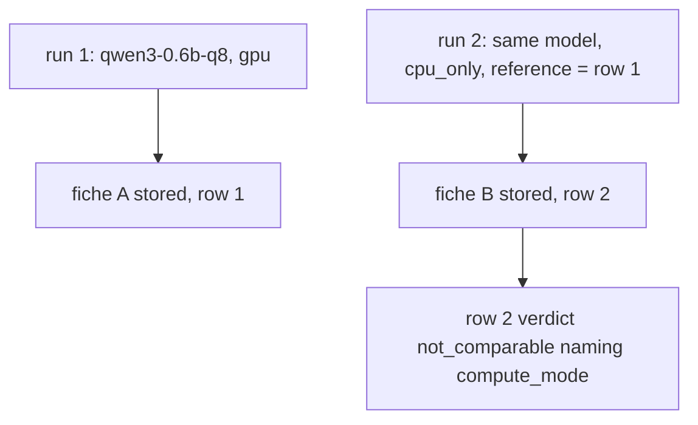
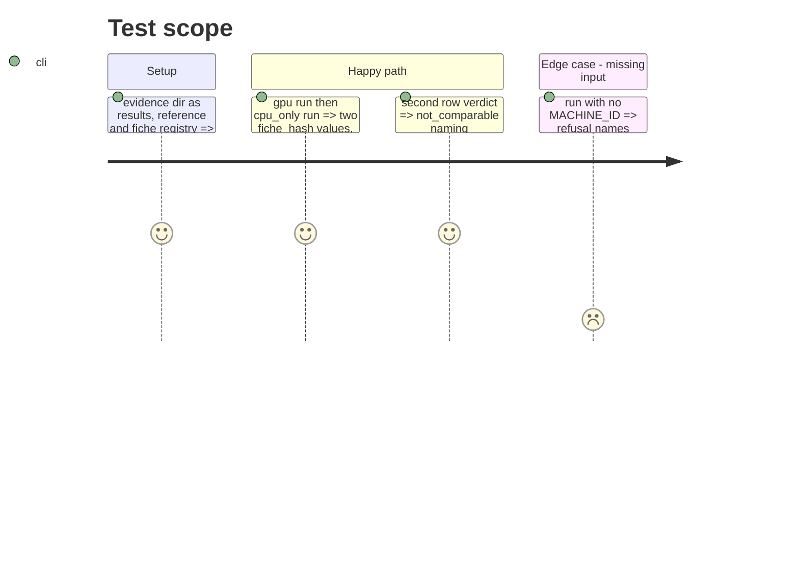

<!-- Fill or omit these sections; never add, rename, or reorder one. -->

# Instruction: Live proof on the laptop, docs, CHANGELOG, PRD alignment

## Architecture projection

> Tree of the final files. ✅ create · ✏️ modify · ❌ delete

```txt
.
├── aidd_docs/tasks/2026_10/2026_10_02_gpu-cpu-never-share-a-fiche/evidence/   ✅ spike logs, runtime.jsonl, fiches/, run logs, evidence.md
├── .env.example                          ✏️ MACHINE_ID, COMPUTE_MODE
├── docs/setup.md                         ✏️ §4 gains both
├── CHANGELOG.md                          ✏️ Unreleased entry
└── aidd_docs/memory/architecture.md      ✏️ fiche projection "3", machine registry
```

## User Journey



## Test Scope



## Tasks to do

### `1)` Live proof

> Epic success check 1, for real.

1. `RUNTIME_REPETITIONS=2`, `RUNTIME_COOLDOWN_S=0`, `RUNTIME_WARMUP_COUNT=0`; every path into `evidence/`.
2. Record both hashes, both fiches' flags, the second verdict, GPU use observed under `cpu_only`.

### `2)` Docs

> The new inputs are documented where an operator looks.

1. `.env.example`, `docs/setup.md` §4, CHANGELOG Unreleased, `architecture.md` gotcha.

## Test acceptance criteria

<!-- Each criterion is an observable behavior, not a command. -->

| Task | Acceptance criteria              |
| ---- | -------------------------------- |
| 1 | `evidence/evidence.md` shows two different hashes, two stored fiches each with its own flags, and the second row's `not_comparable` naming `compute_mode` |
| 2 | An operator reading `.env.example` or setup §4 learns both inputs are required and their values |
