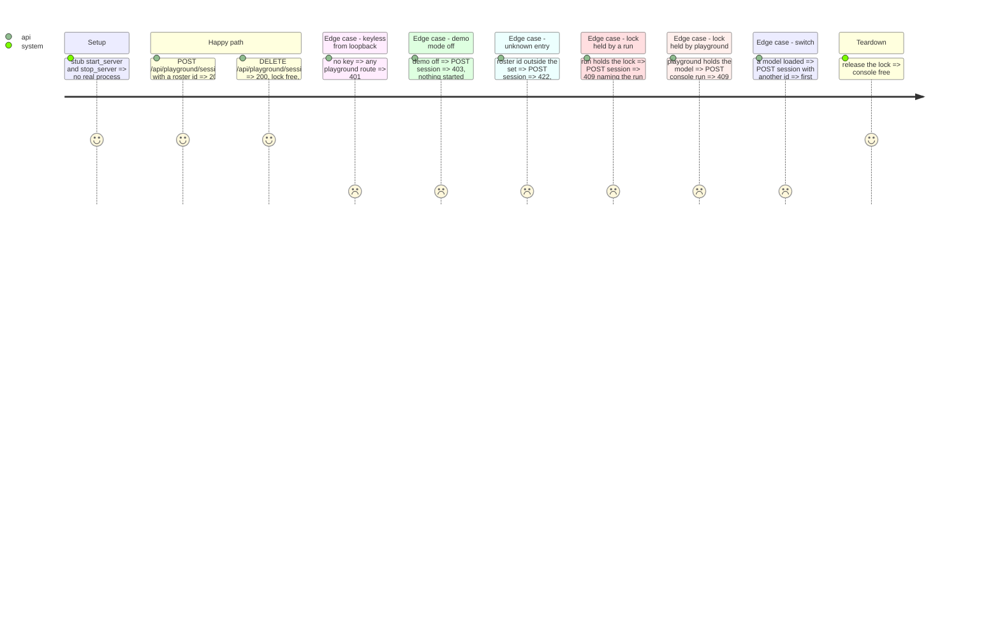

<!-- Fill or omit these sections; never add, rename, or reorder one. -->

# Instruction: Generalised lock, settings, playground model lifecycle and routes

## Architecture projection

```txt
.
├── src/wave_local_ai_v2/demo_console.py  ✏️ PlaygroundHolder; holder_payload names the session; release_if
├── src/wave_local_ai_v2/settings.py      ✏️ optional llama_server_path / slm_models_dir; prompt and max_tokens caps
├── src/wave_local_ai_v2/playground.py    ✅ entry/policy validation, profile choice, start/stop/switch under the lock
├── src/wave_local_ai_v2/service.py       ✏️ shared demo gates; /api/playground options, session start/stop; stop on shutdown; console 409 names the holder's session
├── tests/test_playground.py              ✅ gates, refusals with no process started, lock both ways, release on stop/switch/shutdown
└── tests/test_settings.py                ✏️ caps parse and refuse below 1
```

## Test Scope



## Tasks to do

### `1)` Lock names either holder

1. `PlaygroundHolder(roster_entry_id, profile_id, started_at)`; `holder_payload(holder)` adds `session`.
2. `release_if(holder)`; console 409 message from the holder's session.

### `2)` Settings

1. `llama_server_path`, `slm_models_dir` optional; `playground_max_prompt_chars`, `playground_max_tokens` via `_require_numeric`.

### `3)` Lifecycle

1. `PlaygroundSession.start(entry_id)`: validate, stop own model on switch, acquire, build flags, start; release on failure.
2. `stop()`, also called on service shutdown.
3. Routes on a router with the console's gates.

## Test acceptance criteria

| Task | Acceptance criteria |
| ---- | ------------------- |
| 1 | A run refused while the playground holds the lock names `session: playground`, and the reverse names `session: run` |
| 2 | An unset cap takes its default; a cap below 1 is refused naming its variable |
| 3 | Start, switch, stop and shutdown leave the lock free and every started process stopped |
